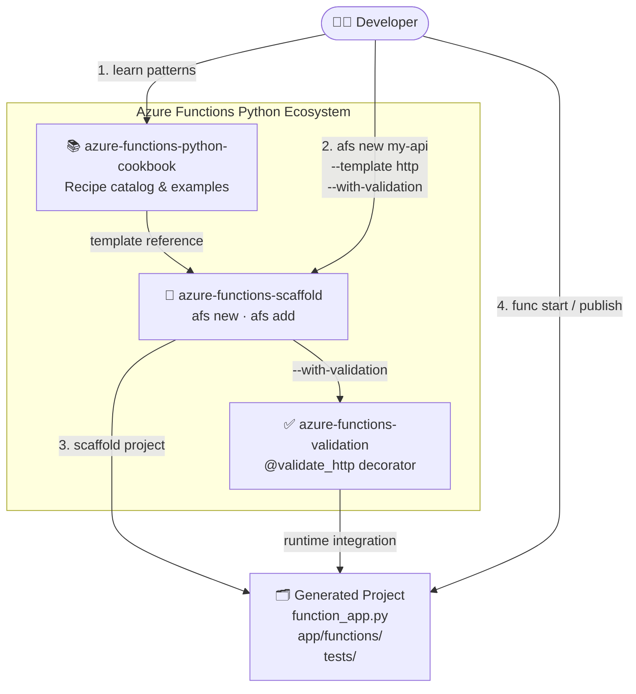
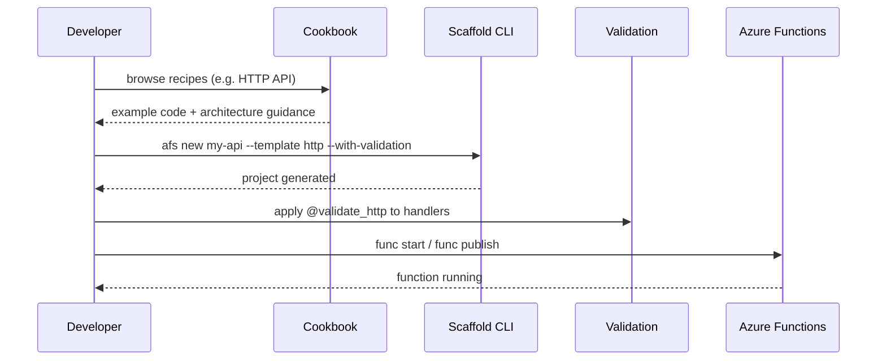
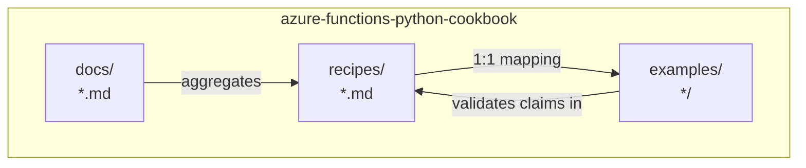
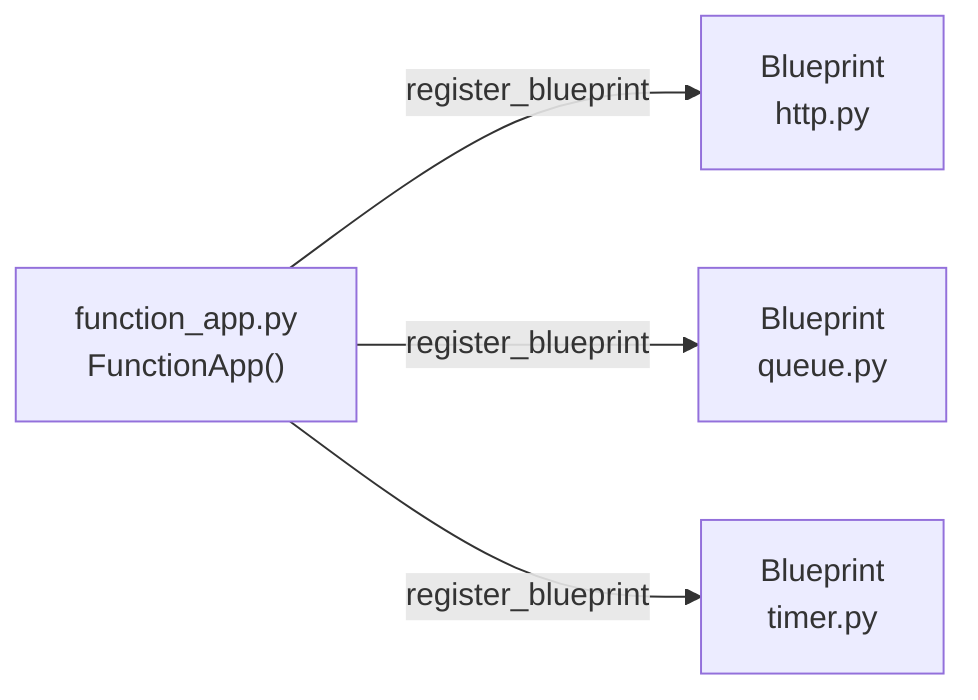
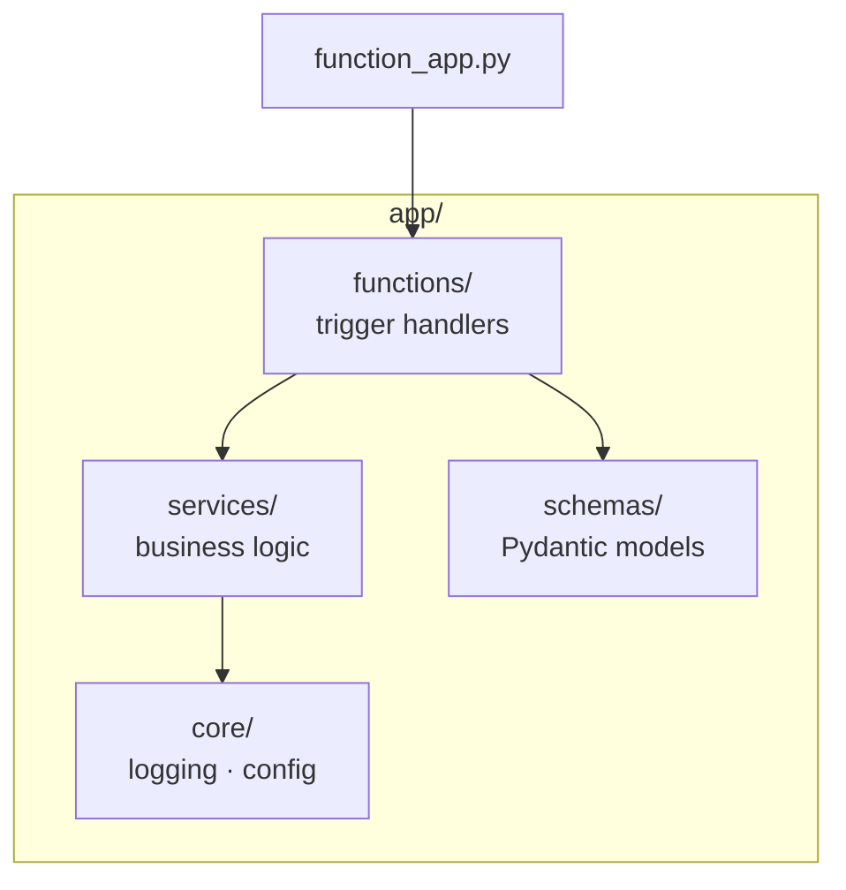
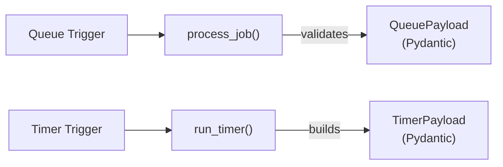

# Architecture

## Overview

The cookbook is a documentation-focused repository that standardizes how Azure Functions Python v2 patterns are explained. The architecture is intentionally simple: recipe source documents define the contract, published docs curate the reader journey, and runnable examples demonstrate execution behavior.

## Ecosystem Overview

The cookbook is part of a broader three-project ecosystem. Each project has a distinct role, and they are designed to compose together.



### Project Roles

| Project | Role | Key API |
|---------|------|---------|
| **cookbook** | Recipe catalog — shows *what* to build and *why* | `docs/`, `examples/`, `recipes/` |
| **scaffold** | CLI that generates projects from cookbook-aligned templates | `afs new`, `afs add` |
| **validation** | Runtime decorator that enforces HTTP input contracts | `@validate_http` |

### Developer Flow




## Layer Model

The architecture has three layers with clear responsibilities:

- `recipes/`: canonical implementation narratives and trigger-specific guidance.
- `docs/`: reader-friendly pages that aggregate patterns and provide onboarding.
- `examples/`: runnable projects that validate recipe claims in code.

This separation allows recipe depth to grow without making onboarding pages noisy.

## Repository Structure

Each recipe maps to exactly one example. This one-to-one mapping keeps documentation discoverable and validation tractable.



## Function App Composition

Start with a single `FunctionApp` entry point. Split into Blueprints only when modules grow beyond a manageable size.



A minimal single-file app:

```python
import azure.functions as func

app = func.FunctionApp(http_auth_level=func.AuthLevel.FUNCTION)


@app.route(route="health", methods=["GET"])
def health(_: func.HttpRequest) -> func.HttpResponse:
    return func.HttpResponse('{"status": "ok"}', mimetype="application/json", status_code=200)
```

## Module Layout

A production recipe separates trigger wiring, business logic, schemas, and observability.



## Trigger Isolation Pattern

Each trigger owns one handler and one payload model. Keeps validation local and limits blast radius.



Queue trigger example:

```python
import json

import azure.functions as func
from pydantic import BaseModel


class QueuePayload(BaseModel):
    task_id: str
    kind: str


app = func.FunctionApp()


@app.queue_trigger(arg_name="msg", queue_name="jobs", connection="AzureWebJobsStorage")
def process_job(msg: func.QueueMessage) -> None:
    payload = QueuePayload.model_validate(json.loads(msg.get_body().decode("utf-8")))
    print(payload.task_id, payload.kind)
```

## Operational Contracts

Recipe architecture should always expose operational assumptions in code examples:

- Validation path: parse request payloads with explicit models.
- Failure path: return deterministic status codes or raise for retry semantics.
- Idempotency path: include a stable operation key for webhook and queue flows.
- Observability path: include log fields that make retries and latency traceable.

## Evolution Strategy

As recipes expand, keep compatibility by evolving contracts rather than replacing them:

- Add fields as optional first, then enforce in a later version.
- Keep existing route names stable unless migration guidance is documented.
- Add new trigger recipes as additive pages to avoid breaking reader workflows.
- Keep code examples executable and parseable with Python 3.10+ syntax.
