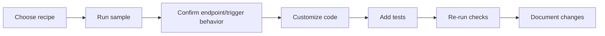

# Getting Started

This guide shows the fastest path from clone to running recipe-aligned
Azure Functions examples locally.

!!! info "What you are using"
    This repository is a cookbook. You consume it by reading patterns in
    `docs/patterns/` and running matching sample apps in `examples/`.

## 1) Clone and set up the environment

```bash
git clone https://github.com/yeongseon/azure-functions-cookbook-python.git
cd azure-functions-cookbook-python
python -m venv .venv
source .venv/bin/activate
```

Install dependencies:

```bash
make install
```

Alternative:

```bash
pip install -e ".[dev,docs]"
```

## 2) Pick a recipe based on your use case

Use this quick map:

| Need | Recipe | Example |
| --- | --- | --- |
| Basic HTTP endpoint | `patterns/apis-and-ingress/hello-http-minimal.md` | `examples/apis-and-ingress/hello_http_minimal` |
| Full CRUD with routing | `patterns/apis-and-ingress/http-routing-query-body.md` | `examples/apis-and-ingress/http_routing_query_body` |
| GitHub event ingestion | `patterns/apis-and-ingress/webhook-github.md` | `examples/apis-and-ingress/webhook_github` |
| Async queue processing | `patterns/messaging-and-pubsub/queue-consumer.md` | `examples/messaging-and-pubsub/queue_consumer` |
| Scheduled jobs | `patterns/scheduled-and-background/timer-cron-job.md` | `examples/scheduled-and-background/timer_cron_job` |

## 3) Read the recipe first

Each recipe describes:

- Why the pattern exists
- Trigger flow and architecture
- Project structure and local run steps
- Production concerns (security, scaling, retries, observability)

!!! tip
    Read the recipe before editing the example code. It gives important
    context for design decisions and operational behavior.

## 4) Run the matching example

### Hello HTTP Minimal

```bash
cd examples/apis-and-ingress/hello_http_minimal
pip install -e .
func start
```

Test endpoints:

```bash
curl http://localhost:7071/api/hello
curl "http://localhost:7071/api/hello?name=Azure"
```

### GitHub Webhook Receiver

```bash
cd examples/apis-and-ingress/webhook_github
pip install -e .
func start
```

Set `GITHUB_WEBHOOK_SECRET` before receiving signed webhook traffic.

### Queue Consumer

```bash
cd examples/messaging-and-pubsub/queue_consumer
pip install -e .
func start
```

For local queue emulation:

```bash
azurite --queuePort 10001
```

Set local storage connection to `UseDevelopmentStorage=true`.

### Timer Cron Job

```bash
cd examples/scheduled-and-background/timer_cron_job
pip install -e .
func start
```

Manual trigger for quick testing:

```bash
curl -X POST http://localhost:7071/admin/functions/scheduled_job -H "Content-Type: application/json" -d '{"input":"test"}'
```

## 5) Adapt a recipe to your needs

After you confirm an example runs:

1. Replace in-memory or placeholder logic with your domain logic.
2. Move secrets to environment variables / Key Vault.
3. Add structured logging and request correlation IDs.
4. Add tests for happy-path and failure-path behavior.
5. Validate production concerns listed in the recipe page.

## 6) Validate changes

```bash
make check-all
make docs
```

This verifies linting, typing, tests, security scan, and docs build.

## Common first-week workflow



## Where to go next

- Pattern orientation: [Pattern Catalog](patterns/index.md)
- Contributor workflow: [Development](development.md)
- Test strategy: [Testing](testing.md)
- Frequent issues: [Troubleshooting](troubleshooting.md)
- Project direction: [Roadmap](roadmap.md)
