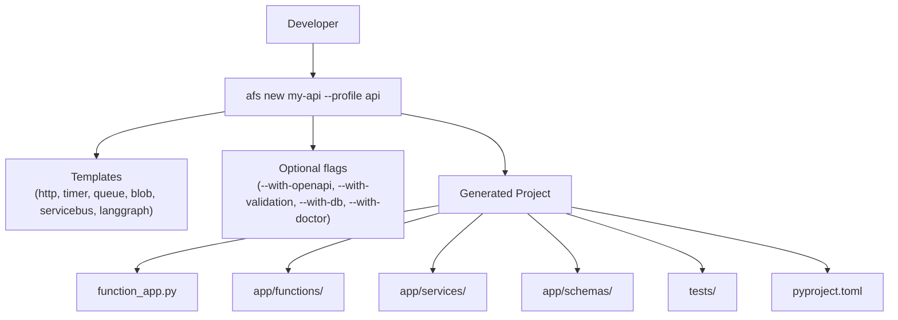

# Scaffold Quick Start

## Overview
`azure-functions-scaffold-python` (alias: `afs`) generates production-ready Azure Functions
Python v2 projects in one command.
It creates the full project layout — `function_app.py`, `host.json`, service modules,
schemas, tests, and tooling config — so you can start writing business logic immediately.

Optional flags wire in toolkit packages like `azure-functions-openapi-python`,
`azure-functions-validation-python`, and `azure-functions-db-python` at generation time.

## When to Use
- You are starting a new Azure Functions project and want a proven layout.
- You want pre-wired integrations with the Azure Functions Python DX Toolkit.
- You need to add new triggers to an existing scaffolded project.

## Architecture


## Prerequisites
- Python 3.10+
- pip

## Templates

| Template | Command | Use Case |
| --- | --- | --- |
| http | `afs new my-api` | REST APIs, webhooks |
| timer | `afs new my-job --template timer` | Scheduled tasks, cron |
| queue | `afs new my-worker --template queue` | Message processing |
| blob | `afs new my-blob --template blob` | File processing |
| servicebus | `afs new my-bus --template servicebus` | Enterprise messaging |
| langgraph | `afs new my-agent --template langgraph` | LangGraph AI agent deployment |

`afs` is short for `azure-functions-scaffold-python`. Both work interchangeably.

## Profiles

Profiles combine a template with pre-selected optional features:

| Profile | Template | Features Included | Command |
|---------|----------|-------------------|---------|
| `api` | http | openapi, validation | `afs new my-api --profile api` |
| `db-api` | http | openapi, validation, db | `afs new my-api --profile db-api` |

Profiles are a convenience — they set the same flags you could pass individually.

## Project Structure

The default HTTP template generates:

```text
my-api/
|- function_app.py          # Azure Functions v2 entrypoint
|- host.json                # Runtime configuration
|- local.settings.json.example
|- pyproject.toml           # Dependencies and tooling config
|- app/
|  |- core/
|  |  `- logging.py         # Structured JSON logging
|  |- functions/
|  |  `- http.py            # HTTP trigger (Blueprint)
|  |- schemas/
|  |  `- request_models.py  # Request/response models
|  `- services/
|     `- hello_service.py   # Business logic
`- tests/
   `- test_http.py          # Pytest tests
```

## Implementation

**Create a new project:**

```bash
afs new my-api
```

**Create with the API profile (openapi + validation):**

```bash
afs new my-api --profile api
```

**Create with database support:**

```bash
afs new my-api --profile db-api
```

**Create a LangGraph agent project:**

```bash
afs new my-agent --template langgraph
```

**Mix individual flags:**

```bash
afs new my-api --with-openapi --with-validation --preset strict
```

### Expand an Existing Project

Add new triggers to a scaffolded project:

```bash
afs add http get-user --project-root ./my-api
afs add timer cleanup --project-root ./my-api
afs add queue sync-jobs --project-root ./my-api
```

Preview what will be generated:

```bash
afs add http get-user --project-root ./my-api --dry-run
```

## Run Locally
```bash
afs new my-api
cd my-api
pip install -e .
func start
```

## Expected Output
```text
Functions:

    hello: [GET] http://localhost:7071/api/hello
```

```bash
curl http://localhost:7071/api/hello
```

```text
Hello, World!
```

## Production Considerations
- Review `host.json` and function auth levels before deploying.
- Set required app settings (connection strings, API keys) in the Azure portal.
- Run `pytest`, lint, and formatting checks before publishing.
- Use `func azure functionapp publish <APP_NAME>` to deploy.

## Related Patterns
- [Hello HTTP Minimal](../patterns/apis-and-ingress/hello-http-minimal.md)
- [DB Input and Output Bindings](../patterns/data-and-pipelines/db-input-output.md)
- [LangGraph Agent](../patterns/ai-and-agents/langgraph-agent.md)
