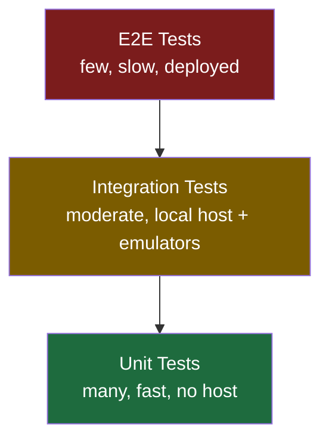

# Testing Patterns

This guide covers unit, integration, and end-to-end testing patterns for Azure Functions Python v2 applications. It explains how to structure tests, mock triggers and bindings, run tests with pytest, and verify deployed functions in a real environment.

## Overview

Azure Functions Python v2 handlers are ordinary Python callables decorated by the `azure.functions` SDK. This means you can import them directly in pytest without starting the Functions host. The test pyramid for serverless follows the same principle as any Python service: keep the majority of coverage at the unit layer, add integration tests for runtime wiring, and reserve a small number of end-to-end checks for the deployed environment.



The pyramid applies directly to Azure Functions:

| Layer | What it covers | Tools |
|---|---|---|
| Unit | Service logic, binding mocks, pure handler calls | `pytest`, `unittest.mock` |
| Integration | Full host startup, real emulators, HTTP round-trips | `func start`, `httpx` / `requests` |
| E2E | Deployed app against real Azure services | `pytest` + `httpx`, Azure CLI |

## Unit Testing Patterns

Unit tests import the handler or service module directly and supply fabricated `azure.functions` objects. No host startup is required.

### Project layout recommendation

Separate business logic from the handler so that the majority of unit tests never touch `azure.functions` at all.

```text
my_function_app/
|- function_app.py          # registers routes / triggers
|- app/
|   |- functions/
|   |   `- greet.py         # thin handler wrappers
|   `- services/
|       `- hello_service.py # pure Python business logic
|- tests/
|   |- test_hello_service.py
|   `- test_greet_handler.py
|- host.json
`- pyproject.toml
```

Testing `app/services/hello_service.py` requires no `azure.functions` import at all:

```python
# tests/test_hello_service.py
from app.services.hello_service import build_greeting


def test_build_greeting_default() -> None:
    assert build_greeting("World") == "Hello, World!"


def test_build_greeting_with_name() -> None:
    assert build_greeting("Ada") == "Hello, Ada!"
```

### Mocking an HTTP trigger

`azure.functions.HttpRequest` is a concrete class that can be instantiated in tests without a running host.

```python
# tests/test_greet_handler.py
import json
import azure.functions as func
from app.functions.greet import greet


def test_greet_with_query_param() -> None:
    req = func.HttpRequest(
        method="GET",
        url="/api/hello",
        body=b"",
        headers={},
        params={"name": "Alice"},
    )
    response = greet(req)
    assert response.status_code == 200
    data = json.loads(response.get_body())
    assert data["greeting"] == "Hello, Alice!"


def test_greet_missing_name_returns_400() -> None:
    req = func.HttpRequest(
        method="GET",
        url="/api/hello",
        body=b"",
        headers={},
    )
    response = greet(req)
    assert response.status_code == 400
```

### Mocking non-HTTP triggers

For timer, queue, blob, and other triggers, use `unittest.mock.MagicMock` to construct the trigger argument accepted by the handler.

```python
# tests/test_timer_handler.py
from unittest.mock import MagicMock
from app.functions.timer import run_maintenance


def test_timer_handler_runs_without_error() -> None:
    timer_info = MagicMock()
    timer_info.past_due = False
    # Should complete without raising
    run_maintenance(timer_info)
```

```python
# tests/test_queue_handler.py
import json
from unittest.mock import MagicMock
from app.functions.process_task import process_task


def test_queue_handler_processes_email_task() -> None:
    msg = MagicMock()
    msg.get_body.return_value = json.dumps(
        {"task_type": "email", "payload": {"to": "user@example.com"}}
    ).encode()
    # Handler should not raise
    process_task(msg)
```

### Mocking output bindings

Output bindings that use the return-value pattern can be tested by inspecting the handler's return value directly. When a binding is injected as a parameter (e.g., `Out[str]`), create a `MagicMock` and assert `.set()` was called.

```python
# tests/test_output_binding.py
import json
from unittest.mock import MagicMock
import azure.functions as func
from app.functions.enqueue import enqueue_item


def test_enqueue_sets_queue_message() -> None:
    req = func.HttpRequest(
        method="POST",
        url="/api/enqueue",
        body=json.dumps({"task_type": "report"}).encode(),
        headers={"Content-Type": "application/json"},
    )
    out_queue: func.Out = MagicMock()
    response = enqueue_item(req, out_queue)
    assert response.status_code == 202
    out_queue.set.assert_called_once()
```

### Testing function_app.py module registration

Verifying that `function_app.py` loads without errors and exposes the `app` object catches import-time configuration mistakes early.

```python
# tests/test_app_loads.py
import importlib.util
import sys
from pathlib import Path


def _load_function_app(app_dir: str) -> object:
    """Load function_app.py from a given directory and return the module."""
    module_path = Path(app_dir) / "function_app.py"
    spec = importlib.util.spec_from_file_location("function_app", module_path)
    assert spec and spec.loader
    module = importlib.util.module_from_spec(spec)
    sys.modules["function_app"] = module
    spec.loader.exec_module(module)  # type: ignore[union-attr]
    return module


def test_function_app_exposes_app_object(tmp_path: Path) -> None:
    module = _load_function_app("examples/apis-and-ingress/hello_http_minimal")
    assert hasattr(module, "app"), "function_app.py must expose an 'app' object"
```

!!! tip
    Use `sys.modules` cleanup between tests when loading multiple `function_app.py` files in the same process. Blueprint sub-packages use a local `app` namespace that will collide across test classes if not cleared.

### Mocking environment variables

Functions that read `os.environ` inside handlers can be tested by patching the environment.

```python
# tests/test_webhook_handler.py
import hashlib
import hmac
import json
import os
from unittest.mock import patch
import azure.functions as func
from app.functions.webhook import github_webhook


def test_missing_secret_returns_500() -> None:
    req = func.HttpRequest(
        method="POST",
        url="/api/github/webhook",
        body=b'{"action": "opened"}',
        headers={"X-GitHub-Event": "push"},
    )
    with patch.dict(os.environ, {}, clear=True):
        os.environ.pop("GITHUB_WEBHOOK_SECRET", None)
        response = github_webhook(req)
    assert response.status_code == 500


def test_valid_signature_accepted() -> None:
    secret = "test-secret"
    body = json.dumps({"ref": "refs/heads/main", "commits": [{}]}).encode()
    sig = "sha256=" + hmac.new(secret.encode(), body, hashlib.sha256).hexdigest()
    req = func.HttpRequest(
        method="POST",
        url="/api/github/webhook",
        body=body,
        headers={
            "X-Hub-Signature-256": sig,
            "X-GitHub-Event": "push",
        },
    )
    with patch.dict(os.environ, {"GITHUB_WEBHOOK_SECRET": secret}):
        response = github_webhook(req)
    assert response.status_code == 200
```

## Integration Testing

Integration tests start the Azure Functions host locally and send real HTTP requests. They verify route registration, middleware, and runtime-level behavior that unit tests cannot detect.

### Prerequisites

```bash
# Install Azure Functions Core Tools v4
npm install -g azure-functions-core-tools@4 --unsafe-perm true

# Python dependencies (in the example's directory)
pip install -r requirements.txt
# or
pip install -e ".[dev]"
```

### pytest fixture: start and stop the local host

Use a session-scoped pytest fixture to start `func start` once for the entire integration test suite.

```python
# tests/integration/conftest.py
from __future__ import annotations

import subprocess
import time
from collections.abc import Generator

import httpx
import pytest

FUNCTION_APP_DIR = "examples/apis-and-ingress/hello_http_minimal"
BASE_URL = "http://localhost:7071"


@pytest.fixture(scope="session")
def func_host() -> Generator[str, None, None]:
    """Start the Functions host and yield the base URL."""
    proc = subprocess.Popen(
        ["func", "start", "--port", "7071"],
        cwd=FUNCTION_APP_DIR,
        stdout=subprocess.PIPE,
        stderr=subprocess.STDOUT,
    )
    # Wait for the host to be ready
    for _ in range(30):
        try:
            httpx.get(f"{BASE_URL}/api/hello?name=ping", timeout=2)
            break
        except httpx.ConnectError:
            time.sleep(1)
    yield BASE_URL
    proc.terminate()
    proc.wait()
```

### HTTP integration tests

```python
# tests/integration/test_hello_integration.py
import httpx


def test_hello_query_param(func_host: str) -> None:
    resp = httpx.get(f"{func_host}/api/hello", params={"name": "Alice"})
    assert resp.status_code == 200
    assert resp.json()["greeting"] == "Hello, Alice!"


def test_hello_post_body(func_host: str) -> None:
    resp = httpx.post(f"{func_host}/api/hello", json={"name": "Bob"})
    assert resp.status_code == 200
    assert resp.json()["greeting"] == "Hello, Bob!"


def test_hello_missing_name(func_host: str) -> None:
    resp = httpx.get(f"{func_host}/api/hello")
    assert resp.status_code == 400
```

!!! note
    The integration fixture above assumes `local.settings.json` is present in the example directory with all required app settings. Copy `local.settings.json.example` to `local.settings.json` and fill in placeholder values before running integration tests.

### Testing with Azurite (Storage emulator)

For tests involving Queue Storage, Blob Storage, or Table Storage triggers, run [Azurite](https://learn.microsoft.com/azure/storage/common/storage-use-azurite) alongside the Functions host.

```bash
# Start Azurite in a separate terminal
npx azurite --silent --location .azurite --debug .azurite/debug.log
```

Set `AzureWebJobsStorage` in `local.settings.json` to the Azurite connection string:

```json
{
  "IsEncrypted": false,
  "Values": {
    "AzureWebJobsStorage": "UseDevelopmentStorage=true",
    "FUNCTIONS_WORKER_RUNTIME": "python"
  }
}
```

!!! warning
    Never commit `local.settings.json` to source control. It may contain connection strings or secrets. Add it to `.gitignore` and document required keys in `local.settings.json.example`.

### Structured log output in integration tests

Reference the `azure-functions-logging-python` pattern to emit structured JSON logs that are parseable by pytest's output capture.

```python
# app/core/logging.py
import logging
import json


class JsonFormatter(logging.Formatter):
    def format(self, record: logging.LogRecord) -> str:  # type: ignore[override]
        payload = {
            "level": record.levelname,
            "logger": record.name,
            "message": record.getMessage(),
            "function": record.__dict__.get("function_name", ""),
            "invocation_id": record.__dict__.get("invocation_id", ""),
        }
        return json.dumps(payload)


def configure_logging() -> None:
    handler = logging.StreamHandler()
    handler.setFormatter(JsonFormatter())
    root = logging.getLogger()
    root.handlers = [handler]
    root.setLevel(logging.INFO)
```

In tests, use `caplog` to assert on structured fields:

```python
# tests/test_structured_logging.py
import logging
import pytest
from app.services.hello_service import build_greeting


def test_greeting_emits_no_errors(caplog: pytest.LogCaptureFixture) -> None:
    with caplog.at_level(logging.ERROR):
        build_greeting("World")
    assert len(caplog.records) == 0
```

## E2E Testing

End-to-end tests run against a deployed Azure Function App. They should be few, deterministic, and focused on smoke-testing critical paths.

!!! warning
    E2E tests consume real Azure resources and may incur costs. Gate them behind a dedicated CI job that runs only on main-branch merges or manual triggers, not on every pull request.

### Configuration

Store the deployed Function App URL and any required API keys in environment variables or a secrets manager. Never hard-code them.

```python
# tests/e2e/conftest.py
import os
import pytest


@pytest.fixture(scope="session")
def e2e_base_url() -> str:
    url = os.environ.get("FUNCTION_APP_URL")
    if not url:
        pytest.skip("FUNCTION_APP_URL not set — skipping E2E tests")
    return url.rstrip("/")


@pytest.fixture(scope="session")
def e2e_function_key() -> str:
    return os.environ.get("FUNCTION_APP_KEY", "")
```

### E2E smoke tests

```python
# tests/e2e/test_greet_e2e.py
import httpx


def test_greet_deployed(e2e_base_url: str, e2e_function_key: str) -> None:
    headers = {"x-functions-key": e2e_function_key} if e2e_function_key else {}
    resp = httpx.get(
        f"{e2e_base_url}/api/hello",
        params={"name": "E2E"},
        headers=headers,
        timeout=30,
    )
    assert resp.status_code == 200
    assert "greeting" in resp.json()


def test_greet_deployed_missing_param(e2e_base_url: str, e2e_function_key: str) -> None:
    headers = {"x-functions-key": e2e_function_key} if e2e_function_key else {}
    resp = httpx.get(
        f"{e2e_base_url}/api/hello",
        headers=headers,
        timeout=30,
    )
    assert resp.status_code == 400
```

### Running E2E tests in CI

```yaml
# .github/workflows/e2e.yml (excerpt)
- name: Run E2E tests
  env:
    FUNCTION_APP_URL: ${{ secrets.FUNCTION_APP_URL }}
    FUNCTION_APP_KEY: ${{ secrets.FUNCTION_APP_KEY }}
  run: pytest tests/e2e/ -v --tb=short
```

## Test Fixtures and Helpers

### Shared conftest.py patterns

Place shared helpers in `tests/conftest.py` so they are available to all test modules without explicit imports.

```python
# tests/conftest.py
from __future__ import annotations

import json
import sys
from pathlib import Path
from typing import Any

import azure.functions as func
import pytest

EXAMPLES_DIR = Path(__file__).resolve().parent.parent / "examples"


def make_http_request(
    method: str = "GET",
    url: str = "/api/test",
    body: bytes = b"",
    headers: dict[str, str] | None = None,
    params: dict[str, str] | None = None,
    json_body: Any | None = None,
) -> func.HttpRequest:
    """Factory function for building HttpRequest objects in tests."""
    if json_body is not None:
        body = json.dumps(json_body).encode()
        headers = {**(headers or {}), "Content-Type": "application/json"}
    return func.HttpRequest(
        method=method,
        url=url,
        body=body,
        headers=headers or {},
        params=params or {},
    )


@pytest.fixture()
def http_get_factory():
    """Return a callable that builds GET HttpRequest objects."""
    def _make(url: str, params: dict[str, str] | None = None) -> func.HttpRequest:
        return make_http_request(method="GET", url=url, params=params)
    return _make


@pytest.fixture()
def http_post_factory():
    """Return a callable that builds POST HttpRequest objects with JSON body."""
    def _make(url: str, json_body: Any) -> func.HttpRequest:
        return make_http_request(method="POST", url=url, json_body=json_body)
    return _make
```

### Parametrized tests

Use `pytest.mark.parametrize` to cover edge cases without duplicating test logic.

```python
# tests/test_hello_service_parametrized.py
import pytest
from app.services.hello_service import build_greeting


@pytest.mark.parametrize(
    ("name", "expected"),
    [
        ("World", "Hello, World!"),
        ("Ada", "Hello, Ada!"),
        ("Azure", "Hello, Azure!"),
    ],
)
def test_build_greeting(name: str, expected: str) -> None:
    assert build_greeting(name) == expected
```

### Module isolation helper

When loading multiple `function_app.py` modules in the same pytest process, clean `sys.modules` between tests to prevent import collisions from Blueprint sub-packages.

```python
# tests/helpers.py
from __future__ import annotations

import importlib.util
import sys
from pathlib import Path
from typing import Any


def clean_app_modules() -> None:
    """Remove all 'app' and 'app.*' entries from sys.modules."""
    for mod_name in list(sys.modules):
        if mod_name == "app" or mod_name.startswith("app."):
            del sys.modules[mod_name]


def load_example_module(example_path: str, examples_dir: Path) -> Any:
    """Import function_app.py from an example directory and return the module."""
    module_path = examples_dir / example_path / "function_app.py"
    module_name = f"example_{example_path.replace('/', '_')}"
    example_dir = str(examples_dir / example_path)

    clean_app_modules()
    sys.modules.pop(module_name, None)

    added = example_dir not in sys.path
    if added:
        sys.path.insert(0, example_dir)

    spec = importlib.util.spec_from_file_location(module_name, module_path)
    assert spec and spec.loader
    module = importlib.util.module_from_spec(spec)
    sys.modules[module_name] = module
    try:
        spec.loader.exec_module(module)  # type: ignore[union-attr]
    finally:
        if added and example_dir in sys.path:
            sys.path.remove(example_dir)

    return module
```

### pytest configuration

A minimal `pyproject.toml` section for pytest:

```toml
[tool.pytest.ini_options]
testpaths = ["tests"]
python_files = ["test_*.py"]
python_classes = ["Test*"]
python_functions = ["test_*"]
addopts = ["-v", "--tb=short"]
markers = [
    "integration: marks tests that require the Functions host running locally",
    "e2e: marks tests that require a deployed Azure Function App",
]
```

Run only unit tests (default):

```bash
pytest tests/ -m "not integration and not e2e"
```

Run integration tests:

```bash
pytest tests/ -m integration
```

Run all tests including E2E:

```bash
FUNCTION_APP_URL=https://myapp.azurewebsites.net \
FUNCTION_APP_KEY=<key> \
pytest tests/ -m e2e
```

!!! tip
    Add `-p no:warnings` to `addopts` in environments where dependency deprecation warnings clutter test output. Prefer fixing warnings in development rather than suppressing them permanently.

## Related Links

- [Azure Functions Python developer guide](https://learn.microsoft.com/azure/azure-functions/functions-reference-python)
- [Test Azure Functions](https://learn.microsoft.com/azure/azure-functions/functions-test-a-function)
