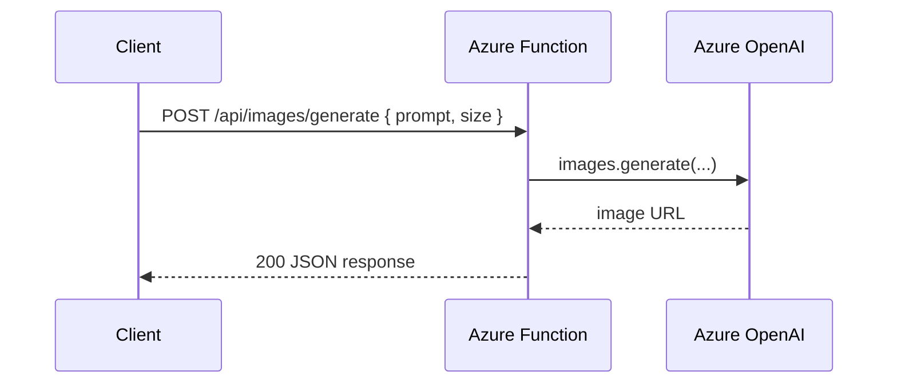

# AI Image Generation

> **Trigger**: HTTP | **State**: stateless | **Guarantee**: request-response | **Difficulty**: intermediate | **Showcase**: Azure OpenAI image generation

## Overview
This recipe exposes an HTTP endpoint that sends a prompt to Azure OpenAI image
generation and returns the resulting image URL.

The sample uses the `openai` Python SDK against an Azure endpoint and keeps the
Function app small enough to show the core pattern clearly. As with the other
cookbook HTTP recipes, it calls out `@with_context`, `@openapi`, and
`@validate_http`, and uses `azure-functions-logging-python` for structured telemetry.

## When to Use
- You want a serverless API that turns text prompts into generated images.
- You need a simple backend wrapper around Azure OpenAI image generation.
- You want request validation and OpenAPI documentation for a media-generation endpoint.

## When NOT to Use
- You need streaming text tokens rather than an image URL.
- You need durable, multi-step asset workflows after generation completes.
- You need advanced media pipelines such as moderation, resizing, or storage processing.

## Architecture
```mermaid
flowchart LR
    A[Client] --> B[HTTP trigger\nPOST /api/images/generate]
    B --> C[@with_context + @openapi + @validate_http]
    C --> D[Azure OpenAI image generation]
    D --> E[Image URL + prompt metadata]
    E --> A
```

## Behavior
The sequence below shows the runtime interaction between components.



## Prerequisites
- Python 3.10+
- Azure Functions Core Tools v4
- `openai` SDK
- Azure OpenAI resource with a DALL-E deployment

## Project Structure
```text
examples/ai-and-agents/ai_image_generation/
|- function_app.py
|- host.json
|- local.settings.json.example
|- requirements.txt
`- README.md
```

## Implementation
The example project is `examples/ai-and-agents/ai_image_generation/`.

`function_app.py` defines typed request and response models, configures
`azure-functions-logging-python`, and creates an Azure OpenAI client with
`AZURE_OPENAI_ENDPOINT`, `AZURE_OPENAI_KEY`, and
`AZURE_OPENAI_IMAGE_DEPLOYMENT`.

The route uses the standard cookbook HTTP decorator order:

```python
@app.route(route="images/generate", methods=["POST"])
@with_context
@openapi(summary="Generate an image", request_body=ImageRequest, response={200: ImageResponse}, tags=["ai"])
@validate_http(body=ImageRequest, response_model=ImageResponse)
def generate_image(req: func.HttpRequest, body: ImageRequest) -> func.HttpResponse:
    ...
```

Generation itself happens through the Azure OpenAI image API in the `openai`
SDK:

```python
result = client.images.generate(
    model=os.getenv("AZURE_OPENAI_IMAGE_DEPLOYMENT", "dall-e-3"),
    prompt=body.prompt,
    size=body.size,
)
```

The function returns the URL plus the revised prompt so callers can trace what
the model actually used.

## Run Locally
```bash
cd examples/ai-and-agents/ai_image_generation
pip install -r requirements.txt
cp local.settings.json.example local.settings.json
func start
```

## Expected Output
```text
Functions:

    generate_image: [POST] http://localhost:7071/api/images/generate
```

Example request:

```bash
curl -X POST http://localhost:7071/api/images/generate \
  -H "Content-Type: application/json" \
  -d '{"prompt": "A futuristic serverless control room in watercolor style", "size": "1024x1024"}'
```

Example response:

```json
{
  "image_url": "https://example.blob.core.windows.net/generated/serverless-control-room.png",
  "revised_prompt": "A futuristic serverless control room in watercolor style",
  "deployment": "dall-e-3"
}
```

## Production Considerations
- Add authentication, prompt moderation, and request quotas before exposing the API broadly.
- Consider storing generated images in Blob Storage instead of returning provider URLs directly.
- Track prompt size, image size, latency, and deployment name with `azure-functions-logging-python`.
- Protect API keys with managed identity and Key Vault-backed configuration.

## Related Links
- [Azure OpenAI image generation how-to](https://learn.microsoft.com/en-us/azure/ai-foundry/openai/how-to/dall-e)
- [Azure Functions HTTP trigger reference](https://learn.microsoft.com/en-us/azure/azure-functions/functions-bindings-http-webhook-trigger)
