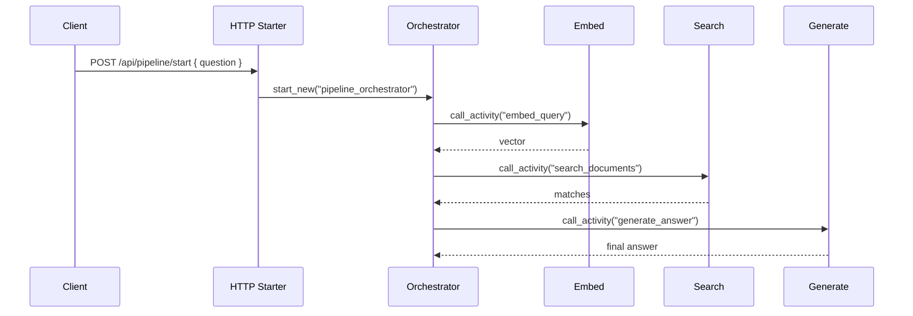

# Durable AI Pipeline

> **Trigger**: HTTP + Durable orchestration | **State**: stateful (workflow) | **Guarantee**: async orchestration | **Difficulty**: advanced | **Showcase**: Durable AI pipeline

## Overview
This recipe uses Durable Functions to orchestrate a multi-step AI workflow on
Azure Functions: embed the request, run vector search, then generate a final
answer from the retrieved context.

The HTTP starter remains a normal cookbook-style route with
`@with_context`, `@openapi`, and `@validate_http`, while the orchestrator and
activities handle the long-running AI workflow. The sample also wires in
`azure-functions-logging-python` so each step can emit structured telemetry.

## When to Use
- You need reliable multi-step AI work that should survive retries and restarts.
- You want to separate embedding, retrieval, and generation into distinct activities.
- You need an HTTP starter endpoint while the actual AI pipeline runs asynchronously.

## When NOT to Use
- You only need a single synchronous chat completion.
- You need token streaming back to the client during generation.
- You do not need orchestration, retries, or durable status endpoints.

## Architecture
```mermaid
flowchart LR
    A[Client] --> B[HTTP starter\nPOST /api/pipeline/start]
    B --> C[@with_context + @openapi + @validate_http]
    C --> D[Durable orchestrator]
    D --> E[Activity: embed query]
    E --> F[Activity: vector search]
    F --> G[Activity: generate answer]
    G --> H[Durable status output]
```



## Prerequisites
- Python 3.10+
- Azure Functions Core Tools v4
- `azure-functions-durable` extension
- `openai` SDK
- Azure OpenAI resource and Azure AI Search index

## Project Structure
```text
examples/ai-and-agents/durable_ai_pipeline/
|- function_app.py
|- host.json
|- local.settings.json.example
|- requirements.txt
`- README.md
```

## Implementation
The example project is `examples/ai-and-agents/durable_ai_pipeline/`.

`function_app.py` creates a Durable Functions app, configures
`azure-functions-logging-python`, and defines one HTTP starter plus three durable
activities. The starter route uses the same cookbook decorator stack used by the
HTTP AI recipes:

```python
@app.route(route="pipeline/start", methods=["POST"])
@with_context
@openapi(summary="Start durable AI pipeline", request_body=PipelineRequest, response={202: PipelineStartResponse}, tags=["ai"])
@validate_http(body=PipelineRequest, response_model=PipelineStartResponse)
def start_pipeline(req: func.HttpRequest, body: PipelineRequest, client: df.DurableOrchestrationClient) -> func.HttpResponse:
    ...
```

The activities use the `openai` SDK with Azure OpenAI for embedding and answer
generation. The search activity queries Azure AI Search with the generated
vector. That keeps the workflow explicit:

```python
vector = yield context.call_activity("embed_query", payload)
matches = yield context.call_activity("search_documents", {"vector": vector, "top_k": payload["top_k"]})
answer = yield context.call_activity("generate_answer", {"question": payload["question"], "documents": matches})
```

This split makes retries, timeouts, and step-level logging easier to reason
about than a single large handler.

## Run Locally
```bash
cd examples/ai-and-agents/durable_ai_pipeline
pip install -r requirements.txt
cp local.settings.json.example local.settings.json
func start
```

## Expected Output
```text
Functions:

    start_pipeline: [POST] http://localhost:7071/api/pipeline/start
    pipeline_orchestrator: durable orchestration trigger
    embed_query: durable activity trigger
    search_documents: durable activity trigger
    generate_answer: durable activity trigger
```

Example request:

```bash
curl -X POST http://localhost:7071/api/pipeline/start \
  -H "Content-Type: application/json" \
  -d '{"question": "How does Azure Functions scale?", "top_k": 3}'
```

Example response:

```json
{
  "instance_id": "pipeline-1234",
  "status_query_get_uri": "http://localhost:7071/runtime/webhooks/durabletask/instances/pipeline-1234"
}
```

## Production Considerations
- Use Durable Functions when the AI pipeline can exceed normal HTTP execution windows.
- Tune retries independently for embedding, retrieval, and generation activities.
- Keep prompts and large search payloads out of orchestration state when possible.
- Use `azure-functions-logging-python` to capture instance IDs, activity latency, and failures.
- Prefer managed identity for Azure OpenAI and Azure AI Search in production.

## Related Links
- [Durable Functions overview](https://learn.microsoft.com/en-us/azure/azure-functions/durable/durable-functions-overview)
- [Azure OpenAI embeddings how-to](https://learn.microsoft.com/en-us/azure/ai-foundry/openai/how-to/embeddings)
- [Azure Functions HTTP trigger reference](https://learn.microsoft.com/en-us/azure/azure-functions/functions-bindings-http-webhook-trigger)
