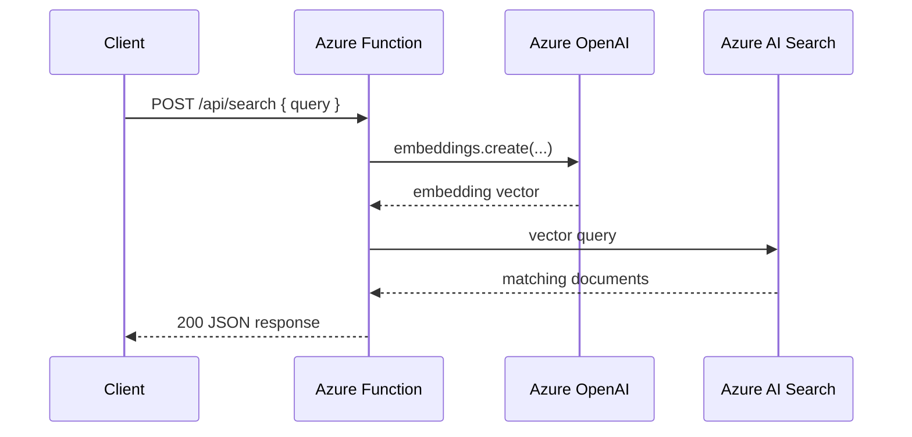

# Embedding Vector Search

> **Trigger**: HTTP | **State**: stateless | **Guarantee**: request-response | **Difficulty**: intermediate | **Showcase**: Azure OpenAI embeddings + Azure AI Search

## Overview
This recipe exposes an HTTP endpoint that generates an embedding with Azure
OpenAI, submits a vector query to Azure AI Search, and returns the matching
documents.

It uses the `openai` SDK for embeddings, the Azure AI Search Python SDK for
vector search, and the cookbook's standard `@with_context`, `@openapi`, and
`@validate_http` decorator stack. `azure-functions-logging` provides structured
telemetry around embedding and retrieval operations.

## When to Use
- You want a focused vector search API without a full RAG answer-generation step.
- You need raw matching documents for ranking, display, or downstream processing.
- You want an example that shows Azure OpenAI embeddings and Azure AI Search together.

## When NOT to Use
- You need the function to produce a final natural-language answer, not just matches.
- You need durable orchestration across multiple AI and retrieval steps.
- You do not have a vector-enabled Azure AI Search index.

## Architecture
```mermaid
flowchart LR
    A[Client] --> B[HTTP trigger\nPOST /api/search]
    B --> C[@with_context + @openapi + @validate_http]
    C --> D[Azure OpenAI embeddings]
    D --> E[Azure AI Search vector query]
    E --> F[Ranked matches]
    F --> A
```



## Prerequisites
- Python 3.10+
- Azure Functions Core Tools v4
- `openai` SDK
- `azure-search-documents` SDK
- Azure OpenAI resource and Azure AI Search index

## Project Structure
```text
examples/ai-and-agents/embedding_vector_search/
|- function_app.py
|- host.json
|- local.settings.json.example
|- requirements.txt
`- README.md
```

## Implementation
The example project is `examples/ai-and-agents/embedding_vector_search/`.

`function_app.py` validates the input body, configures `azure-functions-logging`,
and initializes both Azure OpenAI and Azure AI Search clients from environment
variables such as `AZURE_OPENAI_ENDPOINT`, `AZURE_OPENAI_KEY`,
`AZURE_OPENAI_EMBEDDING_DEPLOYMENT`, `AI_SEARCH_ENDPOINT`, `AI_SEARCH_KEY`, and
`AI_SEARCH_INDEX`.

The HTTP handler follows the standard cookbook route pattern:

```python
@app.route(route="search", methods=["POST"])
@with_context
@openapi(summary="Run vector search", request_body=VectorSearchRequest, response={200: VectorSearchResponse}, tags=["ai"])
@validate_http(body=VectorSearchRequest, response_model=VectorSearchResponse)
def search(req: func.HttpRequest, body: VectorSearchRequest) -> func.HttpResponse:
    ...
```

Inside the handler, the function first generates an embedding, then issues a
vector query against Azure AI Search:

```python
embedding = client.embeddings.create(
    model=os.getenv("AZURE_OPENAI_EMBEDDING_DEPLOYMENT", "text-embedding-3-small"),
    input=body.query,
)

results = search_client.search(
    search_text=None,
    vector_queries=[VectorizedQuery(vector=embedding.data[0].embedding, k_nearest_neighbors=body.top_k, fields="content_vector")],
)
```

This pattern is a good fit when the caller needs scored matches and will decide
how to use them next.

## Run Locally
```bash
cd examples/ai-and-agents/embedding_vector_search
pip install -r requirements.txt
cp local.settings.json.example local.settings.json
func start
```

## Expected Output
```text
Functions:

    search: [POST] http://localhost:7071/api/search
```

Example request:

```bash
curl -X POST http://localhost:7071/api/search \
  -H "Content-Type: application/json" \
  -d '{"query": "How does Azure Functions scale?", "top_k": 3}'
```

Example response:

```json
{
  "query": "How does Azure Functions scale?",
  "results": [
    {
      "id": "doc-1",
      "title": "Azure Functions overview",
      "content": "Azure Functions automatically scales based on demand.",
      "score": 0.92
    }
  ]
}
```

## Production Considerations
- Make sure your Azure AI Search index schema and vector dimensions match the embedding model.
- Add filtering and semantic ranking if raw vector similarity is not enough.
- Log query length, match count, and latency with `azure-functions-logging`.
- Use managed identity or secretless configuration for Azure OpenAI and Azure AI Search.

## Related Links
- [Azure OpenAI embeddings how-to](https://learn.microsoft.com/en-us/azure/ai-foundry/openai/how-to/embeddings)
- [Azure AI Search vector search overview](https://learn.microsoft.com/en-us/azure/search/vector-search-overview)
- [Azure Functions HTTP trigger reference](https://learn.microsoft.com/en-us/azure/azure-functions/functions-bindings-http-webhook-trigger)
