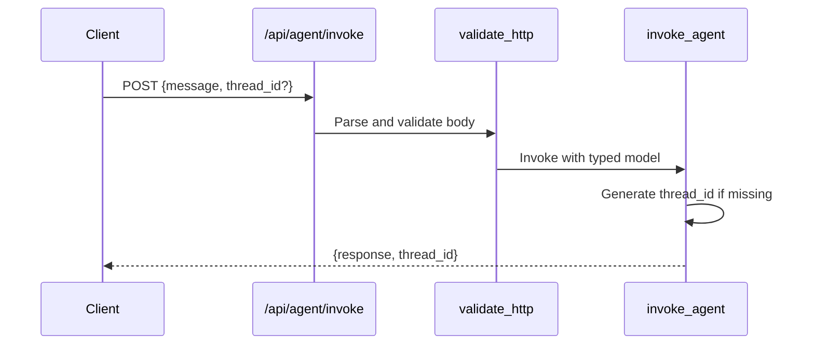

# LangGraph Agent

> **Trigger**: HTTP | **State**: stateless | **Guarantee**: at-most-once | **Difficulty**: advanced

## Overview
This recipe shows how to keep a LangGraph graph alongside a regular Azure Functions
HTTP app using `azure-functions-langgraph-python`.
The example registers a compiled graph with `LangGraphApp`, but the public HTTP surface
in the sample is a separate `func.FunctionApp` route at `/api/agent/invoke`.

The example returns a minimal "Agent received" response and thread ID from that manual
route. Replace the stubbed response with real graph execution or LLM calls for production use.

## When to Use
- You want a standard Azure Functions HTTP endpoint that can live beside LangGraph registration.
- You want serverless deployment without LangGraph Platform costs.
- You want request validation, OpenAPI metadata, and logging around an agent-style endpoint.

## When NOT to Use
- You only need a simple stateless HTTP function and do not need LangGraph in the project at all.
- You require durable multi-step workflows better suited to Durable Functions orchestration.
- You require built-in streaming, health, or checkpoint-backed conversation endpoints from this sample as-is.

## Architecture
```mermaid
flowchart TD
    A[Client] -->|POST /api/agent/invoke| B[func.FunctionApp route]
    B --> C[Validation + OpenAPI + logging decorators]
    C --> D[invoke_agent handler]
    D --> E[JSON response\nresponse + thread_id]
    F[Startup] --> G[build_graph()]
    G --> H[LangGraphApp.register(graph)]
```

## Prerequisites
- Python 3.10+
- Azure Functions Core Tools v4
- `langgraph` and `azure-functions-langgraph-python` packages
- Pydantic for request and response models

## Project Structure
```text
examples/ai-and-agents/langgraph_agent/
|-- function_app.py
|-- host.json
|-- local.settings.sample.json
|-- requirements.txt
`-- README.md
```

## Implementation
The sample keeps everything in a single `function_app.py`, but it does two separate things:

1. Creates and optionally registers a LangGraph graph at startup.
2. Exposes a manual HTTP endpoint with Azure Functions decorators.

```python
import azure.functions as func
from azure_functions_langgraph import LangGraphApp
from azure_functions_logging import setup_logging, with_context, get_logger
from azure_functions_openapi import openapi
from azure_functions_validation import validate_http
from pydantic import BaseModel

setup_logging(format="json")
logger = get_logger(__name__)

langgraph_app = LangGraphApp()
app = func.FunctionApp(http_auth_level=func.AuthLevel.FUNCTION)


class InvokeRequest(BaseModel):
    message: str
    thread_id: str | None = None


class InvokeResponse(BaseModel):
    response: str
    thread_id: str


def build_graph():
    try:
        from langgraph.graph import StateGraph, END
        from typing import TypedDict

        class AgentState(TypedDict):
            message: str
            response: str

        def process_node(state: AgentState) -> AgentState:
            logger.info("Processing message", extra={"message": state["message"]})
            return {"response": f"Agent received: {state['message']}"}

        graph = StateGraph(AgentState)
        graph.add_node("process", process_node)
        graph.set_entry_point("process")
        graph.add_edge("process", END)
        return graph.compile()
    except ImportError:
        logger.warning("langgraph not installed, using stub")
        return None


graph = build_graph()
if graph:
    langgraph_app.register(graph=graph)


@app.route(route="agent/invoke", methods=["POST"])
@with_context
@openapi(
    summary="Invoke LangGraph agent",
    request_body=InvokeRequest,
    response={200: InvokeResponse},
    tags=["agent"],
)
@validate_http(body=InvokeRequest, response_model=InvokeResponse)
def invoke_agent(req: func.HttpRequest, body: InvokeRequest) -> func.HttpResponse:
    import uuid

    thread_id = body.thread_id or str(uuid.uuid4())
    logger.info("Invoking agent", extra={"thread_id": thread_id})
    result = {"response": f"Agent received: {body.message}", "thread_id": thread_id}
    return func.HttpResponse(
        body=InvokeResponse(**result).model_dump_json(),
        mimetype="application/json",
    )
```

In this example, the HTTP contract is fully manual. The registered graph is initialized at startup,
but the sample route does not expose automatic `/graphs/...` invoke or stream endpoints.

Request format for the documented endpoint:

```json
{
    "message": "Hello!",
    "thread_id": "conversation-1"
}
```

If `thread_id` is omitted, the handler generates a UUID before returning the response.

## Behavior


At startup, the module separately tries to build and register a graph:

```python
graph = build_graph()
if graph:
    langgraph_app.register(graph=graph)
```

## Run Locally
```bash
cd examples/ai-and-agents/langgraph_agent
pip install -r requirements.txt
func start
```

## Expected Output
```text
Functions:

    invoke_agent: [POST] http://localhost:7071/api/agent/invoke
```

Invoke the agent:

```bash
curl -X POST http://localhost:7071/api/agent/invoke \
  -H "Content-Type: application/json" \
  -d '{"message": "Hello!"}'
```

```json
{"response":"Agent received: Hello!","thread_id":"generated-or-supplied-thread-id"}
```

## Production Considerations
- Authentication: the sample sets `http_auth_level=func.AuthLevel.FUNCTION`; configure keys and client access accordingly.
- Scaling: Azure Functions scales the HTTP route independently; keep request handlers lightweight.
- State: the sample echoes input and returns a thread ID, but does not persist conversation state.
- Observability: the example enables structured logging and adds request context around the route.
- Evolution path: if you later wire the HTTP route to execute the compiled graph, add checkpointing and explicit timeout handling.

## Scaffold Starter
```bash
afs new my-agent --template langgraph
cd my-agent
pip install -e .
func start
```

## Related Links
- [Azure Functions HTTP trigger reference](https://learn.microsoft.com/en-us/azure/azure-functions/functions-bindings-http-webhook-trigger)
