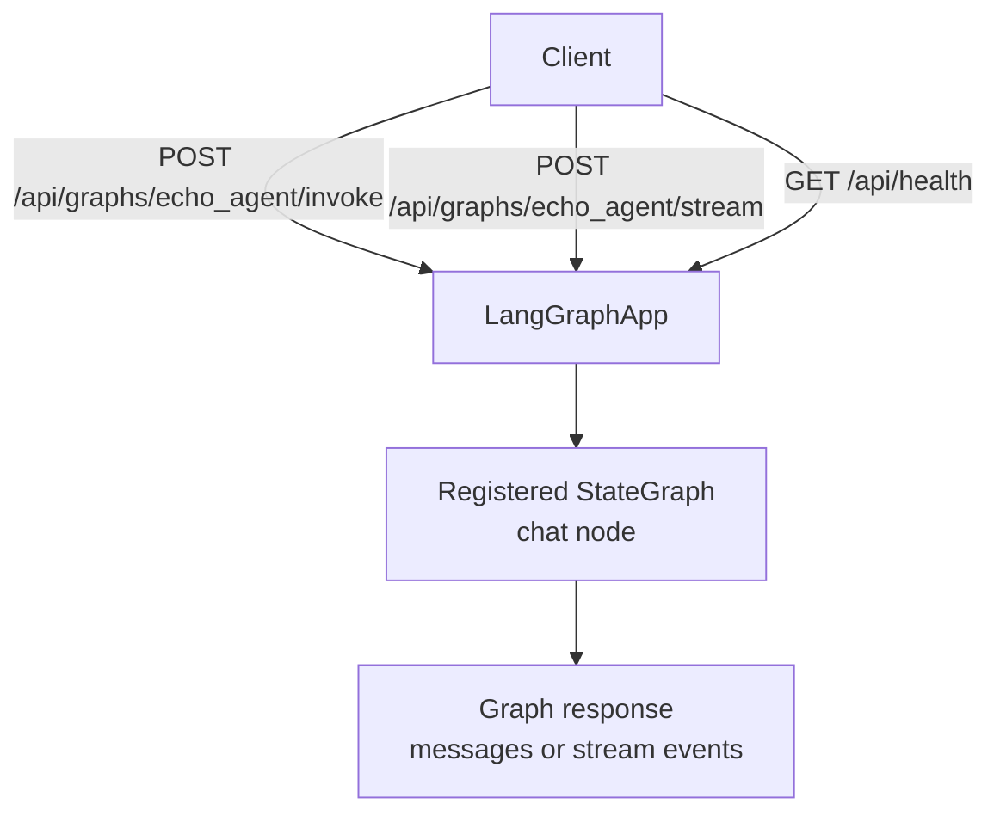
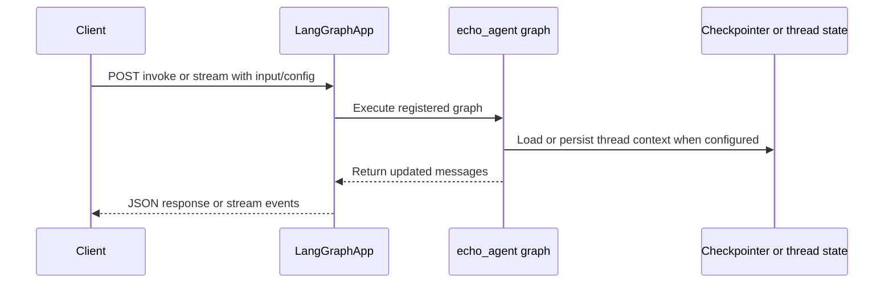

# LangGraph Agent

> **Trigger**: HTTP | **State**: stateful | **Guarantee**: at-most-once | **Difficulty**: advanced

## Overview
This recipe deploys a LangGraph agent as Azure Functions HTTP endpoints using
`azure-functions-langgraph-python`.
You define a graph, register it with `LangGraphApp`, and get invoke, stream,
and health endpoints automatically — no manual route wiring needed.

The example builds a minimal echo agent that mirrors user messages back.
Replace the `chat` node with real LLM calls for production use.

## When to Use
- You have a LangGraph agent and want to serve it over HTTP on Azure Functions.
- You want serverless deployment without LangGraph Platform costs.
- You need invoke and stream endpoints with minimal boilerplate.

## When NOT to Use
- You only need a simple stateless HTTP function without graph execution or streaming endpoints.
- You require durable multi-step workflows better suited to Durable Functions orchestration.
- You cannot externalize conversation state and checkpointing for multi-turn production workloads.

## Architecture


## Prerequisites
- Python 3.10+
- Azure Functions Core Tools v4
- `langgraph` and `azure-functions-langgraph-python` packages
- `typing_extensions` for `TypedDict`

## Project Structure
```text
my-agent/
|- function_app.py
|- host.json
|- local.settings.json.example
|- requirements.txt
`- README.md
```

## Implementation
The full agent fits in a single `function_app.py`.

```python
from langgraph.graph import END, START, StateGraph
from typing_extensions import TypedDict

import azure.functions as func

from azure_functions_langgraph import LangGraphApp


# 1. Define your state
class AgentState(TypedDict):
    messages: list[dict[str, str]]


# 2. Define your nodes
def chat(state: AgentState) -> dict:
    user_msg = state["messages"][-1]["content"]
    return {
        "messages": state["messages"]
        + [{"role": "assistant", "content": f"Echo: {user_msg}"}]
    }


# 3. Build graph
builder = StateGraph(AgentState)
builder.add_node("chat", chat)
builder.add_edge(START, "chat")
builder.add_edge("chat", END)
graph = builder.compile()

# 4. Deploy
app = LangGraphApp(auth_level=func.AuthLevel.ANONYMOUS)
app.register(graph=graph, name="echo_agent")
func_app = app.function_app
```

`LangGraphApp` creates three endpoints per registered graph:

1. `POST /api/graphs/echo_agent/invoke` — synchronous execution
2. `POST /api/graphs/echo_agent/stream` — buffered SSE responses
3. `GET /api/health` — lists registered graphs

Request format for invoke and stream:

```json
{
    "input": {
        "messages": [{"role": "human", "content": "Hello!"}]
    }
}
```

## Behavior


For conversation state, pass a `thread_id` via config:

```json
{
    "input": {
        "messages": [{"role": "human", "content": "Hello!"}]
    },
    "config": {
        "configurable": {"thread_id": "conversation-1"}
    }
}
```

## Run Locally
```bash
cd my-agent
pip install -r requirements.txt
func start
```

## Expected Output
```text
Functions:

    echo_agent_invoke: [POST] http://localhost:7071/api/graphs/echo_agent/invoke
    echo_agent_stream: [POST] http://localhost:7071/api/graphs/echo_agent/stream
    health: [GET] http://localhost:7071/api/health
```

Health check:

```bash
curl -s http://localhost:7071/api/health
```

```json
{"status": "ok", "graphs": [{"name": "echo_agent", "description": null, "has_checkpointer": false}]}
```

Invoke the agent:

```bash
curl -X POST http://localhost:7071/api/graphs/echo_agent/invoke \
  -H "Content-Type: application/json" \
  -d '{"input": {"messages": [{"role": "human", "content": "Hello!"}]}}'
```

```json
{"messages": [{"role": "human", "content": "Hello!"}, {"role": "assistant", "content": "Echo: Hello!"}]}
```

## Production Considerations
- Authentication: set `auth_level=func.AuthLevel.FUNCTION` for production; the default `ANONYMOUS` is for local development only.
- Scaling: Azure Functions scales per-instance; keep graph execution lightweight or offload heavy LLM calls asynchronously.
- State: the echo example is stateless. For multi-turn conversations, compile the graph with a checkpointer (e.g. `AzureBlobCheckpointSaver`).
- Observability: log thread IDs and graph names for tracing conversation flows.
- Timeouts: Azure Functions HTTP triggers have a 230-second timeout; long-running graphs should use the stream endpoint.

## Scaffold Starter
```bash
afs new my-agent --template langgraph
cd my-agent
pip install -e .
func start
```

## Related Links
- [Azure Functions HTTP trigger reference](https://learn.microsoft.com/en-us/azure/azure-functions/functions-bindings-http-webhook-trigger)
