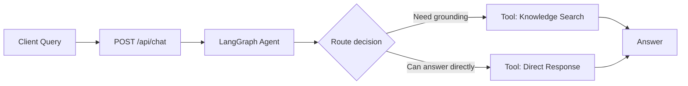
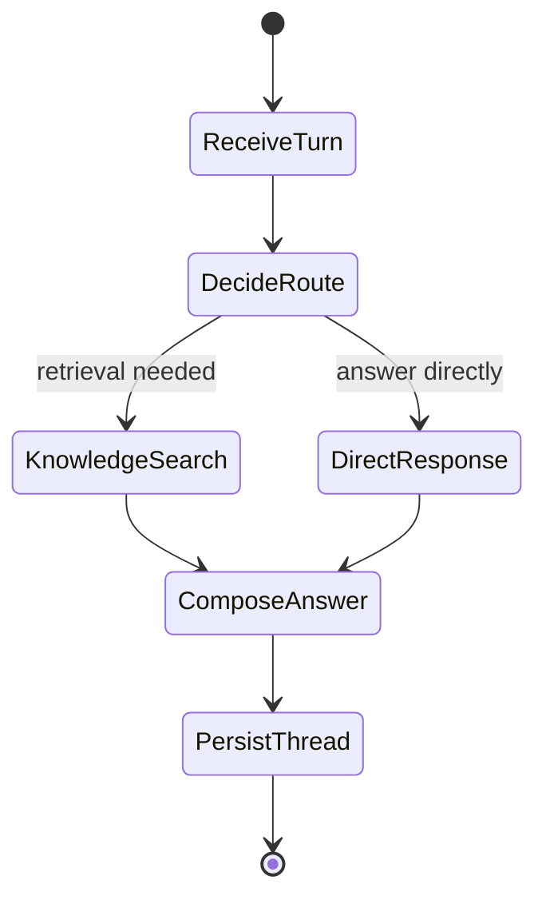

# LangGraph RAG Agent

> **Trigger**: HTTP | **State**: stateful (agent) | **Guarantee**: request-response | **Difficulty**: advanced | **Showcase**: LangGraph + Knowledge

## Overview
This recipe combines `azure-functions-langgraph-python` and `azure-functions-knowledge-python`
to expose a Retrieval-Augmented Generation (RAG) agent on Azure Functions.

The agent keeps per-thread conversation state, routes each turn through a
LangGraph workflow, and decides whether to search a knowledge base or answer
directly. The example keeps the decision policy simple so the integration stays
easy to understand.

## When to Use
- You want a serverless LangGraph agent with a built-in knowledge search tool.
- You need a single HTTP endpoint for multi-turn conversations.
- You want typed request validation, OpenAPI metadata, and structured logs in the same recipe.

## When NOT to Use
- You only need a stateless FAQ endpoint with no conversation memory.
- You need durable, hours-long orchestration better handled by Durable Functions.
- You need production-grade retrieval ranking, persistent checkpoints, and LLM-based tool selection out of the box.

## Architecture


## Prerequisites
- Python 3.10+
- Azure Functions Core Tools v4
- `langgraph`, `azure-functions-langgraph-python`, and `azure-functions-knowledge-python`
- `azure-functions-validation-python`, `azure-functions-openapi-python`, and `azure-functions-logging-python`

## Project Structure
```text
examples/ai-and-agents/langgraph_rag_agent/
|- function_app.py
|- host.json
|- local.settings.json.example
|- requirements.txt
`- README.md
```

## Implementation
The example defines a small LangGraph with three logical steps:

1. Read the latest user turn and decide whether retrieval is needed.
2. Call the knowledge tool when the question looks domain-specific.
3. Otherwise generate a direct response and append it to thread history.

```python
def router_node(state: AgentState) -> dict[str, str]:
    message = state["messages"][-1]["content"].lower()
    keywords = ("search", "docs", "policy", "manual", "knowledge")
    route = "knowledge_search" if any(word in message for word in keywords) else "direct_response"
    return {"route": route}


def knowledge_search_node(state: AgentState) -> dict[str, object]:
    query = state["messages"][-1]["content"]
    citations = search_knowledge(query=query, top_k=state.get("top_k", 3))
    answer = build_rag_answer(query, citations)
    return {
        "route": "knowledge_search",
        "answer": answer,
        "citations": citations,
        "messages": state["messages"] + [{"role": "assistant", "content": answer}],
    }
```

The HTTP handler remains a normal Azure Functions route, so it can use the
usual decorator stack:

```python
@app.route(route="chat", methods=["POST"])
@with_context
@openapi(summary="Chat with LangGraph RAG agent", request_body=ChatRequest, response={200: ChatResponse}, tags=["ai"])
@validate_http(body=ChatRequest, response_model=ChatResponse)
def chat(req: func.HttpRequest, body: ChatRequest) -> func.HttpResponse:
    ...
```

This keeps the integration matrix explicit:

- **LangGraph** for graph definition and routing
- **Knowledge** for retrieval augmentation
- **Validation** for typed request and response contracts
- **OpenAPI** for discoverable API metadata
- **Logging** for per-thread observability

## Behavior
The diagram below shows the runtime interaction between components.



The sample keeps conversation state in memory with `thread_id`.
For production, switch to a persistent checkpointer or external thread store.

## Request Format
```json
{
  "message": "Search the onboarding runbook for password reset steps.",
  "thread_id": "support-42",
  "top_k": 3
}
```

## Run Locally
```bash
cd examples/ai-and-agents/langgraph_rag_agent
pip install -r requirements.txt
cp local.settings.json.example local.settings.json
func start
```

## Expected Output
```text
Functions:

    chat: [POST] http://localhost:7071/api/chat
```

Example call:

```bash
curl -X POST http://localhost:7071/api/chat \
  -H "Content-Type: application/json" \
  -d '{
    "message": "Search the onboarding runbook for password reset steps.",
    "thread_id": "support-42",
    "top_k": 2
  }'
```

Example response:

```json
{
  "thread_id": "support-42",
  "route": "knowledge_search",
  "answer": "I searched the knowledge base and found two relevant passages about password reset steps.",
  "citations": [
    {
      "title": "Onboarding Runbook",
      "snippet": "Reset the password from the Helpdesk portal before reissuing MFA.",
      "source": "mock://onboarding-runbook"
    }
  ],
  "history_length": 2
}
```

## Production Considerations
- **State**: replace in-memory thread storage with a persistent store or LangGraph checkpointer.
- **Retrieval quality**: use embeddings, filtering, and citation formatting that match your corpus.
- **Security**: protect `/chat` with `FUNCTION` or stronger auth before deployment.
- **Observability**: log `thread_id`, route, knowledge hit count, and latency per turn.
- **Timeouts**: keep retrieval bounded and stream long-running model calls when needed.

## Related Links
- [LangGraph](https://learn.microsoft.com/en-us/azure/azure-functions/functions-reference-python)
- [Azure Functions HTTP trigger reference](https://learn.microsoft.com/en-us/azure/azure-functions/functions-bindings-http-webhook-trigger)
