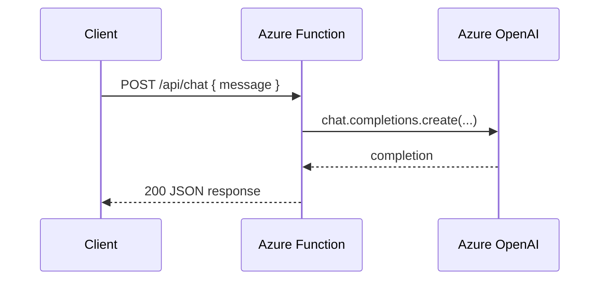

# Azure OpenAI Direct Chat

> **Trigger**: HTTP | **State**: stateless | **Guarantee**: request-response | **Difficulty**: beginner | **Showcase**: Azure OpenAI chat completion

## Overview
This recipe shows the smallest useful Azure Functions AI endpoint: an HTTP trigger
that sends a prompt to Azure OpenAI and returns the model response.

The sample uses the `openai` Python SDK with an Azure endpoint and keeps the
function surface area simple enough for first-time AI integrations. It also uses
`azure-functions-validation`, `azure-functions-openapi`, and
`azure-functions-logging`, so the route follows the cookbook's standard
`@with_context`, `@openapi`, and `@validate_http` decorator stack.

## When to Use
- You want the simplest possible serverless chat completion endpoint.
- You need a thin HTTP facade over Azure OpenAI for internal apps or prototypes.
- You want typed request validation, OpenAPI metadata, and structured logs on day one.

## When NOT to Use
- You need retrieval, tools, or workflow orchestration before generating a response.
- You need streaming tokens instead of a single request-response payload.
- You need multi-turn memory or durable state across requests.

## Architecture
```mermaid
flowchart LR
    A[Client] --> B[HTTP trigger\nPOST /api/chat]
    B --> C[@with_context + @openapi + @validate_http]
    C --> D[Azure OpenAI chat completion]
    D --> E[JSON answer]
    E --> A
```



## Prerequisites
- Python 3.10+
- Azure Functions Core Tools v4
- `openai` SDK
- Azure OpenAI resource with a chat deployment

## Project Structure
```text
examples/ai-and-agents/openai_direct_chat/
|- function_app.py
|- host.json
|- local.settings.json.example
|- requirements.txt
`- README.md
```

## Implementation
The example project is `examples/ai-and-agents/openai_direct_chat/`.

`function_app.py` defines typed request and response models, configures
`azure-functions-logging`, and creates an Azure OpenAI client from environment
variables such as `AZURE_OPENAI_ENDPOINT`, `AZURE_OPENAI_KEY`, and
`AZURE_OPENAI_CHAT_DEPLOYMENT`.

The HTTP route follows the cookbook's standard decorator order for AI APIs:

```python
@app.route(route="chat", methods=["POST"])
@with_context
@openapi(summary="Chat with Azure OpenAI", request_body=ChatRequest, response={200: ChatResponse}, tags=["ai"])
@validate_http(body=ChatRequest, response_model=ChatResponse)
def chat(req: func.HttpRequest, body: ChatRequest) -> func.HttpResponse:
    ...
```

Inside the handler, the function submits the caller message to Azure OpenAI by
using the `openai` SDK's Azure client:

```python
client = AzureOpenAI(
    api_key=os.getenv("AZURE_OPENAI_KEY"),
    api_version="2024-02-01",
    azure_endpoint=os.getenv("AZURE_OPENAI_ENDPOINT"),
)

completion = client.chat.completions.create(
    model=os.getenv("AZURE_OPENAI_CHAT_DEPLOYMENT", "gpt-4o-mini"),
    messages=[
        {"role": "system", "content": body.system_prompt},
        {"role": "user", "content": body.message},
    ],
)
```

The response returns the generated answer plus the deployment name so operators
can correlate requests with logs from `azure-functions-logging`.

## Run Locally
```bash
cd examples/ai-and-agents/openai_direct_chat
pip install -r requirements.txt
cp local.settings.json.example local.settings.json
func start
```

## Expected Output
```text
Functions:

    chat: [POST] http://localhost:7071/api/chat
```

Example request:

```bash
curl -X POST http://localhost:7071/api/chat \
  -H "Content-Type: application/json" \
  -d '{"message": "Give me one sentence about Azure Functions."}'
```

Example response:

```json
{
  "answer": "Azure Functions is a serverless platform for running event-driven code without managing infrastructure.",
  "deployment": "gpt-4o-mini"
}
```

## Production Considerations
- Protect the route with `FUNCTION` or stronger auth before deployment.
- Apply content filtering, rate limiting, and prompt guardrails for public-facing APIs.
- Log latency, deployment name, and token usage with `azure-functions-logging`.
- Move API keys to managed identity plus Azure Key Vault where possible.

## Related Links
- [Azure OpenAI in Azure AI Foundry Models](https://learn.microsoft.com/en-us/azure/ai-foundry/openai/how-to/chatgpt)
- [Azure Functions HTTP trigger reference](https://learn.microsoft.com/en-us/azure/azure-functions/functions-bindings-http-webhook-trigger)
