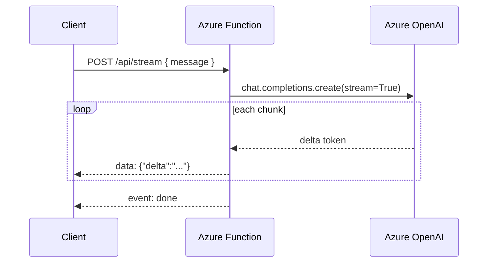

# Streaming AI Response

> **Trigger**: HTTP | **State**: stateless | **Guarantee**: buffered SSE | **Difficulty**: intermediate | **Showcase**: SSE from Azure OpenAI

## Overview
This recipe exposes an HTTP endpoint that returns a buffered Server-Sent Events
(SSE) response produced from Azure OpenAI streaming chat completions.

It keeps the route in the normal cookbook HTTP shape with
`@with_context`, `@openapi`, and `@validate_http`, and uses
`azure-functions-logging` so each streamed request can be correlated in logs.
This is useful when clients need SSE-formatted output from Azure OpenAI.

## When to Use
- You want SSE-formatted output from Azure OpenAI chat completions.
- Your client can parse SSE-formatted text responses.
- You want a simple streaming wrapper over Azure OpenAI without a full agent stack.

## When NOT to Use
- You only need a single JSON response after generation completes.
- Your client platform cannot consume SSE streams.
- You need durable orchestration or background execution instead of a live stream.

## Architecture
```mermaid
flowchart LR
    A[Client] --> B[HTTP trigger\nPOST /api/stream]
    B --> C[@with_context + @openapi + @validate_http]
    C --> D[Azure OpenAI streaming completion]
    D --> E[SSE events]
    E --> A
```



## Prerequisites
- Python 3.10+
- Azure Functions Core Tools v4
- `openai` SDK
- Azure OpenAI resource with a chat deployment

## Project Structure
```text
examples/ai-and-agents/streaming_ai_response/
|- function_app.py
|- host.json
|- local.settings.json.example
|- requirements.txt
`- README.md
```

## Implementation
The example project is `examples/ai-and-agents/streaming_ai_response/`.

`function_app.py` configures `azure-functions-logging`, validates the request
body, and converts Azure OpenAI streaming chunks into SSE frames with the
`text/event-stream` content type.

The route still uses the toolkit decorators, even though the payload format is a
stream rather than a JSON response model:

```python
@app.route(route="stream", methods=["POST"])
@with_context
@openapi(summary="Stream Azure OpenAI response", request_body=StreamRequest, tags=["ai"])
@validate_http(body=StreamRequest)
def stream_chat(req: func.HttpRequest, body: StreamRequest) -> func.HttpResponse:
    ...
```

Inside the handler, the function reads Azure OpenAI streaming events via the
`openai` SDK and writes SSE-formatted output:

```python
for event in client.chat.completions.create(..., stream=True):
    delta = event.choices[0].delta.content
    if delta:
        frames.append(f"data: {json.dumps({'delta': delta})}\n\n")
```

`azure-functions-logging` is useful here because streaming failures often happen
mid-response and need request-level correlation data in logs.

## Run Locally
```bash
cd examples/ai-and-agents/streaming_ai_response
pip install -r requirements.txt
cp local.settings.json.example local.settings.json
func start
```

## Expected Output
```text
Functions:

    stream_chat: [POST] http://localhost:7071/api/stream
```

Example request:

```bash
curl -N -X POST http://localhost:7071/api/stream \
  -H "Content-Type: application/json" \
  -d '{"message": "Explain Azure Functions scaling in three short points."}'
```

Example SSE output:

```text
data: {"delta": "Azure Functions "}

data: {"delta": "scales automatically "}

event: done
data: {"status": "completed"}
```

## Production Considerations
- Note that this example buffers the full response before returning it. For true token-by-token streaming, verify your hosting plan supports HTTP streaming.
- Add timeouts and client disconnect handling around long model responses.
- Record request IDs, deployment names, and stream completion status with `azure-functions-logging`.
- Consider chunked responses for very large outputs if your hosting plan supports HTTP streaming.

## Related Links
- [Azure OpenAI chat completions how-to](https://learn.microsoft.com/en-us/azure/ai-foundry/openai/how-to/chatgpt)
- [Azure Functions HTTP streams](https://learn.microsoft.com/en-us/azure/azure-functions/functions-bindings-http-webhook-trigger?pivots=programming-language-python#http-streams)
