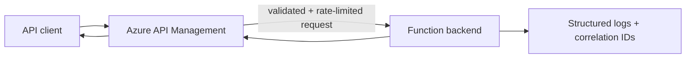
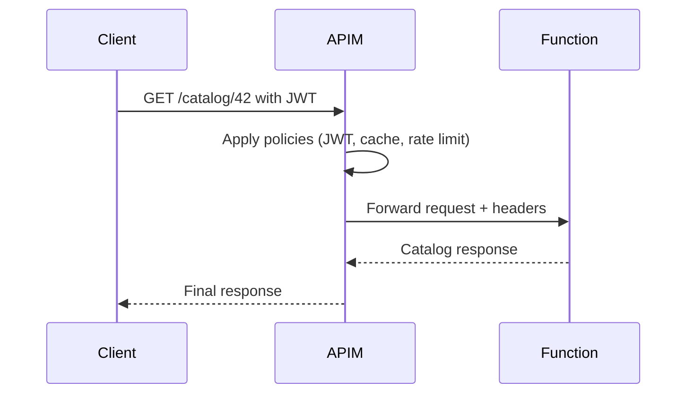

# APIM Function Backend

> **Trigger**: HTTP | **Guarantee**: at-most-once | **Complexity**: intermediate

## Overview
The `examples/apis-and-ingress/apim_function_backend/` recipe treats Azure Functions as an application backend behind Azure API Management. APIM becomes the policy enforcement and ingress layer for rate limiting, JWT validation, response caching, and request enrichment, while the function focuses on business logic.

This split is useful when many APIs need a consistent gateway posture. The sample function reads APIM forwarding headers such as correlation ID and cache status, documents the HTTP contract with `@openapi`, and validates the path contract with `@validate_http`.

## When to Use
- You want Functions behind a centralized API gateway.
- Cross-cutting concerns like JWT checks or quotas belong in APIM policies.
- Backend handlers should stay small and focused on business logic.

## When NOT to Use
- The API is internal-only and does not need gateway features.
- Gateway latency and cost outweigh the benefits.
- You need websocket or streaming behavior that fits another ingress better.

## Architecture


## Behavior


## Implementation
The HTTP handler uses the canonical decorator order and returns a typed response model that includes APIM context headers.

```python
@app.route(route="catalog/{item_id}", methods=["GET"])
@with_context
@openapi(summary="APIM-backed function backend", tags=["Ingress"], route="/api/catalog/{item_id}", method="get")
@validate_http(path=CatalogPath, response_model=CatalogResponse)
def get_catalog_item(req: func.HttpRequest, path: CatalogPath) -> CatalogResponse:
```

The sample logs `routed_by`, `correlation_id`, and `cache_status` through `azure-functions-logging`, which mirrors the metadata APIM often injects during policy execution.

## Run Locally
1. `cd examples/apis-and-ingress/apim_function_backend`
2. Create and activate a virtual environment.
3. `pip install -r requirements.txt`
4. Copy `local.settings.json.example` to `local.settings.json`.
5. Run `func start`.
6. Call `GET /api/catalog/{item_id}` directly or front it with APIM in Azure.

## Expected Output
```text
[Information] Handled APIM backend request item_id=42 routed_by=azure-api-management correlation_id=6d9f cache_status=hit
```

## Production Considerations
- Policy ownership: keep auth, quotas, and cache behavior versioned with APIM config.
- Correlation: propagate APIM correlation IDs into application logs and traces.
- Backend auth: require managed identity or function keys between APIM and Functions when appropriate.
- Caching: cache only safe GET responses and align TTLs with backend freshness.
- Error contracts: standardize APIM-transformed errors so clients see consistent envelopes.

## Related Links
- [Azure API Management overview](https://learn.microsoft.com/en-us/azure/api-management/api-management-key-concepts)
- [Import Azure Functions as APIs in API Management](https://learn.microsoft.com/en-us/azure/api-management/import-function-app-as-api)
- [Policies in Azure API Management](https://learn.microsoft.com/en-us/azure/api-management/api-management-howto-policies)
