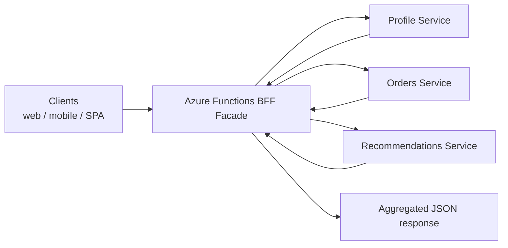
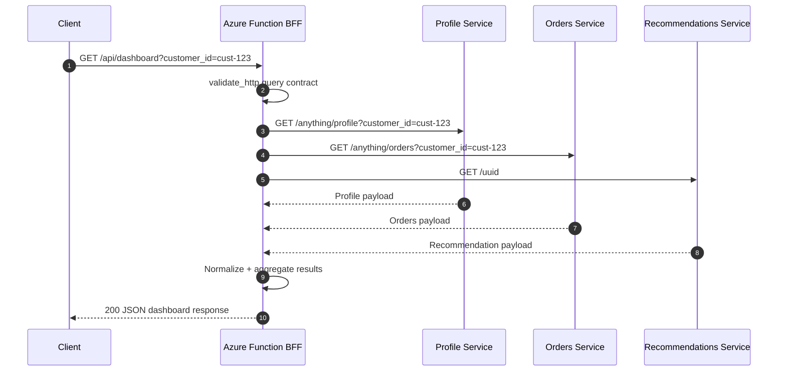

# BFF Facade API

> **Trigger**: HTTP | **State**: stateless | **Guarantee**: request-response | **Difficulty**: intermediate

## Overview
This recipe documents a Backend-for-Frontend (BFF) facade implemented in
`examples/apis-and-ingress/bff_facade_api/`.
The function receives one client request, fans out to multiple backend HTTP services,
normalizes their payloads, and returns one aggregated response shaped for the calling UI.

This pattern is useful when mobile, web, or edge clients would otherwise need to orchestrate
several service calls on their own.
It keeps aggregation, response shaping, and observability at the ingress layer while leaving
backend systems focused on domain-specific responsibilities.

## Integration Matrix
- Validation: `azure-functions-validation-python`
- OpenAPI: `azure-functions-openapi-python`
- Logging: `azure-functions-logging-python`

## When to Use
- You want one client-friendly endpoint instead of several chatty backend calls.
- You need to aggregate data from multiple services into a UI-shaped payload.
- You want consistent validation, API documentation, and logging at the HTTP edge.
- You need a façade layer that can hide backend URL structure and payload differences.

## When NOT to Use
- A single backend already exposes the exact response shape the client needs.
- The aggregation work is long-running and should move to an async workflow.
- You need durable orchestration, retries across many steps, or compensation logic.
- You cannot tolerate added ingress latency from synchronous fan-out calls.

## Architecture


## Behavior


## Prerequisites
- Python 3.10+
- Azure Functions Core Tools v4
- Packages from `requirements.txt`, including `azure-functions`, `azure-functions-validation-python`,
  `azure-functions-openapi-python`, `azure-functions-logging-python`, and `requests`
- Network access to the configured backend URLs, which default to `https://httpbin.org`

## Implementation
The example keeps the ingress logic in one `function_app.py` file and uses the cookbook's canonical
HTTP decorator order:

```python
@app.route(route="dashboard", methods=["GET"], auth_level=func.AuthLevel.ANONYMOUS)
@openapi(
    summary="Aggregate dashboard data",
    response={200: DashboardResponse},
    tags=["apis-and-ingress"],
)
@validate_http(query=DashboardQuery, response_model=DashboardResponse)
def dashboard(req: func.HttpRequest, query: DashboardQuery) -> func.HttpResponse:
    ...
```

Key implementation details:

- **validation**: `@validate_http` enforces the query contract before backend fan-out begins.
- **openapi**: `@openapi` documents the façade endpoint and response model.
- **logging**: structured `logger.info()` calls record which customer was requested and which
  backend sources contributed to the response.
- **aggregation**: helper functions call each backend, parse JSON, and compose a stable payload for
  the frontend.

## Project Structure
```text
examples/apis-and-ingress/bff_facade_api/
├── function_app.py
├── host.json
├── local.settings.json.example
├── README.md
└── requirements.txt
```

## Configuration
Copy `local.settings.json.example` to `local.settings.json` and adjust backend URLs as needed.

| Setting | Purpose |
| --- | --- |
| `AzureWebJobsStorage` | Azure Functions runtime storage |
| `FUNCTIONS_WORKER_RUNTIME` | Must be `python` |
| `PROFILE_SERVICE_URL` | Backend URL for profile data |
| `ORDERS_SERVICE_URL` | Backend URL for order summary data |
| `RECOMMENDATIONS_SERVICE_URL` | Backend URL for recommendation data |
| `BACKEND_TIMEOUT_SECONDS` | Per-backend HTTP timeout |

Example:

```json
{
  "IsEncrypted": false,
  "Values": {
    "AzureWebJobsStorage": "UseDevelopmentStorage=true",
    "FUNCTIONS_WORKER_RUNTIME": "python",
    "PROFILE_SERVICE_URL": "https://httpbin.org/anything/profile",
    "ORDERS_SERVICE_URL": "https://httpbin.org/anything/orders",
    "RECOMMENDATIONS_SERVICE_URL": "https://httpbin.org/uuid",
    "BACKEND_TIMEOUT_SECONDS": "5"
  }
}
```

## Run Locally
```bash
cd examples/apis-and-ingress/bff_facade_api
python3 -m venv .venv
source .venv/bin/activate
pip install -r requirements.txt
cp local.settings.json.example local.settings.json
func start
```

Call the facade endpoint:

```bash
curl "http://localhost:7071/api/dashboard?customer_id=cust-123&include_headers=true"
```

## Expected Output
```text
GET /api/dashboard?customer_id=cust-123
-> 200 {
     "customer_id": "cust-123",
     "profile": {"source": "profile", "path": "/anything/profile", "customer_id": "cust-123"},
     "orders": {"source": "orders", "path": "/anything/orders", "customer_id": "cust-123"},
     "recommendations": {"source": "recommendations", "request_id": "<uuid>"},
     "sources": ["profile", "orders", "recommendations"]
   }
```

## Production Considerations
- **Latency**: synchronous aggregation adds the slowest backend call to end-to-end latency.
- **Resilience**: define timeout, retry, and partial-failure behavior per backend dependency.
- **Caching**: cache stable backend fragments when multiple client screens reuse them.
- **Security**: keep backend URLs and credentials server-side so clients never see internal topology.
- **Observability**: emit correlation IDs and per-backend duration fields for fan-out troubleshooting.
- **Payload ownership**: keep the façade response UI-oriented and avoid leaking raw backend schemas.

## Related Links
- [BFF pattern](https://learn.microsoft.com/en-us/azure/architecture/patterns/backends-for-frontends)
- [Azure Functions HTTP trigger](https://learn.microsoft.com/en-us/azure/azure-functions/functions-bindings-http-webhook-trigger)
- [Hello HTTP Minimal](./hello-http-minimal.md)
