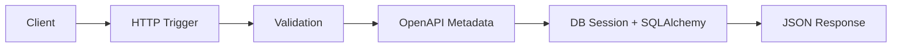
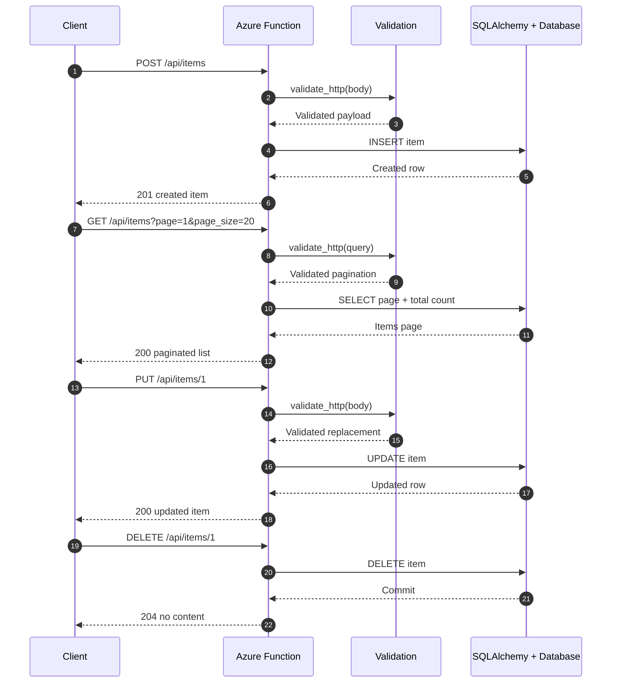

# Full Stack CRUD API

> **Trigger**: HTTP | **State**: stateless | **Guarantee**: request-response | **Difficulty**: intermediate | **Showcase**: Full Toolkit

## Overview
This showcase recipe demonstrates a complete REST CRUD API implemented in
`examples/apis-and-ingress/full_stack_crud_api/`.
It combines the Azure Functions Python DX Toolkit packages into one runnable Azure Functions Python v2 app:
`azure-functions-db-python`, `azure-functions-validation-python`, `azure-functions-openapi-python`,
`azure-functions-logging-python`, plus workflow guidance for `azure-functions-doctor-python` and
`azure-functions-scaffold-python`.

The sample exposes a full `items` resource with `GET` list pagination, `GET` by id, `POST`, `PUT`, and
`DELETE`. It is designed as the canonical “everything working together” ingress sample for toolkit users
who want one recipe that shows request contracts, OpenAPI metadata, structured logs, SQLAlchemy models,
and local project setup in one place.

## Integration Matrix
- **db**: `azure-functions-db-python` manages the shared SQLAlchemy engine lifecycle.
- **validation**: `azure-functions-validation-python` enforces query and body contracts.
- **openapi**: `azure-functions-openapi-python` documents the CRUD endpoints.
- **logging**: `azure-functions-logging-python` emits structured request telemetry.
- **doctor**: `azure-functions-doctor-python` is the recommended pre-deploy health check.
- **scaffold**: `azure-functions-scaffold-python` can generate the starting project structure.

## When to Use
- You want one end-to-end sample that demonstrates the full toolkit on a realistic HTTP API.
- You need synchronous CRUD over relational data with a compact SQLAlchemy model.
- You want decorator-based validation and OpenAPI metadata on the same functions.
- You want structured logs and reusable DB wiring without building a large framework layer.

## When NOT to Use
- You need async workflows, long-running jobs, or eventual consistency instead of request-response APIs.
- You need cursor pagination, partial updates, or advanced domain modeling beyond a compact showcase.
- You need repository abstractions, service layering, or multi-table transactions not necessary for a recipe.
- You are building an event-driven ingestion pipeline rather than an HTTP-facing CRUD API.

## Architecture


## Behavior


## Prerequisites
- Python 3.10+
- Azure Functions Core Tools v4
- A SQLAlchemy-compatible database URL in `DB_URL` (SQLite works locally by default)
- Packages from `requirements.txt`, including `azure-functions-db-python`, `azure-functions-validation-python`,
  `azure-functions-openapi-python`, `azure-functions-logging-python`, `sqlalchemy`, and `pydantic`

## Implementation
The example keeps the app compact while still showing the toolkit integration points clearly.

```python
@app.route(route="items", methods=["GET"])
@openapi(summary="List items with pagination", response={200: ItemListResponse}, tags=["items"])
@validate_http(query=PaginationQuery, response_model=ItemListResponse)
def list_items(req: func.HttpRequest, query: PaginationQuery) -> func.HttpResponse:
    ...
```

Key implementation details:

- **Canonical decorator order**: `@app.route` → `@openapi` → `@validate_http`.
- **db**: `EngineProvider` creates one shared engine and `sessionmaker` provides short-lived sessions.
- **validation**: the list endpoint validates pagination query parameters and the create/update endpoints
  validate JSON bodies before database work starts.
- **openapi**: each CRUD route publishes summary, request-body, and response metadata.
- **logging**: every operation emits structured fields like `operation`, `item_id`, `page`, and `total`.
- **SQLAlchemy model**: `models.py` defines the `Item` entity and timestamp fields.
- **doctor**: run `azure-functions-doctor-python` before shipping to catch missing settings or packaging drift.
- **scaffold**: use `azure-functions-scaffold-python` to bootstrap a new Function App, then apply this recipe.

## CRUD Surface

| Method | Route | Purpose |
| --- | --- | --- |
| `GET` | `/api/items` | List items with `page` and `page_size` |
| `GET` | `/api/items/{id}` | Fetch one item |
| `POST` | `/api/items` | Create an item |
| `PUT` | `/api/items/{id}` | Replace an existing item |
| `DELETE` | `/api/items/{id}` | Delete an item |

## Project Structure
```text
examples/apis-and-ingress/full_stack_crud_api/
├── function_app.py
├── host.json
├── local.settings.json.example
├── models.py
├── README.md
└── requirements.txt
```

## Configuration
Set these values in `local.settings.json`:

| Setting | Purpose |
| --- | --- |
| `AzureWebJobsStorage` | Azure Functions runtime storage |
| `FUNCTIONS_WORKER_RUNTIME` | Must be `python` |
| `DB_URL` | SQLAlchemy connection string for the shared engine |

Example:

```json
{
  "IsEncrypted": false,
  "Values": {
    "AzureWebJobsStorage": "UseDevelopmentStorage=true",
    "FUNCTIONS_WORKER_RUNTIME": "python",
    "DB_URL": "sqlite:///./items.db"
  }
}
```

## Run Locally
```bash
cd examples/apis-and-ingress/full_stack_crud_api
python3 -m venv .venv
source .venv/bin/activate
pip install -r requirements.txt
cp local.settings.json.example local.settings.json
func start
```

The sample auto-creates the `items` table on startup for the default SQLite configuration.

## Expected Output
```text
POST /api/items {"name":"Widget","description":"Starter item","price":9.99}
-> 201 {"id":1,"name":"Widget","description":"Starter item","price":9.99,...}

GET /api/items?page=1&page_size=20
-> 200 {
     "page": 1,
     "page_size": 20,
     "total": 1,
     "items": [
       {"id":1,"name":"Widget","description":"Starter item","price":9.99,...}
     ],
     "next_link": null
   }

DELETE /api/items/1
-> 204
```

## Production Considerations
- **Pagination**: offset pagination is simple and good for admin-style APIs, but cursor pagination is more stable for very large tables.
- **Validation bounds**: keep `page_size` capped and body fields bounded to avoid oversized requests.
- **Error handling**: extend the sample with standardized 404/409/problem-details responses if your API contract requires them.
- **Observability**: keep structured logging fields consistent so CRUD operations are easy to trace in Application Insights.
- **Database portability**: the local SQLite setup maps cleanly to Azure SQL or other SQLAlchemy-supported backends.
- **Project hygiene**: run `azure-functions-doctor-python` during CI or before deployment to detect environment issues early.

## Related Links
- [Azure Functions Python developer guide](https://learn.microsoft.com/en-us/azure/azure-functions/functions-reference-python)
- [Azure Functions HTTP trigger](https://learn.microsoft.com/en-us/azure/azure-functions/functions-bindings-http-webhook-trigger)
- [SQLAlchemy REST Pagination](../data-and-pipelines/sqlalchemy-rest-pagination.md)
