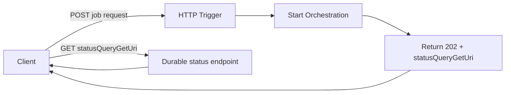
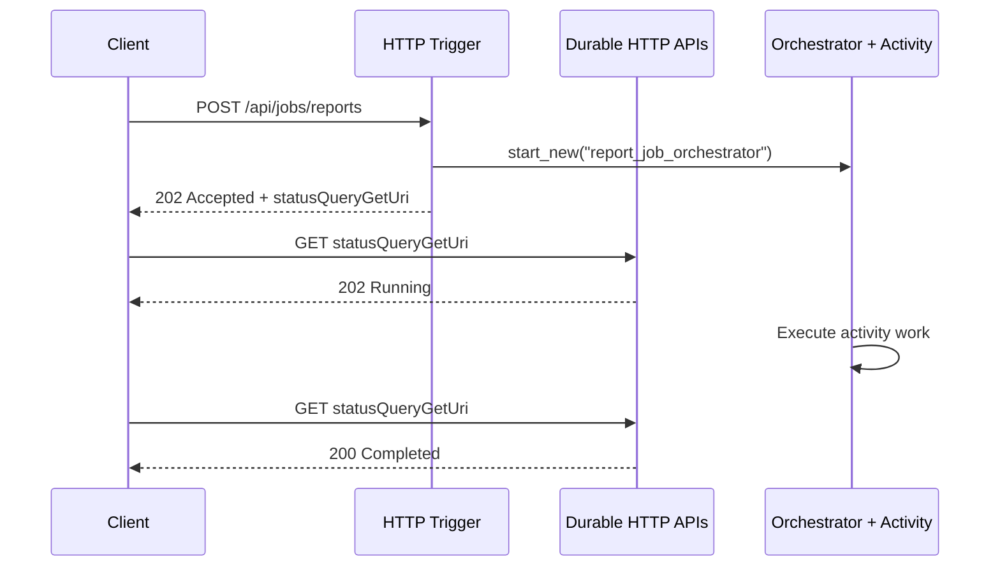

# Async HTTP 202 Polling

> **Trigger**: HTTP | **State**: durable | **Guarantee**: at-least-once | **Difficulty**: intermediate

## Overview
The `examples/async-apis-and-jobs/async_http_polling/` project implements the classic `202 Accepted` + polling pattern with Durable Functions HTTP APIs.
The initial HTTP request validates input, starts a durable orchestration, and returns immediately with `statusQueryGetUri` so the client can poll for completion.

This pattern is useful when work may take seconds or minutes and you do not want the caller to hold an open connection.
The example also shows how to layer `azure-functions-validation-python`, `azure-functions-openapi-python`, and `azure-functions-logging-python` onto the HTTP starter without adding custom polling infrastructure.

## When to Use
- You need a clean HTTP contract for long-running work.
- You want Azure Functions to manage orchestration state and built-in status endpoints.
- You need clients to poll safely instead of waiting on a long request.
- You want a simple upgrade path from request/response APIs to job-style APIs.

## When NOT to Use
- You need a fully synchronous response with the final business result.
- You need push-based completion notifications rather than polling.
- You only need fire-and-forget buffering and a queue is enough.
- You cannot tolerate at-least-once activity execution and have not designed for idempotency.

## Architecture


## Behavior


## Implementation
The starter uses decorator order compatible with the cookbook's HTTP toolkit integration:

```python
@app.route(route="jobs/reports", methods=["POST"], auth_level=func.AuthLevel.ANONYMOUS)
@openapi(
    summary="Start a durable report job",
    description="Accepts work, returns 202, and provides the Durable statusQueryGetUri for polling.",
    request_body=ReportJobRequest,
    response={202: dict[str, Any]},
    tags=["async-jobs"],
)
@validate_http(body=ReportJobRequest)
@app.durable_client_input(client_name="client")
async def start_report_job(req, body, client):
    instance_id = await client.start_new("report_job_orchestrator", None, body.model_dump())
    check_status = client.create_check_status_response(req, instance_id)
    management_payload = json.loads(check_status.get_body().decode("utf-8"))
    return func.HttpResponse(
        body=json.dumps(
            {
                "status": "accepted",
                "instanceId": instance_id,
                "statusQueryGetUri": management_payload["statusQueryGetUri"],
            }
        ),
        status_code=202,
        mimetype="application/json",
        headers=dict(check_status.headers),
    )
```

The orchestrator keeps state durable while the activity performs the actual long-running work:

```python
@app.orchestration_trigger(context_name="context")
def report_job_orchestrator(context):
    job_request = context.get_input() or {}
    result = yield context.call_activity("generate_report_activity", job_request)
    return {"status": "completed", "instanceId": context.instance_id, "result": result}


@app.activity_trigger(input_name="job_request")
def generate_report_activity(job_request):
    time.sleep(int(job_request.get("delay_seconds", 5)))
    return {
        "customerId": job_request["customer_id"],
        "operation": job_request.get("operation", "rebuild-report"),
    }
```

## Project Structure
```text
examples/async-apis-and-jobs/async_http_polling/
|-- function_app.py
|-- host.json
|-- local.settings.json.example
|-- requirements.txt
`-- README.md
```

## Configuration
Copy `local.settings.json.example` to `local.settings.json` and provide a Storage connection string because Durable Functions persists orchestration state in Azure Storage.

```json
{
  "IsEncrypted": false,
  "Values": {
    "AzureWebJobsStorage": "UseDevelopmentStorage=true",
    "FUNCTIONS_WORKER_RUNTIME": "python"
  }
}
```

## Run Locally
```bash
cd examples/async-apis-and-jobs/async_http_polling
pip install -r requirements.txt
cp local.settings.json.example local.settings.json
func start
```

Submit a job:

```bash
curl -X POST "http://localhost:7071/api/jobs/reports" \
  -H "Content-Type: application/json" \
  -d '{"customer_id":"cust-123","operation":"rebuild-report","delay_seconds":5}'
```

Then poll the returned `statusQueryGetUri` until the orchestration finishes.

## Expected Output
```text
POST /api/jobs/reports {"customer_id":"cust-123","operation":"rebuild-report","delay_seconds":5}
-> 202 {"status":"accepted","instanceId":"<instance-id>","statusQueryGetUri":"http://localhost:7071/runtime/webhooks/durabletask/..."}

GET <statusQueryGetUri>
-> 202 {"runtimeStatus":"Running"}

GET <statusQueryGetUri>
-> 200 {"runtimeStatus":"Completed","output":{"status":"completed","instanceId":"<instance-id>","result":{"customerId":"cust-123","operation":"rebuild-report"}}}
```

## Production Considerations
- Idempotency: clients may retry the initial POST, so use request identifiers or deduplication for business-safe replays.
- Polling cadence: document backoff guidance so clients do not hammer the status endpoint.
- Timeouts: durable orchestration avoids request timeouts, but activities still need sensible limits and retry policy design.
- Observability: log `instanceId`, business identifiers, and correlation IDs on both starter and activity functions.
- Security: switch away from anonymous auth in production and avoid exposing management URLs to untrusted parties.
- Cleanup: define retention and purge strategy for completed orchestration history.

## Related Links
- [Async HTTP APIs](https://learn.microsoft.com/en-us/azure/azure-functions/durable/durable-functions-http-features)
- [Durable Functions overview](https://learn.microsoft.com/en-us/azure/azure-functions/durable/durable-functions-overview)
