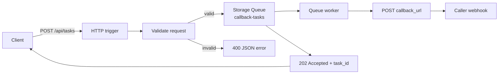
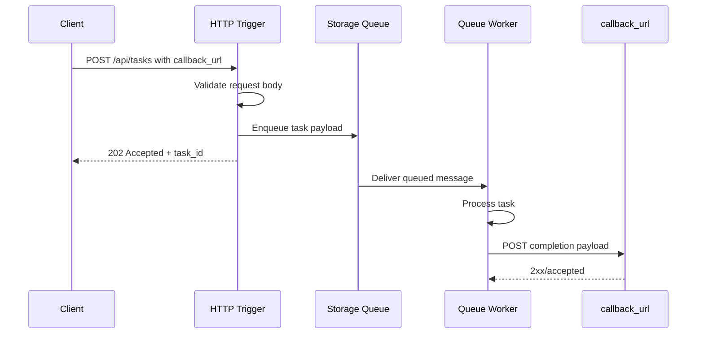

# Callback Completion

> **Trigger**: HTTP + Queue | **State**: stateless | **Guarantee**: at-least-once | **Difficulty**: intermediate

## Overview
The `examples/async-apis-and-jobs/callback_completion/` project accepts work over HTTP, pushes it onto Azure Storage Queue, and returns immediately.
When background processing finishes, the worker sends an HTTP `POST` to the caller-provided `callback_url` with the result payload.

This pattern is useful when callers want push-based completion notifications instead of polling.
The example keeps the Functions app stateless while combining request validation and structured logging without adding OpenAPI metadata.

## Integration Matrix
- Validation: `azure-functions-validation-python`
- Logging: `azure-functions-logging-python`
- OpenAPI: not used

## When to Use
- You need to accept work quickly and complete it asynchronously.
- The caller can expose a webhook endpoint for completion events.
- You want queue buffering between ingress and background processing.
- You want the worker tier to notify another system when work finishes.

## When NOT to Use
- The caller cannot host or receive webhook callbacks.
- You need the final result in the original HTTP response.
- You need durable workflow state, timers, or human interaction steps.
- You cannot tolerate duplicate callback attempts and have not designed idempotent consumers.

## Architecture


## Behavior


## Implementation
The HTTP entrypoint validates the JSON body, generates a `task_id`, logs the accepted request, and enqueues a compact work item.

```python
@app.route(route="tasks", methods=["POST"], auth_level=AUTH_LEVEL_ANONYMOUS)
@validate_http(body=TaskCreateRequest)
@app.queue_output(
    arg_name="task_queue",
    queue_name=TASK_QUEUE_NAME,
    connection="AzureWebJobsStorage",
)
def submit_task(req, body, task_queue):
    task_id = str(uuid4())
    message = {
        "task_id": task_id,
        "task_name": body.task_name,
        "callback_url": body.callback_url,
    }
    task_queue.set(json.dumps(message))
    return _json_response({"status": "accepted", "task_id": task_id}, status_code=202)
```

The queue worker performs the background work and posts the completion payload to the callback URL.

```python
@app.queue_trigger(
    arg_name="msg",
    queue_name=TASK_QUEUE_NAME,
    connection="AzureWebJobsStorage",
)
def process_task(msg):
    payload = _queue_message_to_dict(msg)
    result = _build_result(payload)
    _send_callback(
        payload["callback_url"],
        {"status": "completed", "task_id": payload["task_id"], "result": result},
    )
```

If the callback POST fails, the queue-triggered invocation should fail so Azure Functions can retry according to queue trigger semantics.

## Project Structure
```text
examples/async-apis-and-jobs/callback_completion/
|-- function_app.py
|-- host.json
|-- local.settings.json.example
|-- requirements.txt
`-- README.md
```

## Configuration
Copy `local.settings.json.example` to `local.settings.json` and set `AzureWebJobsStorage`.
Optionally override `TASK_QUEUE_NAME` and `TASK_PROCESSING_DELAY_SECONDS` for local experiments.

## Run Locally
```bash
cd examples/async-apis-and-jobs/callback_completion
pip install -r requirements.txt
cp local.settings.json.example local.settings.json
func start
```

Submit a task:

```bash
curl -X POST "http://localhost:7071/api/tasks" \
  -H "Content-Type: application/json" \
  -d '{"task_name":"generate-report","callback_url":"https://webhook.site/your-id"}'
```

When the worker finishes, it sends a callback similar to:

```json
{
  "status": "completed",
  "task_id": "<task-id>",
  "result": {
    "taskName": "generate-report",
    "artifactUrl": "https://example.invalid/results/<task-id>.json"
  }
}
```

## Expected Output
```text
POST /api/tasks {"task_name":"generate-report","callback_url":"https://webhook.site/your-id"}
-> 202 {"status":"accepted","task_id":"<task-id>","callback_pending":true}

POST https://webhook.site/your-id
-> {"status":"completed","task_id":"<task-id>","result":{"taskName":"generate-report","artifactUrl":"https://example.invalid/results/<task-id>.json"}}
```

## Production Considerations
- Callback idempotency: receivers should deduplicate by `task_id` because queue processing and callback delivery are at-least-once.
- Callback security: sign outbound callbacks or use authenticated webhook endpoints.
- Retry behavior: let transient callback failures raise so the queue trigger can retry.
- Timeouts: set reasonable outbound HTTP timeouts so workers do not hang on slow callback endpoints.
- Observability: log `task_id`, callback host, and delivery status for both submission and completion paths.
- Queue hygiene: monitor poison messages and add dead-letter handling if callback failures persist.

## Related Links
- [Webhooks](https://learn.microsoft.com/en-us/azure/azure-functions/functions-bindings-http-webhook-trigger)
- [Azure Queue Storage trigger for Azure Functions](https://learn.microsoft.com/en-us/azure/azure-functions/functions-bindings-storage-queue-trigger)
