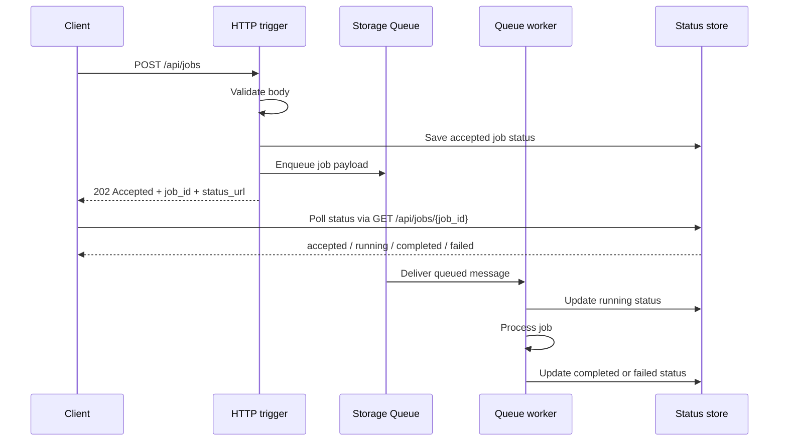

# Queue-Backed Job

> **Trigger**: HTTP + Queue | **State**: stateless | **Guarantee**: at-least-once | **Difficulty**: beginner

## Overview
The `examples/async-apis-and-jobs/queue_backed_job/` project accepts a job over HTTP, validates the payload, writes a status record, and enqueues work to Azure Storage Queue.
A queue-triggered worker processes the message later and updates the job record so clients can poll for status without holding the original request open.

This is the lightweight version of an async job API when Durable Functions would be unnecessary.
It pairs well with `azure-functions-validation-python`, `azure-functions-openapi-python`, and structured logging on the front-door HTTP function.

## When to Use
- You need to return quickly from an HTTP API while background work continues.
- You want simple queue-backed buffering between submission and processing.
- You want a beginner-friendly pattern before moving to orchestration frameworks.
- You need a polling-friendly job contract but can manage status storage yourself.

## When NOT to Use
- You need the final business result in the initial HTTP response.
- You need complex fan-out, timers, human interaction, or durable orchestration state.
- You need exactly-once execution semantics.
- You do not have a place to persist job status for polling.

## Architecture
```mermaid
flowchart LR
    client[Client] -->|POST /api/jobs| api[HTTP trigger]
    api --> validate[Validate request]
    validate --> accepted[Write accepted status]
    accepted --> queue[Storage Queue]
    queue --> worker[Queue worker]
    worker --> store[Status store]
    store -->|GET /api/jobs/{job_id}| client
```

## Behavior


## Implementation
The recipe uses one HTTP POST function, one HTTP GET polling function, and one queue-triggered worker.
The POST handler follows the cookbook's canonical HTTP decorator order:

```python
@app.route(route="jobs", methods=["POST"], auth_level=func.AuthLevel.ANONYMOUS)
@openapi(
    summary="Submit a queue-backed job",
    description="Validates input, writes an accepted status record, and enqueues work for later processing.",
    request_body=JobSubmissionRequest,
    response={202: dict[str, Any]},
    tags=["async-jobs"],
)
@validate_http(body=JobSubmissionRequest)
@app.queue_output(
    arg_name="job_message",
    queue_name="job-requests",
    connection="AzureWebJobsStorage",
)
def submit_job(req, body, job_message):
    ...
```

The worker reads from Storage Queue and updates a status store after each lifecycle step:

```python
@app.queue_trigger(
    arg_name="msg",
    queue_name="job-requests",
    connection="AzureWebJobsStorage",
)
def process_job(msg: func.QueueMessage) -> None:
    payload = json.loads(msg.get_body().decode("utf-8"))
    _write_job_status(payload["job_id"], {"status": "running"})
    _write_job_status(payload["job_id"], {"status": "completed"})
```

## Project Structure
```text
examples/async-apis-and-jobs/queue_backed_job/
|-- function_app.py
|-- host.json
|-- local.settings.json.example
|-- requirements.txt
`-- README.md
```

## Run Locally
```bash
cd examples/async-apis-and-jobs/queue_backed_job
pip install -r requirements.txt
cp local.settings.json.example local.settings.json
func start
```

Submit a job:

```bash
curl -X POST "http://localhost:7071/api/jobs" \
  -H "Content-Type: application/json" \
  -d '{"job_type":"thumbnail","customer_id":"cust-123","payload":{"asset_url":"https://example.invalid/image.png"}}'
```

Poll the returned status URL:

```bash
curl "http://localhost:7071/api/jobs/<job-id>"
```

## Expected Output
```text
POST /api/jobs {"job_type":"thumbnail","customer_id":"cust-123","payload":{"asset_url":"https://example.invalid/image.png"}}
-> 202 {"status":"accepted","job_id":"<job-id>","status_url":"http://localhost:7071/api/jobs/<job-id>"}

GET /api/jobs/<job-id>
-> 200 {"job_id":"<job-id>","status":"running"}

GET /api/jobs/<job-id>
-> 200 {"job_id":"<job-id>","status":"completed","result":{"artifactUrl":"https://example.invalid/jobs/<job-id>.json"}}
```

## Production Considerations
- Idempotency: clients may retry the initial POST, so decide whether to accept caller-supplied idempotency keys.
- Retries: queue delivery is at-least-once, so workers must tolerate duplicate execution.
- Poison handling: configure retry counts and inspect poison queues for repeated failures.
- Status retention: define how long completed job records remain queryable.
- Security: tighten auth level and protect status endpoints if job metadata is sensitive.
- Observability: log `job_id`, `job_type`, `customer_id`, and correlation identifiers in both functions.

## Related Links
- [Queue bindings](https://learn.microsoft.com/en-us/azure/azure-functions/functions-bindings-storage-queue)
- [Async HTTP 202 Polling](./async-http-202-polling.md)
- [Queue Producer](../messaging-and-pubsub/queue-producer.md)
