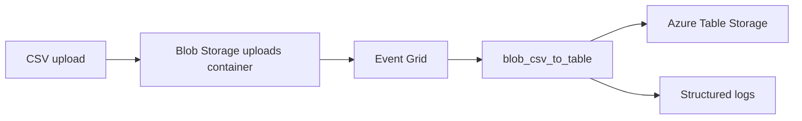
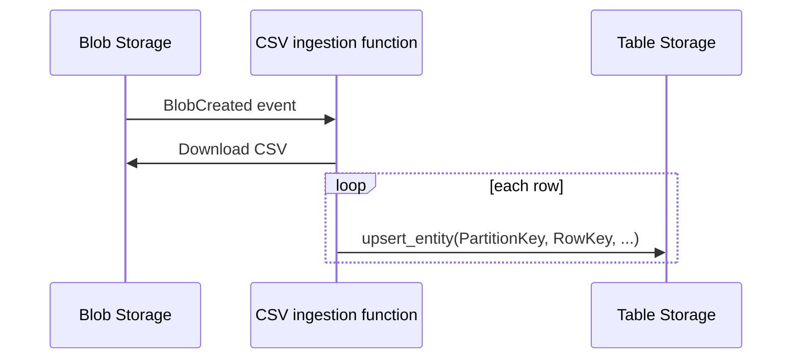

# Blob CSV to Table

> **Trigger**: Event Grid (Blob) | **Guarantee**: at-least-once | **Complexity**: intermediate

## Overview
The `examples/blob-and-file-triggers/blob_csv_to_table/` recipe processes uploaded CSV files and materializes each row into Azure Table Storage. The function wakes up on a blob-created event, downloads the CSV, parses it with `csv.DictReader`, and upserts each row using a deterministic partition and row key strategy.

This pattern is useful for lightweight ingestion pipelines where files arrive in batches but downstream consumers want queryable row-level records. Table Storage keeps the operational footprint small while still giving you a durable projection of the uploaded file.

## When to Use
- CSV files arrive in Blob Storage and need row-level indexing.
- A lightweight NoSQL table is enough for the target shape.
- Reprocessing the same file should overwrite or merge existing rows.

## When NOT to Use
- The file schema is highly variable or nested.
- You need relational constraints or analytical query features.
- A single upload contains more data than one function execution should handle.

## Architecture


## Behavior


## Implementation
The Event Grid handler resolves the uploaded blob and loads its rows into the configured table.

```python
@app.event_grid_trigger(arg_name="event")
@with_context
def blob_csv_to_table(event: func.EventGridEvent) -> None:
    data = event.get_json()
    container, blob_name = _blob_parts(str(data["url"]))
```

The sample uses `BlobClient` to download the CSV, `TableServiceClient` to upsert entities, and `azure-functions-logging` to record row counts and source filenames.

## Run Locally
1. `cd examples/blob-and-file-triggers/blob_csv_to_table`
2. Create and activate a virtual environment.
3. `pip install -r requirements.txt`
4. Copy `local.settings.json.example` to `local.settings.json`.
5. Start Azurite or configure a real storage account with blob and table endpoints.
6. Run `func start` and submit a blob-created Event Grid payload for a CSV upload.

## Expected Output
```text
[Information] Loaded CSV blob into Table Storage blob_name=daily/orders.csv table_name=CsvRows processed=42
```

## Production Considerations
- Schema drift: validate required headers before writing any rows.
- Partitioning: choose partition keys that support your most common queries.
- Replay handling: use deterministic keys so the same file can be reloaded safely.
- File size: split very large CSVs or hand them to a batch pipeline.
- Poison data: move malformed files to a quarantine path for operator review.

## Related Links
- [Azure Functions Event Grid trigger](https://learn.microsoft.com/en-us/azure/azure-functions/functions-bindings-event-grid-trigger)
- [Azure Table Storage for Python](https://learn.microsoft.com/en-us/azure/storage/tables/table-storage-how-to-use-python)
- [Azure Blob Storage for Python](https://learn.microsoft.com/en-us/azure/storage/blobs/storage-quickstart-blobs-python)
