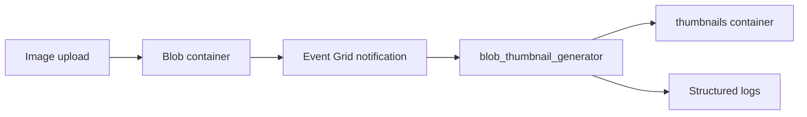
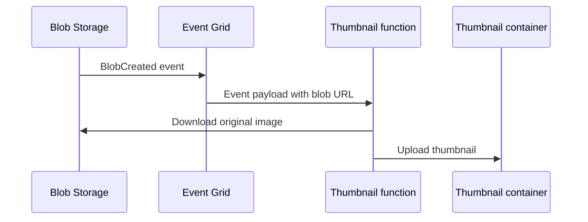

# Blob Thumbnail Generator

> **Trigger**: Event Grid (Blob) | **Guarantee**: at-least-once | **Complexity**: intermediate

## Overview
The `examples/blob-and-file-triggers/blob_thumbnail_generator/` recipe uses Event Grid notifications from Blob Storage to kick off image resizing work. Instead of polling containers, the function reacts to blob-created events, downloads the original image, generates a thumbnail, and uploads the result to a dedicated output container.

This pattern is a strong default for media workflows because it reduces trigger latency and avoids broad storage scans. The underlying event path is still at-least-once, so thumbnail generation must be safe to re-run for the same blob.

## When to Use
- You need near-real-time processing after image uploads.
- The output artifact belongs in Blob Storage alongside the source file.
- The transformation can be repeated safely if the event is replayed.

## When NOT to Use
- You need strict exactly-once image processing.
- The file processing step is too large for a single function execution.
- Blob polling is acceptable and Event Grid plumbing is unnecessary.

## Architecture


## Behavior


## Implementation
The Event Grid trigger resolves the blob URL, downloads the source image, and writes the generated thumbnail to the output container.

```python
@app.event_grid_trigger(arg_name="event")
@with_context
def blob_thumbnail_generator(event: func.EventGridEvent) -> None:
    data = event.get_json()
    blob_url = str(data["url"])
    source_container, blob_name = _blob_parts(blob_url)
```

The helper uses Pillow for the resize step and the Azure Storage Blob SDK for input/output operations. All invocation metadata is logged through `azure-functions-logging`.

## Run Locally
1. `cd examples/blob-and-file-triggers/blob_thumbnail_generator`
2. Create and activate a virtual environment.
3. `pip install -r requirements.txt`
4. Copy `local.settings.json.example` to `local.settings.json`.
5. Start Azurite or configure a real storage account.
6. Run `func start` and post a blob-created Event Grid event for an uploaded image.

## Expected Output
```text
[Information] Generated thumbnail from blob event source_container=images blob_name=products/camera.png output_container=thumbnails
```

## Production Considerations
- Replay safety: overwrite the same thumbnail blob name to keep the handler idempotent.
- Image validation: reject oversized or malformed images before processing.
- Throughput: large images can increase memory pressure on Consumption plans.
- Security: keep both source and output containers private.
- Backfill: use a separate batch path for historical image regeneration.

## Related Links
- [Azure Functions Event Grid trigger](https://learn.microsoft.com/en-us/azure/azure-functions/functions-bindings-event-grid-trigger)
- [Event Grid on Blob Storage](https://learn.microsoft.com/en-us/azure/event-grid/event-schema-blob-storage)
- [Azure Blob Storage for Python](https://learn.microsoft.com/en-us/azure/storage/blobs/storage-quickstart-blobs-python)
