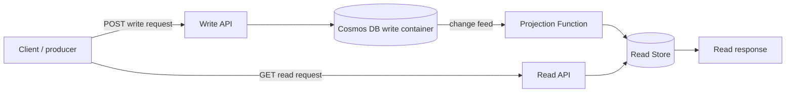
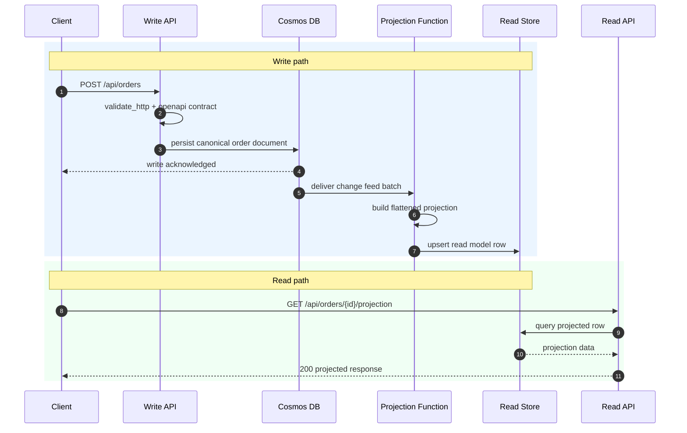

# CQRS Read Projection

> **Trigger**: Cosmos DB Change Feed + HTTP | **State**: stateful | **Guarantee**: at-least-once | **Difficulty**: advanced

## Overview
The `examples/data-and-pipelines/cqrs_read_projection/` sample demonstrates a CQRS pattern where
the write side accepts orders over HTTP and stores the canonical record in Cosmos DB. A Cosmos DB
change feed trigger then builds a projection and materializes a flattened read model into a
SQL-style read store. A separate HTTP endpoint serves read queries from that projection instead of
reading the write container directly.

This split keeps write operations optimized for transactional ingestion while the read side stays
tailored for fast query patterns, reporting, and API-friendly response shapes.

## When to Use
- You want an append/update-friendly write model in Cosmos DB but a query-friendly read model.
- You can tolerate eventual consistency between the write API and the read API.
- You need projections, denormalized summaries, or API-specific views without overloading the write store.
- You want asynchronous projection rebuilds using the Azure Functions change feed trigger.

## When NOT to Use
- Clients must read their own writes immediately with strict consistency.
- Your domain is simple enough that one store and one schema already serve both reads and writes well.
- Operating a second store, projection logic, and replay-safe writes would add more complexity than value.
- The downstream read store cannot safely handle duplicate projection attempts.

## Architecture


## Behavior


## Prerequisites
- Python 3.10+
- Azure Functions Core Tools v4
- Azure Cosmos DB account or emulator
- A read-model database reachable through `azure-functions-db-python` (the sample uses SQLite)
- Azure Storage emulator or account for Functions runtime state

## Implementation
The sample combines all four toolkit integrations in one flow:

- **validation**: `@validate_http` enforces the write request schema.
- **openapi**: `@openapi` documents both the write and read APIs.
- **logging**: `setup_logging`, `with_context`, and structured log fields capture projection activity.
- **db**: `DbBindings` writes and reads the SQL-style projection table.

The write endpoint accepts an order payload and sends the canonical document to Cosmos DB. The
change feed function computes a read model with pre-aggregated fields such as `item_count` and
`total_amount`, then upserts that row into the read store. The read endpoint queries the projected
table and returns the already-shaped view.

```python
@app.route(route="orders", methods=["POST"])
@with_context
@openapi(summary="Create order", request_body=OrderWriteRequest, response={202: OrderAccepted})
@validate_http(body=OrderWriteRequest, response_model=OrderAccepted)
@app.cosmos_db_output(
    arg_name="order_doc",
    database_name="ordersdb",
    container_name="orders",
    connection="CosmosDBConnection",
)
def create_order(req: func.HttpRequest, body: OrderWriteRequest, order_doc: func.Out[str]) -> func.HttpResponse:
    ...


@app.cosmos_db_trigger(
    arg_name="documents",
    database_name="ordersdb",
    container_name="orders",
    connection="CosmosDBConnection",
    lease_container_name="leases",
    create_lease_container_if_not_exists=True,
)
@db.output("projection_out", url="%READ_DB_URL%", table="order_read_models")
def project_order_read_models(documents: list[dict[str, Any]], projection_out: DbOut) -> None:
    ...
```

## Project Structure
```text
examples/data-and-pipelines/cqrs_read_projection/
|-- function_app.py
|-- host.json
|-- local.settings.json.example
|-- README.md
|-- requirements.txt
`-- schema.sql
```

## Config
Set these values in `local.settings.json`:

| Setting | Purpose |
| --- | --- |
| `AzureWebJobsStorage` | Azure Functions runtime storage |
| `FUNCTIONS_WORKER_RUNTIME` | Must be `python` |
| `CosmosDBConnection` | Cosmos DB connection string for the write model and change feed |
| `READ_DB_URL` | SQLAlchemy-compatible connection string for the read store |

Example:

```json
{
  "IsEncrypted": false,
  "Values": {
    "AzureWebJobsStorage": "UseDevelopmentStorage=true",
    "FUNCTIONS_WORKER_RUNTIME": "python",
    "CosmosDBConnection": "AccountEndpoint=https://<account>.documents.azure.com:443/;AccountKey=<key>;",
    "READ_DB_URL": "sqlite:///readmodels.db"
  }
}
```

Initialize the SQLite projection table before starting the Functions host:

```bash
sqlite3 readmodels.db < schema.sql
```

## Run Locally
```bash
cd examples/data-and-pipelines/cqrs_read_projection
python -m venv .venv
source .venv/bin/activate
pip install -r requirements.txt
cp local.settings.json.example local.settings.json
sqlite3 readmodels.db < schema.sql
func start
```

Then:

1. `POST /api/orders` to write the canonical order into Cosmos DB.
2. Wait for the change feed projection to populate the read store.
3. `GET /api/orders/<order-id>/projection` to fetch the materialized view.

## Expected Output
```text
POST /api/orders
-> 202 {"id":"order-1001","status":"accepted"}

[Information] Projecting 1 changed document(s).
[Information] Upserted order read model. order_id=order-1001 customer_id=cust-42 total_amount=45.5

GET /api/orders/order-1001/projection
-> 200 {
     "id": "order-1001",
     "customer_id": "cust-42",
     "status": "confirmed",
     "item_count": 2,
     "total_amount": 45.5,
     "updated_at": "2026-04-17T00:00:00Z"
   }
```

## Production Considerations
- **Idempotency**: change feed delivery is at-least-once, so projection writes must be safe to replay.
- **Projection lag**: monitor the delay between the write container timestamp and the read model update timestamp.
- **Schema evolution**: version both write documents and read projections so rebuilds stay controlled.
- **Backfills**: keep a repeatable process for replaying Cosmos DB data into a rebuilt read store.
- **Observability**: log projection batch size, row upserts, and read-model misses with correlation IDs.
- **Data ownership**: treat the read model as disposable and rebuildable from the write model.

## Related Links
- [CQRS pattern](https://learn.microsoft.com/en-us/azure/architecture/patterns/cqrs)
- [Change Feed Processor](./change-feed-processor.md)
- [DB Input and Output Bindings](./db-input-output.md)
