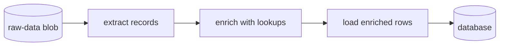
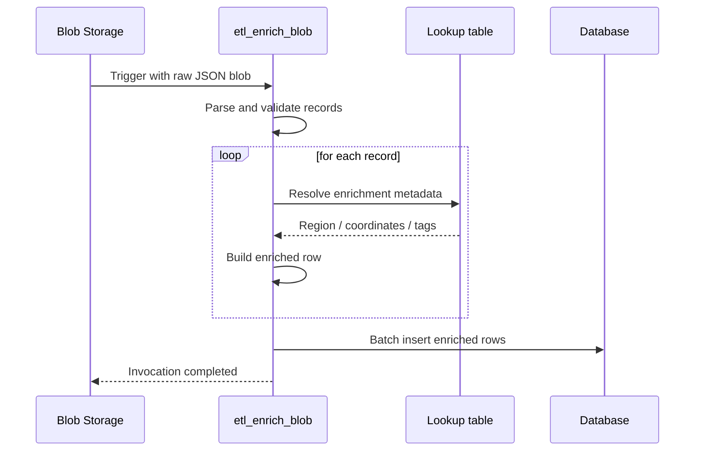

# ETL Enrichment

> **Trigger**: Blob / Timer | **State**: stateless | **Guarantee**: at-least-once | **Difficulty**: intermediate

## Overview
The `examples/data-and-pipelines/etl_enrichment/` sample shows an Extract-Transform-Load workflow
with an enrichment step in the middle. A blob-triggered Azure Function reads raw JSON records,
normalizes core fields, enriches each record with reference data such as region metadata or
geocoding-like lookups, and then writes the enriched rows to a database through
`azure-functions-db-python`.

This pattern is useful when source data arrives incomplete and must be joined with external
context before it becomes analytically useful. The enrichment logic stays deterministic and
replay-safe so the pipeline can tolerate retried blob executions.

## When to Use
- Raw files arrive in blob storage and must be processed asynchronously.
- Source records need reference-data lookups before loading into a reporting or serving store.
- You want a simple, function-based ETL stage without provisioning a larger orchestration system.

## When NOT to Use
- You need exactly-once delivery and the destination cannot deduplicate replayed writes.
- Enrichment depends on slow, high-latency external APIs that should be decoupled behind queues.
- The workflow requires cross-file transactions or long-running stateful orchestration.

## Architecture


## Behavior


## Prerequisites
- Python 3.10+
- Azure Functions Core Tools v4
- Azurite or an Azure Storage account for the blob trigger
- A database reachable through `DB_URL`
- `azure-functions-db-python` and `azure-functions-logging-python`

## Project Structure
```text
examples/data-and-pipelines/etl_enrichment/
|-- function_app.py
|-- host.json
|-- local.settings.json.example
|-- requirements.txt
`-- README.md
```

## Implementation
The blob trigger reads a JSON array from the `raw-data` container and logs the extraction stage.
Each input record is normalized into a consistent shape before enrichment.

```python
@app.blob_trigger(
    arg_name="myblob",
    path="raw-data/{name}",
    connection="AzureWebJobsStorage",
)
@db.output("out", url="%DB_URL%", table="enriched_customers")
def etl_enrich_blob(myblob: func.InputStream, out: DbOut) -> None:
    raw_records = _load_raw_records(myblob.read())
    enriched_rows = [_enrich_record(record) for record in raw_records]
    out.set(enriched_rows)
```

The enrichment stage can call lookup helpers, cached reference tables, or SDK clients. In this
example it derives region details and pseudo-geocode data from deterministic local mappings so the
pipeline stays replay-safe.

```python
def _enrich_record(record: RawRecord) -> dict[str, str | float]:
    region = REGION_LOOKUPS.get(record["country_code"], FALLBACK_LOOKUP)
    return {
        "customer_id": record["customer_id"],
        "city": record["city"],
        "country_code": record["country_code"],
        "region": region["region"],
        "market_tier": region["market_tier"],
        "latitude": region["latitude"],
        "longitude": region["longitude"],
    }
```

## Run Locally
```bash
cd examples/data-and-pipelines/etl_enrichment
python -m venv .venv
source .venv/bin/activate
pip install -r requirements.txt
cp local.settings.json.example local.settings.json
func start
```

Upload a blob such as `customers-2026-04-17.json` to the `raw-data` container:

```json
[
  {"customer_id": "cust-1001", "city": "Seattle", "country_code": "US"},
  {"customer_id": "cust-1002", "city": "Berlin", "country_code": "DE"}
]
```

## Expected Output
```text
[Information] ETL extraction started blob=raw-data/customers-2026-04-17.json size_bytes=126
[Information] ETL enrichment completed blob=raw-data/customers-2026-04-17.json input_count=2 enriched_count=2
[Information] Loaded enriched rows target_table=enriched_customers count=2
```

## Production Considerations
- Scaling: blob-trigger concurrency affects downstream database pressure; size connection pools accordingly.
- Retries: blob-trigger replays can reinsert rows, so use upserts or natural keys in the destination.
- Idempotency: include source blob name, record key, or version fields to support deduplication.
- Observability: emit per-stage counts, enrichment misses, and load latency with structured logs.
- Reference data: cache slow lookups or materialize them locally when latency or rate limits matter.

## Related Links
- [File Processing Pipeline](./file-processing-pipeline.md)
- [DB Input and Output Bindings](./db-input-output.md)
- [Azure Functions scenarios](https://learn.microsoft.com/en-us/azure/azure-functions/functions-overview#scenarios)
- [Azure Blob storage trigger for Azure Functions](https://learn.microsoft.com/en-us/azure/azure-functions/functions-bindings-storage-blob-trigger)
