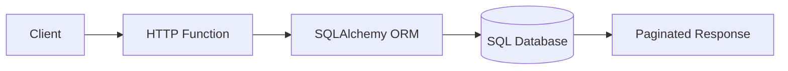
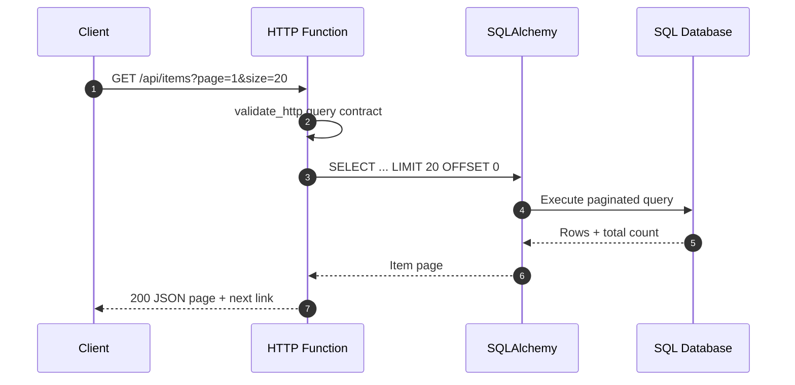

# SQLAlchemy REST Pagination

> **Trigger**: HTTP | **State**: stateless | **Guarantee**: request-response | **Difficulty**: intermediate

## Overview
This recipe demonstrates a REST API built on Azure Functions Python v2 with a SQLAlchemy ORM model,
page-based pagination, and `azure-functions-db-python` connection management.

The sample exposes `POST /items` to create rows and `GET /items` to return paginated results.
It uses SQLAlchemy for the `Item` entity and `LIMIT`/`OFFSET` pagination, while still aligning with
the toolkit integration matrix: **db** for shared database connectivity, **validation** for request
contracts, **openapi** for endpoint metadata, and **logging** for structured telemetry.

For simple page-number APIs, offset pagination is easy to reason about and works well with admin
dashboards and moderate datasets. For very large or frequently mutating datasets, move the same
shape toward cursor-based pagination to avoid unstable page boundaries.

## When to Use
- You need a straightforward HTTP API over relational data backed by SQLAlchemy models.
- Clients want predictable page-number pagination such as `page=1&page_size=20`.
- You want to standardize validation, OpenAPI metadata, logging, and DB wiring in one Azure Functions app.
- You want a sample that runs locally with SQLite but maps cleanly to Azure SQL or other SQLAlchemy-supported databases.

## When NOT to Use
- You need strict keyset/cursor pagination for very large tables or highly concurrent write workloads.
- You require multi-step distributed transactions or long-running workflows.
- Your access pattern is event-driven ingestion instead of synchronous request-response APIs.
- You need advanced ORM relationships, lazy-loading behavior, or repository layers beyond a compact recipe sample.

## Architecture


## Behavior


## Prerequisites
- Python 3.10+
- Azure Functions Core Tools v4
- A SQLAlchemy-compatible database URL in `DB_URL`
- Packages from `requirements.txt`, including `azure-functions-db-python`, `azure-functions-validation-python`, `azure-functions-openapi-python`, `azure-functions-logging-python`, and `sqlalchemy`

## Implementation
The example in `examples/data-and-pipelines/sqlalchemy_rest_pagination/` keeps the recipe compact:

- **db**: `EngineProvider` from `azure-functions-db-python` shares engine lifecycle and connection configuration.
- **validation**: `@validate_http` validates `page`, `page_size`, and POST bodies.
- **openapi**: `@openapi` documents both endpoints.
- **logging**: `setup_logging()` and structured `logger.info()` calls capture request behavior.
- **SQLAlchemy ORM**: a declarative `Item` model defines the table shape and powers paginated queries.

```python
@app.route(route="items", methods=["GET"])
@openapi(summary="List items with pagination", response={200: PaginatedItemsResponse}, tags=["items"])
@validate_http(query=PaginationQuery, response_model=PaginatedItemsResponse)
def list_items(req: func.HttpRequest, query: PaginationQuery) -> func.HttpResponse:
    offset = (query.page - 1) * query.page_size
    rows = session.scalars(
        select(Item).order_by(Item.id.asc()).offset(offset).limit(query.page_size)
    ).all()
    ...
```

The POST endpoint inserts a new `Item`, commits the transaction, and returns the created record.
The GET endpoint calculates `total`, applies `LIMIT/OFFSET`, and emits a `next_link` when more rows remain.

## Project Structure
```text
examples/data-and-pipelines/sqlalchemy_rest_pagination/
|-- function_app.py
|-- host.json
|-- local.settings.json.example
|-- models.py
|-- README.md
`-- requirements.txt
```

## Config
Set these values in `local.settings.json`:

| Setting | Purpose |
| --- | --- |
| `AzureWebJobsStorage` | Azure Functions runtime storage |
| `FUNCTIONS_WORKER_RUNTIME` | Must be `python` |
| `DB_URL` | SQLAlchemy connection string used by the shared engine |

Example:

```json
{
  "IsEncrypted": false,
  "Values": {
    "AzureWebJobsStorage": "UseDevelopmentStorage=true",
    "FUNCTIONS_WORKER_RUNTIME": "python",
    "DB_URL": "sqlite:///./items.db"
  }
}
```

## Run Locally
```bash
cd examples/data-and-pipelines/sqlalchemy_rest_pagination
python3 -m venv .venv
source .venv/bin/activate
pip install -r requirements.txt
cp local.settings.json.example local.settings.json
func start
```

The sample auto-creates the `items` table on startup when it connects to the local SQLite database.

## Expected Output
```text
POST /api/items {"name":"Widget","price":9.99}
-> 201 {"id":1,"name":"Widget","price":9.99,"created_at":"2026-04-17T00:00:00+00:00"}

GET /api/items?page=1&page_size=20
-> 200 {
     "page": 1,
     "page_size": 20,
     "total": 1,
     "items": [
       {"id":1,"name":"Widget","price":9.99,"created_at":"2026-04-17T00:00:00+00:00"}
     ],
     "next_link": null
   }
```

## Production Considerations
- **Pagination strategy**: page-number pagination is simple, but cursor pagination is more stable for large or rapidly changing tables.
- **Ordering**: always paginate on a deterministic sort key such as `id` or `created_at`.
- **Bounds**: cap `page_size` to prevent oversized queries and memory spikes.
- **Connection reuse**: keep one shared engine provider per function app instance to reduce connection churn.
- **Indexes**: index the columns used for ordering and cursor boundaries.
- **Observability**: log page, size, returned row count, and total count for troubleshooting.

## Related Links
- [Azure SQL bindings for Azure Functions](https://learn.microsoft.com/en-us/azure/azure-functions/functions-bindings-azure-sql)
- [DB Input and Output Bindings](./db-input-output.md)
