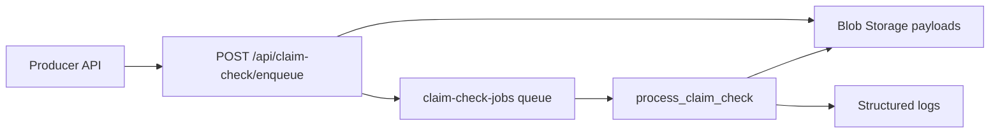
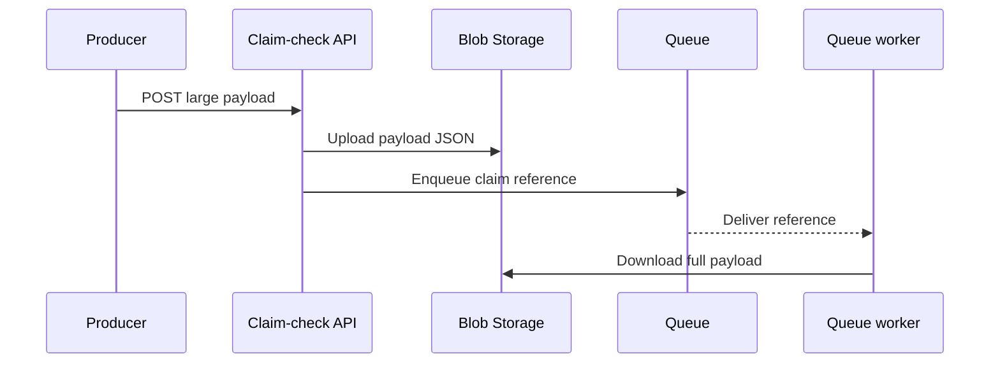

# Claim Check Pattern

> **Trigger**: HTTP + Queue | **Guarantee**: at-least-once | **Complexity**: intermediate

## Overview
The `examples/messaging-and-pubsub/claim_check_pattern/` recipe implements the claim check pattern for large messages. Instead of sending a heavy payload through a queue, the function stores the payload in Blob Storage and sends only a lightweight reference through the queue.

This keeps queue messages small, reduces transport pressure, and lets downstream workers fetch the full body only when they are ready to process it. The pattern is especially useful for large JSON documents, attachments, or compliance-heavy event payloads.

## When to Use
- Queue or Service Bus message sizes are too small for the full payload.
- Workers do not need the large body until processing time.
- Storing payloads in Blob Storage is acceptable for the business flow.

## When NOT to Use
- The payload is already small enough for direct transport.
- Exactly-once processing is required without idempotent blob handling.
- The payload must not be persisted outside the broker.

## Architecture


## Behavior


## Implementation
The ingress route uses `@openapi`, `@validate_http`, and queue output binding to create the claim reference after uploading the full body to Blob Storage.

```python
@app.route(route="claim-check/enqueue", methods=["POST"])
@with_context
@openapi(summary="Create claim check", tags=["Messaging"], route="/api/claim-check/enqueue", method="post")
@validate_http(body=ClaimCheckRequest)
@app.queue_output(arg_name="claim_queue", queue_name="claim-check-jobs", connection="AzureWebJobsStorage")
def enqueue_claim_check(req: func.HttpRequest, body: ClaimCheckRequest, claim_queue: func.Out[str]) -> func.HttpResponse:
```

The queue-triggered worker downloads the referenced blob and logs the recovered payload metadata with `azure-functions-logging`.

## Run Locally
1. `cd examples/messaging-and-pubsub/claim_check_pattern`
2. Create and activate a virtual environment.
3. `pip install -r requirements.txt`
4. Copy `local.settings.json.example` to `local.settings.json`.
5. Start Azurite or configure a real storage account.
6. Run `func start`, POST a large payload, and inspect the queue worker logs.

## Expected Output
```text
[Information] Stored claim-check payload and queued reference claim_id=9c1e payload_type=invoice.import container=claim-check-payloads
[Information] Processed claim-check payload claim_id=9c1e payload_type=invoice.import payload_keys=['items', 'source', 'tenant']
```

## Production Considerations
- Lifecycle: add blob retention or cleanup after successful processing.
- Security: encrypt payload blobs and restrict access tightly.
- Idempotency: use stable claim IDs when retries can recreate the same claim.
- Observability: log both claim IDs and blob names for debugging.
- Broker choice: the same pattern applies to Service Bus when queue features are insufficient.

## Related Links
- [Reliable event processing patterns](https://learn.microsoft.com/en-us/azure/architecture/patterns/claim-check)
- [Queue storage bindings for Azure Functions](https://learn.microsoft.com/en-us/azure/azure-functions/functions-bindings-storage-queue)
- [Azure Blob Storage for Python](https://learn.microsoft.com/en-us/azure/storage/blobs/storage-quickstart-blobs-python)
