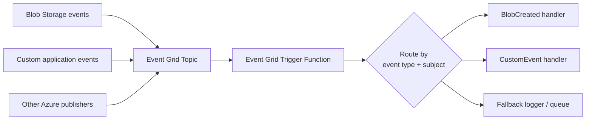
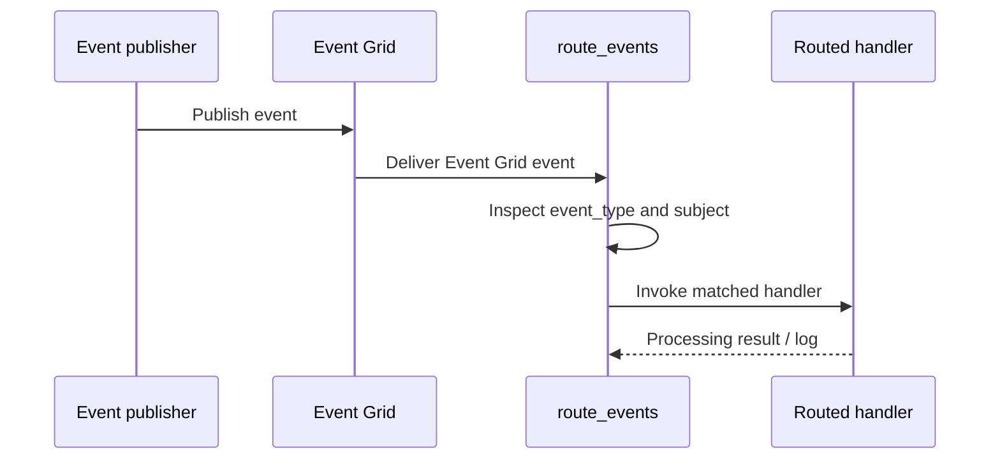

# Event Grid Event Router

> **Trigger**: Event Grid | **State**: stateless | **Guarantee**: at-least-once | **Difficulty**: intermediate

## Overview
The `examples/messaging-and-pubsub/eventgrid_router/` project shows an Event Grid-triggered Azure Function that inspects
incoming events and routes them to different handlers based on `event_type` plus lightweight `subject` filtering.

This pattern is useful when multiple producers publish to the same Event Grid topic and you want one function entry point
to normalize logging, apply routing rules, and delegate event-specific work without exposing an HTTP API surface.

## When to Use
- You receive multiple event types through a shared Event Grid topic or subscription.
- You want a single trigger function to centralize routing and structured logging.
- You want simple event-type and subject-prefix dispatch before calling downstream handlers.

## When NOT to Use
- You need long-running orchestration or stateful correlation across events.
- You need strict exactly-once processing guarantees.
- You have complex broker requirements better served by Service Bus topics, sessions, or dead-letter flows.

## Architecture


## Behavior


## Implementation
The function uses `@app.event_grid_trigger(...)` and a small routing table.

### Prerequisites
- Python 3.10+
- Azure Functions Core Tools v4
- An Event Grid topic or Azure service publishing into Event Grid
- Optional: `azure-functions-logging-python` for structured JSON logs

### Project Structure
```text
examples/messaging-and-pubsub/eventgrid_router/
|-- function_app.py
|-- host.json
|-- local.settings.json.example
|-- requirements.txt
`-- README.md
```

The entry point configures logging, declares the Event Grid trigger, then resolves a route key from event metadata.

```python
@app.event_grid_trigger(arg_name="event")
@with_context
def route_events(event: func.EventGridEvent) -> None:
    payload = event.get_json() or {}
    route_key = _resolve_route(event.event_type, event.subject)
    handler = ROUTES.get(route_key, handle_unknown_event)

    logger.info(
        "Routing Event Grid event",
        extra={
            "event_id": event.id,
            "event_type": event.event_type,
            "subject": event.subject,
            "route_key": route_key,
        },
    )
    handler(event, payload)
```

One route handles blob creation events only when they arrive from the configured container path.

```python
def _resolve_route(event_type: str, subject: str) -> str:
    if event_type == "Microsoft.Storage.BlobCreated" and "/containers/inbound-blobs/" in subject:
        return "blob_created"
    if event_type == "Contoso.Items.ItemArchived" and subject.startswith("/tenants/premium/"):
        return "premium_item_archived"
    return "fallback"
```

This keeps the trigger small while making handler behavior explicit and easy to extend.

## Configuration
Set these values in `local.settings.json` when running locally:

| Variable | Purpose |
|----------|---------|
| `AzureWebJobsStorage` | Local/runtime storage used by Azure Functions Core Tools |
| `FUNCTIONS_WORKER_RUNTIME` | Must be `python` |

## Run Locally
```bash
cd examples/messaging-and-pubsub/eventgrid_router
python -m venv .venv
source .venv/bin/activate
pip install -r requirements.txt
cp local.settings.json.example local.settings.json
func start
```

Then post a sample Event Grid payload to the local webhook endpoint:

```bash
curl -X POST "http://localhost:7071/runtime/webhooks/EventGrid?functionName=route_events" \
  -H "Content-Type: application/json" \
  -d '[{"id":"1","topic":"demo","subject":"/blobServices/default/containers/inbound-blobs/blobs/report.csv","eventType":"Microsoft.Storage.BlobCreated","eventTime":"2026-01-01T00:00:00Z","data":{"url":"https://example.blob.core.windows.net/inbound-blobs/report.csv"},"dataVersion":"1.0","metadataVersion":"1"}]'
```

## Expected Output
```text
Routing Event Grid event {"event_type":"Microsoft.Storage.BlobCreated","route_key":"blob_created",...}
Handled blob created event {"blob_url":"https://example.blob.core.windows.net/inbound-blobs/report.csv",...}
```

For unmatched events, the fallback handler logs that no explicit route was found so you can decide whether to ignore,
store, or forward them elsewhere.

## Production Considerations
- Idempotency: Event Grid is at-least-once, so downstream handlers should tolerate duplicate delivery.
- Filtering: prefer Event Grid subscription filters for coarse routing and keep in-function routing for fine-grained logic.
- Observability: log `event_id`, `event_type`, `subject`, and chosen route for traceability.
- Failure handling: avoid partial side effects inside handlers unless each action is independently idempotent.
- Throughput: split into multiple subscriptions/functions if routing rules or load become too large for one trigger.

## Related Links
- [Event Grid trigger](https://learn.microsoft.com/en-us/azure/azure-functions/functions-bindings-event-grid-trigger)
- [Blob Event Grid Trigger Example](../blob-and-file-triggers/blob-eventgrid-trigger.md)
- [Retry and Idempotency](../reliability/retry-and-idempotency.md)
