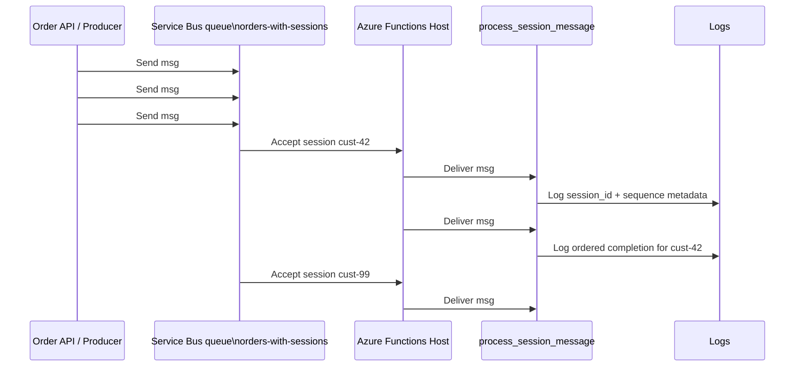
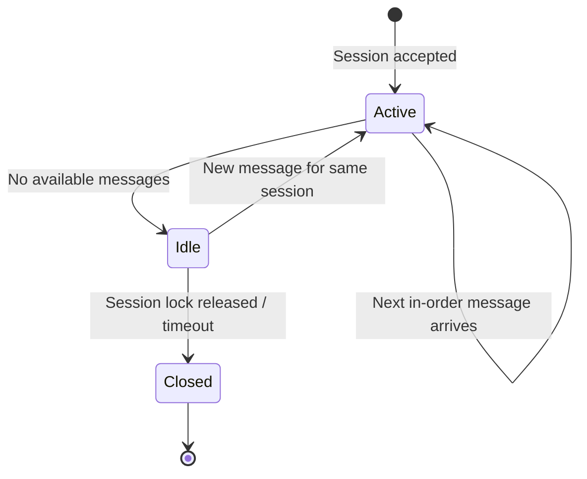

# Service Bus Sessions

> **Trigger**: Service Bus (sessions) | **State**: stateless | **Guarantee**: at-least-once + ordered | **Difficulty**: intermediate

## Overview
The `examples/messaging-and-pubsub/servicebus_sessions/` recipe demonstrates ordered, grouped message processing with
Azure Service Bus sessions. Messages that share the same `session_id` are delivered in order to one active session
receiver, which makes this pattern a strong fit for workflows such as per-customer order processing, claim handling,
or account-level event sequencing.

This recipe uses a queue trigger with `is_sessions_enabled=True`, extracts the `session_id` from each
`ServiceBusMessage`, and emits structured logs through `azure-functions-logging-python` so operators can trace ordered work
per session.

## When to Use
- Events must be processed in FIFO order within a business key such as `customer_id`, `order_id`, or `tenant_id`.
- You need independent ordered streams without serializing the entire queue.
- You want Service Bus to manage session ownership and delivery ordering for grouped messages.

## When NOT to Use
- Messages are independent and parallel throughput matters more than per-key ordering.
- Global ordering across all messages is required; sessions only preserve order within each session.
- Long-running work would keep sessions locked too long without a clear need for ordered handling.

## Architecture


## Behavior


## Implementation
The function binds to a session-enabled queue and reads the message body plus transport metadata that helps explain
ordering behavior:

```python
@app.service_bus_queue_trigger(
    arg_name="msg",
    queue_name="orders-with-sessions",
    connection="ServiceBusConnection",
    is_sessions_enabled=True,
)
def process_session_message(msg: func.ServiceBusMessage) -> None:
    session_id = getattr(msg, "session_id", None)
```

The sample expects each message body to be JSON with order-processing fields. The handler logs `session_id`,
`message_id`, `delivery_count`, and business fields such as `customer_id` and `step`, giving operators enough context
to understand replay behavior while confirming in-order execution inside a session.

## Project Structure
```text
examples/messaging-and-pubsub/servicebus_sessions/
|-- function_app.py
|-- host.json
|-- local.settings.json.example
|-- requirements.txt
`-- README.md
```

## Config
Set these values in `local.settings.json` for local execution:

| Setting | Purpose |
|---------|---------|
| `AzureWebJobsStorage` | Required by the Functions host for local execution |
| `FUNCTIONS_WORKER_RUNTIME` | Must be `python` |
| `ServiceBusConnection` | Service Bus connection string or identity-based connection settings |

Create a queue named `orders-with-sessions` with sessions enabled before starting the app. Publish related messages
with the same `session_id` (for example `cust-42`) to observe ordered delivery inside that group.

## Run Locally
```bash
cd examples/messaging-and-pubsub/servicebus_sessions
python -m venv .venv
source .venv/bin/activate
pip install -r requirements.txt
cp local.settings.json.example local.settings.json
func start
```

Then send JSON messages to `orders-with-sessions`, making sure related messages share the same `session_id`.

## Expected Output
```text
[Information] Service Bus session message received session_id=cust-42 step=payment.authorized sequence=1
[Information] Service Bus session message received session_id=cust-42 step=inventory.reserved sequence=2
[Information] Service Bus session message received session_id=cust-99 step=payment.authorized sequence=1
```

Messages for `cust-42` appear in order before the function moves on to later work from that same session. A different
session such as `cust-99` can be processed independently.

## Production Considerations
- Throughput: sessions preserve order per key, but hot sessions can become bottlenecks if one key dominates traffic.
- Idempotency: ordering does not remove at-least-once delivery, so handlers must still tolerate duplicates.
- Session design: pick stable business keys with enough cardinality to avoid concentrating all work into one session.
- Observability: always log `session_id`, `message_id`, `delivery_count`, and business step names.
- Lock duration: keep handlers short or tune lock renewal strategy so session processing does not expire mid-flow.

## Related Links
- [Service Bus sessions](https://learn.microsoft.com/en-us/azure/service-bus-messaging/message-sessions)
- [Service Bus trigger](https://learn.microsoft.com/en-us/azure/azure-functions/functions-bindings-service-bus-trigger)
- [Service Bus Worker](./servicebus-worker.md)
