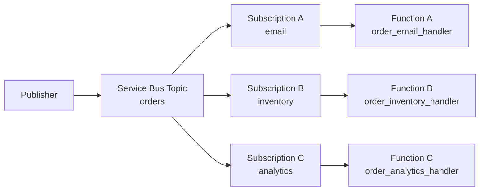
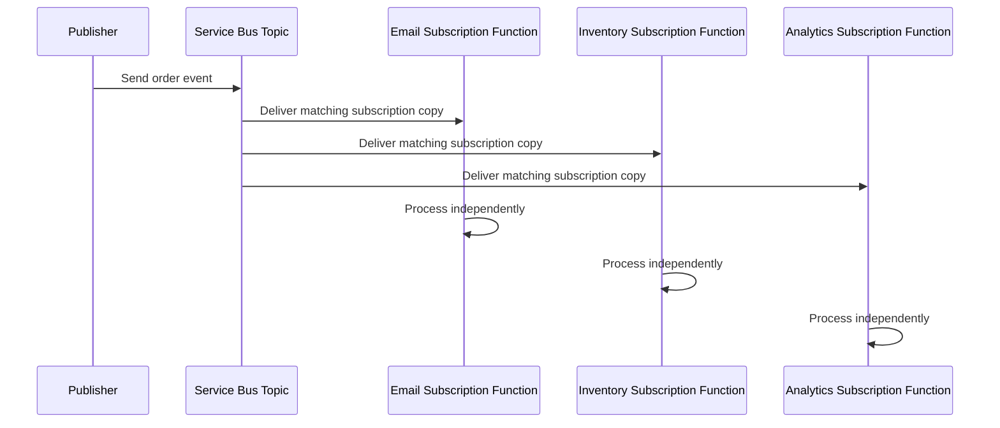

# Service Bus Topic Fan-out

> **Trigger**: Service Bus Topic | **State**: stateless | **Guarantee**: at-least-once | **Difficulty**: intermediate

## Overview
The `examples/messaging-and-pubsub/servicebus_topic_fanout/` recipe shows a fan-out pattern where one publisher
sends an order event to a Service Bus topic and multiple subscription-triggered Azure Functions process their own
copy independently.

This is useful when one business event must drive several downstream workflows without tightly coupling those
workflows together. In this sample, the same `orders` topic message is distributed to `email`, `inventory`, and
`analytics` subscriptions.

## When to Use
- One event must trigger multiple independent side effects.
- Each downstream consumer needs its own retry, scaling, and failure boundary.
- You want publisher code to stay unaware of subscriber implementation details.

## When NOT to Use
- Only one consumer exists and a queue is simpler.
- Subscribers must coordinate shared state transactionally before acknowledging work.
- Message duplication across subscriptions would create unacceptable downstream cost or complexity.

## Architecture


## Behavior


## Implementation
The example defines three `@app.service_bus_topic_trigger` handlers in one `function_app.py` file. Each handler is
bound to the same topic but a different subscription name:

```python
@app.service_bus_topic_trigger(
    arg_name="msg",
    topic_name="orders",
    subscription_name="email",
    connection="ServiceBusConnection",
)
def order_email_handler(msg: func.ServiceBusMessage) -> None:
    payload = _load_order_event(msg)
    logger.info("Order event fan-out handled by email subscription", extra={...})
```

All handlers reuse a shared JSON decoder and log context builder so delivery metadata stays consistent across the
fan-out branches. The integration matrix for this recipe needs only the `logging` toolkit:

```text
requirements.txt
|-- azure-functions
`-- azure-functions-logging-python
```

## Project Structure
```text
examples/messaging-and-pubsub/servicebus_topic_fanout/
|-- function_app.py
|-- host.json
|-- local.settings.json.example
|-- requirements.txt
`-- README.md
```

## Config
Set these values in `local.settings.json` when running locally:

| Setting | Purpose |
|---------|---------|
| `AzureWebJobsStorage` | Required by the Functions host for local execution |
| `FUNCTIONS_WORKER_RUNTIME` | Must be `python` |
| `ServiceBusConnection` | Connection string or identity-based Service Bus configuration |

Create topic `orders` and subscriptions `email`, `inventory`, and `analytics` before starting the app.

## Run Locally
```bash
cd examples/messaging-and-pubsub/servicebus_topic_fanout
pip install -r requirements.txt
cp local.settings.json.example local.settings.json
func start
```

Then publish a JSON message to the `orders` topic from Service Bus Explorer, the Azure CLI, or an existing producer.

## Expected Output
```text
[Information] Order event fan-out handled by email subscription
[Information] Order event fan-out handled by inventory subscription
[Information] Order event fan-out handled by analytics subscription
```

Each log line includes shared message metadata such as `order_id`, `message_id`, `correlation_id`, and
`delivery_count`, but each handler adds its own branch-specific context.

## Production Considerations
- Scaling: each subscription scales independently, so size concurrency and throughput per branch.
- Filtering: use subscription rules to route only the events each handler needs.
- Idempotency: every subscriber must tolerate duplicate delivery because Service Bus guarantees at-least-once.
- Observability: log branch name, message identifiers, and delivery count for each subscription.
- Security: prefer managed identity with least-privilege `Azure Service Bus Data Receiver` access.

## Related Links
- [Service Bus trigger](https://learn.microsoft.com/en-us/azure/azure-functions/functions-bindings-service-bus-trigger)
- [Service Bus Worker](./servicebus-worker.md)
- [Retry and Idempotency](../reliability/retry-and-idempotency.md)
