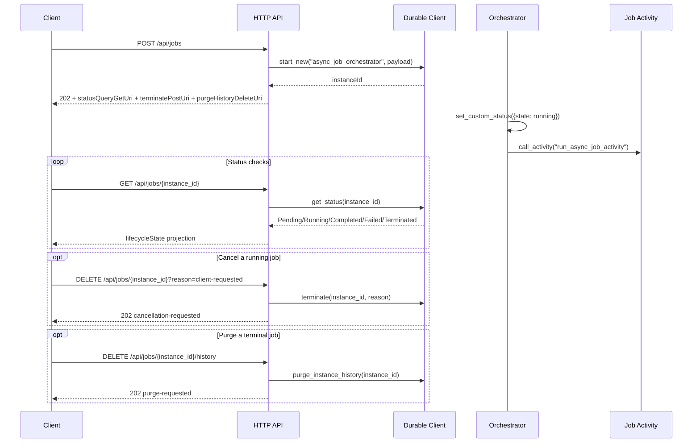

# Async Job Lifecycle

> **Trigger**: HTTP + Durable | **State**: durable | **Guarantee**: at-least-once | **Difficulty**: intermediate

## Overview
This recipe demonstrates a full async job lifecycle on top of Durable Functions instance management.
An HTTP endpoint creates a job, returns Durable management URLs, and a companion API surface lets callers check status, request cancellation, and purge finished history.

The example keeps the control plane small and explicit:

- `POST /api/jobs` creates durable work and returns built-in management links.
- `GET /api/jobs/{instance_id}` translates Durable runtime status into a job lifecycle view.
- `DELETE /api/jobs/{instance_id}` requests cancellation by terminating the orchestration.
- `DELETE /api/jobs/{instance_id}/history` purges completed, failed, or cancelled instance history.

It also shows the integration matrix for validation, OpenAPI metadata, and structured logging on the HTTP-facing functions.

## When to Use
- You need a durable HTTP API for long-running jobs that outlive a single request.
- You want built-in status, cancellation, and purge semantics without designing a separate job state store.
- You want clients to poll durable management endpoints while still exposing a domain-friendly CRUD wrapper.

## When NOT to Use
- The work completes comfortably inside one synchronous HTTP request.
- You do not need durable history or restart-safe orchestration semantics.
- A queue-triggered worker with a simple status table is enough and lifecycle management is minimal.

## Architecture
```mermaid
flowchart LR
    client[Client] -->|POST /api/jobs| create[Create job API]
    create -->|202 + instanceId + management URLs| client
    create -->|start_new()| orch[async_job_orchestrator]
    orch --> pending[pending]
    pending --> running[running]
    running --> completed[completed]
    running --> failed[failed]
    running --> cancelled[cancelled]
    client -->|GET /api/jobs/{instance_id}| status[Status API]
    status -->|get_status()| orch
    client -->|DELETE /api/jobs/{instance_id}| cancel[Cancel API]
    cancel -->|terminate()| orch
    client -->|DELETE /api/jobs/{instance_id}/history| purge[Purge API]
    purge -->|purge_instance_history()| history[(Durable history)]
```

## Behavior


## Prerequisites
- Python 3.10+
- Azure Functions Core Tools v4
- Durable Functions extension bundle enabled in `host.json`
- Storage connection for Durable Functions (`AzureWebJobsStorage`)
- `azure-functions`, `azure-functions-durable`, `azure-functions-validation-python`, `azure-functions-openapi-python`, and `azure-functions-logging-python`

## Project Structure
```text
examples/orchestration-and-workflows/async_job_lifecycle/
|- function_app.py
|- host.json
|- local.settings.json.example
|- requirements.txt
`- README.md
```

## Implementation
The example uses `df.DFApp()` so HTTP endpoints, the durable orchestrator, and the activity live in one file.

```python
app = df.DFApp(http_auth_level=func.AuthLevel.ANONYMOUS)
```

Create endpoint with validation, OpenAPI metadata, and management URL extraction:

```python
@app.route(route="jobs", methods=["POST"], auth_level=func.AuthLevel.ANONYMOUS)
@openapi(summary="Create an async job", request_body=JobCreateRequest, response={202: JobAcceptedResponse})
@validate_http(body=JobCreateRequest, response_model=JobAcceptedResponse)
@app.durable_client_input(client_name="client")
async def create_job(req: func.HttpRequest, body: JobCreateRequest, client: df.DurableOrchestrationClient):
    instance_id = await client.start_new("async_job_orchestrator", None, body.model_dump())
    check_status = client.create_check_status_response(req, instance_id)
```

Status endpoint projects Durable runtime values into business-facing lifecycle states:

```python
status = await client.get_status(instance_id)
lifecycle_state = {
    "Pending": "pending",
    "Running": "running",
    "Completed": "completed",
    "Failed": "failed",
    "Terminated": "cancelled",
}.get(str(status.runtime_status), "unknown")
```

Cancellation maps to Durable termination, and purge is limited to terminal instances:

```python
await client.terminate(instance_id, reason)
await client.purge_instance_history(instance_id)
```

The orchestrator only coordinates durable work and marks progress with custom status:

```python
@app.orchestration_trigger(context_name="context")
def async_job_orchestrator(context: df.DurableOrchestrationContext):
    payload = context.get_input() or {}
    context.set_custom_status({"state": "running", "jobType": payload.get("job_type")})
    return (yield context.call_activity("run_async_job_activity", payload))
```

## Run Locally
```bash
cd examples/orchestration-and-workflows/async_job_lifecycle
python -m venv .venv
source .venv/bin/activate
pip install -r requirements.txt
cp local.settings.json.example local.settings.json
func start
```

## Expected Output
```text
POST /api/jobs -> 202 Accepted with instanceId and Durable management URLs
GET /api/jobs/<instanceId> -> pending/running/completed/failed/cancelled projection
DELETE /api/jobs/<instanceId>?reason=client-requested -> cancellation-requested
DELETE /api/jobs/<instanceId>/history -> purge-requested after terminal completion
```

## Production Considerations
- Idempotency: activities can run more than once; keep side effects safe for retries.
- Cancellation: `terminate()` is asynchronous, so clients should poll until the job becomes `cancelled`.
- Purging: only purge terminal instances after observability and audit retention needs are satisfied.
- Security: prefer `FUNCTION` auth or upstream identity rather than anonymous public management routes.
- Observability: log `instanceId`, `job_type`, `customer_id`, and cancellation reasons on every control-plane action.

## Related Links
- [Durable HTTP API](https://learn.microsoft.com/en-us/azure/azure-functions/durable/durable-functions-http-api)
- [Manage Durable Functions instances](https://learn.microsoft.com/en-us/azure/azure-functions/durable/durable-functions-instance-management)
- [Durable Functions overview](https://learn.microsoft.com/en-us/azure/azure-functions/durable/durable-functions-overview)
- [Durable Human Interaction](./durable-human-interaction.md)
- [Durable Retry Pattern](./durable-retry-pattern.md)
