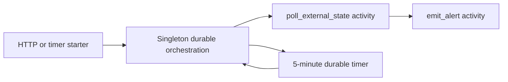
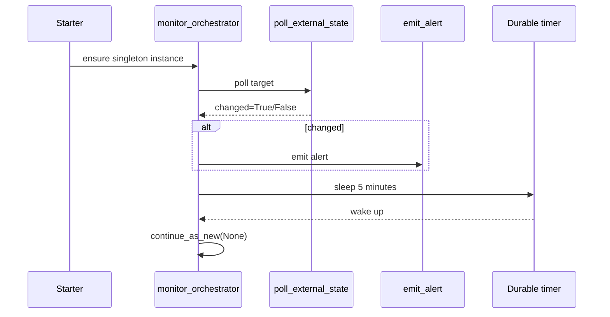

# Durable Singleton Monitor

> **Trigger**: HTTP + Timer + Orchestration | **Guarantee**: at-least-once | **Complexity**: advanced

## Overview
The `examples/orchestration-and-workflows/durable_singleton_monitor/` recipe uses an eternal Durable Functions orchestration to monitor an external dependency. A singleton instance polls the target every 5 minutes, emits an alert when a change is detected, waits on a durable timer, and then continues as new to keep history bounded.

This is a strong pattern for long-running monitors because the orchestration keeps one authoritative loop alive while surviving host restarts and scale changes. A timer-triggered starter and an HTTP endpoint both ensure that the singleton exists without accidentally creating many independent monitors.

## When to Use
- Exactly one monitor loop should exist for a dependency or region.
- Polling cadence matters but state must survive host recycles.
- Change detection and alerting are separate activity steps.

## When NOT to Use
- A stateless cron job is enough.
- You need many millions of independent monitors better modeled as queued work.
- The target system can push events directly instead of being polled.

## Architecture


## Behavior


## Implementation
The timer and HTTP starter both call the same `_ensure_monitor` helper, preventing duplicate monitor instances.

```python
@app.timer_trigger(schedule="0 */5 * * * *", arg_name="timer")
@app.durable_client_input(client_name="client")
@with_context
async def ensure_monitor_timer(timer: func.TimerRequest, client: df.DurableOrchestrationClient) -> None:
    instance_id = await _ensure_monitor(client)
```

The orchestration runs one poll cycle, conditionally alerts, waits on a durable timer, then uses `continue_as_new` to stay eternal without unbounded history growth.

## Run Locally
1. `cd examples/orchestration-and-workflows/durable_singleton_monitor`
2. Create and activate a virtual environment.
3. `pip install -r requirements.txt`
4. Copy `local.settings.json.example` to `local.settings.json`.
5. Run `func start`.
6. POST to `http://localhost:7071/api/monitor/start` or wait for the timer starter.

## Expected Output
```text
[Information] Ensured singleton monitor orchestration instance_id=external-api-monitor
[Information] Timer checked singleton monitor instance_id=external-api-monitor past_due=False
[Information] Polled external API state target=inventory-api changed=True version=etag-2026-04-17T12:00:00Z
[Warning] Detected monitored state change target=inventory-api changed=True version=etag-2026-04-17T12:00:00Z
```

## Production Considerations
- Singleton identity: choose one stable instance ID per monitored target.
- History control: always use `continue_as_new` for eternal orchestrations.
- Alert dedupe: prevent paging storms when the same change is observed repeatedly.
- External API resilience: add retries, circuit breaking, and timeout budgets in the poll activity.
- Ownership: define how the singleton is paused, terminated, or migrated during incidents.

## Related Links
- [Durable Functions overview](https://learn.microsoft.com/en-us/azure/azure-functions/durable/durable-functions-overview)
- [Durable timers](https://learn.microsoft.com/en-us/azure/azure-functions/durable/durable-functions-timers)
- [Eternal orchestrations in Durable Functions](https://learn.microsoft.com/en-us/azure/azure-functions/durable/durable-functions-eternal-orchestrations)
