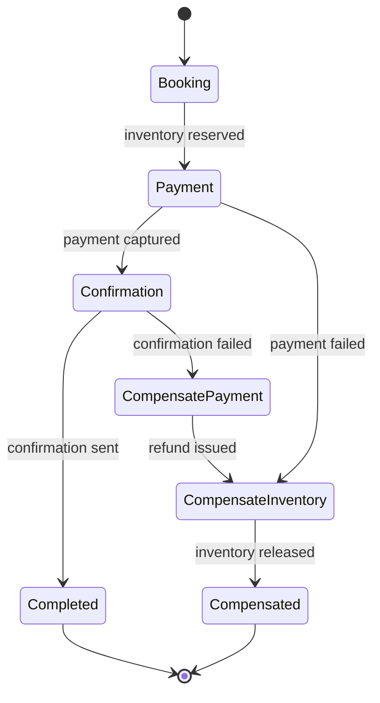
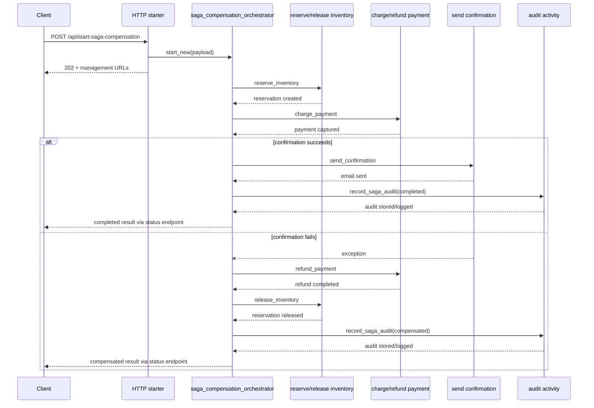

# Saga Compensation

> **Trigger**: Durable Orchestration | **State**: durable | **Guarantee**: at-least-once | **Difficulty**: advanced

## Overview
This recipe shows the Saga pattern implemented with Durable Functions.
The example models a multi-step transaction for order fulfillment where inventory reservation,
payment capture, and customer confirmation must behave like one business unit even though they
touch different systems.

When a downstream step fails, the orchestrator runs compensating activities in reverse order to
undo previously completed work.
This keeps distributed state convergent without requiring a two-phase commit across services.

## When to Use
- You have a long-running business transaction spanning multiple systems or teams.
- Each step can expose a compensating action such as refund, release, or cancel.
- You need durable execution history, replay-safe coordination, and operational recovery.

## When NOT to Use
- The workflow can be completed with a single local database transaction.
- A step has irreversible side effects and no safe compensation strategy.
- You need strict lock-based consistency instead of eventual consistency with rollback semantics.

## Architecture


## Behavior


## Implementation
The runnable project lives at `examples/orchestration-and-workflows/saga_compensation/`.
It exposes an anonymous HTTP starter and a durable orchestrator that executes three forward steps:
`reserve_inventory`, `charge_payment`, and `send_confirmation`.

The orchestrator keeps a reverse-order compensation stack as each forward activity succeeds.
If a later activity raises an exception, previously registered compensations run in reverse order.

```python
@bp.orchestration_trigger(context_name="context")
def saga_compensation_orchestrator(context: df.DurableOrchestrationContext):
    payload = context.get_input()
    completed_steps = []
    compensations = []

    try:
        reservation = yield context.call_activity("reserve_inventory", payload)
        completed_steps.append(reservation)
        compensations.append(("release_inventory", {"reservation_id": reservation["reservation_id"]}))

        payment = yield context.call_activity("charge_payment", payload)
        completed_steps.append(payment)
        compensations.append(("refund_payment", {"payment_id": payment["payment_id"]}))

        confirmation = yield context.call_activity("send_confirmation", payload)
        completed_steps.append(confirmation)
        return {"status": "completed", "completed_steps": completed_steps}
    except Exception:
        compensation_results = []
        for activity_name, compensation_payload in reversed(compensations):
            compensation_results.append(
                yield context.call_activity(activity_name, compensation_payload)
            )
        return {"status": "compensated", "compensations": compensation_results}
```

The sample also wires in `azure-functions-logging-python` for structured logs and includes `DB_URL`
configuration plus `azure-functions-db-python` dependency so saga audit handling is ready to expand into
binding-backed persistence.

## Project Structure
```text
examples/orchestration-and-workflows/saga_compensation/
|- function_app.py
|- host.json
|- local.settings.json.example
|- requirements.txt
`- README.md
```

## Config
Copy `local.settings.json.example` to `local.settings.json` and provide:

- `AzureWebJobsStorage`: durable state storage connection string or Azurite setting
- `FUNCTIONS_WORKER_RUNTIME=python`
- `DB_URL`: connection string or SQLite URL used by audit-related configuration

Default local example:

```json
{
  "IsEncrypted": false,
  "Values": {
    "AzureWebJobsStorage": "UseDevelopmentStorage=true",
    "FUNCTIONS_WORKER_RUNTIME": "python",
    "DB_URL": "sqlite:///local-saga.db"
  }
}
```

## Run Locally
```bash
cd examples/orchestration-and-workflows/saga_compensation
pip install -r requirements.txt
cp local.settings.json.example local.settings.json
func start
```

Start a normal run:

```bash
curl -X POST "http://localhost:7071/api/start-saga-compensation" \
  -H "Content-Type: application/json" \
  -d '{"order_id":"ORD-2001","sku":"demo-widget","quantity":1,"amount":59.99,"email":"buyer@example.com"}'
```

Trigger compensation:

```bash
curl -X POST "http://localhost:7071/api/start-saga-compensation" \
  -H "Content-Type: application/json" \
  -d '{"order_id":"ORD-2002","fail_confirmation":true}'
```

## Expected Output
```text
POST /api/start-saga-compensation -> 202 Accepted

Successful orchestration result:
- status: completed
- completed_steps: reserve_inventory, charge_payment, send_confirmation

Compensated orchestration result:
- status: compensated
- error: Confirmation dispatch failed for order ORD-2002
- compensations: refund_payment, release_inventory
```

## Production Considerations
- Idempotency: all forward and compensating activities should tolerate at-least-once execution.
- Ordering: compensation must reflect business rollback order, not just implementation order.
- Observability: log `order_id`, durable `instance_id`, compensation count, and failure reason.
- Storage: keep durable history storage and audit persistence capacity aligned with orchestration volume.
- Recovery: define operator playbooks for partially compensated incidents and non-compensable failures.

## Related Links
- [Saga pattern](https://learn.microsoft.com/en-us/azure/architecture/reference-architectures/saga/saga)
- [Durable Retry Pattern](./durable-retry-pattern.md)
- [Durable Human Interaction](./durable-human-interaction.md)
- [Durable Functions overview](https://learn.microsoft.com/en-us/azure/azure-functions/durable/durable-functions-overview)
