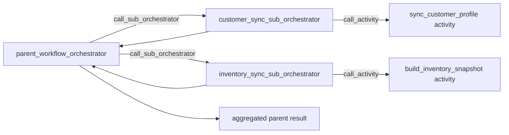
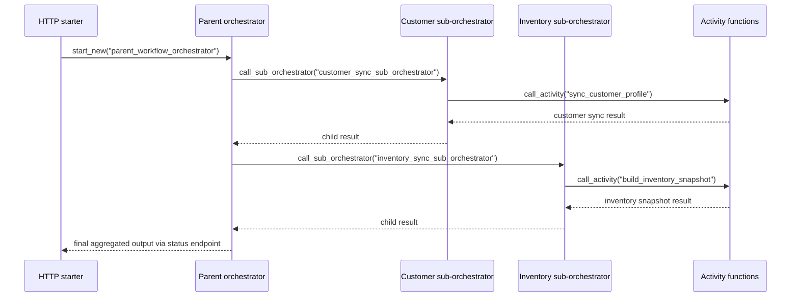

# Sub-Orchestration

> **Trigger**: Durable Orchestration | **State**: durable | **Guarantee**: at-least-once | **Difficulty**: intermediate

## Overview
This recipe shows how a parent Durable Functions orchestrator can delegate parts of a workflow
to child sub-orchestrators with `context.call_sub_orchestrator(...)`.
The parent stays focused on high-level coordination while each child owns its own durable
history, retries, and activity scheduling.

This is useful when one orchestration would otherwise become too large or when a repeated
workflow segment deserves its own reusable orchestration boundary.
Sub-orchestrations still follow the same replay-safe rules as any other orchestrator: they only
coordinate durable work and do not perform direct I/O themselves.

## When to Use
- You want to decompose a large orchestration into smaller reusable workflow units.
- Different stages of the workflow need their own durable history and status boundaries.
- The parent workflow needs to invoke nested orchestration logic in a deterministic way.

## When NOT to Use
- A direct activity call is enough and you do not need another orchestration boundary.
- The workflow is so small that extra orchestration layers only add complexity.
- The child logic performs only synchronous computation with no durable coordination value.

## Architecture


## Behavior


## Prerequisites
- Python 3.10+
- Azure Functions Core Tools v4
- Durable storage configured in local settings
- `azure-functions`, `azure-functions-durable`, and `azure-functions-logging-python` installed

## Project Structure
```text
examples/orchestration-and-workflows/sub_orchestration/
|- function_app.py
|- host.json
|- local.settings.json.example
|- requirements.txt
`- README.md
```

## Implementation
The starter launches the parent orchestration and returns the standard Durable status URLs.

```python
@app.route(route="start-sub-orchestration", methods=["POST"], auth_level=func.AuthLevel.ANONYMOUS)
@app.durable_client_input(client_name="client")
async def start_sub_orchestration(req: func.HttpRequest, client: df.DurableOrchestrationClient):
    instance_id = await client.start_new("parent_workflow_orchestrator", None, payload)
    return client.create_check_status_response(req, instance_id)
```

The parent orchestrator calls two child orchestrators in sequence and aggregates their outputs.

```python
@app.orchestration_trigger(context_name="context")
def parent_workflow_orchestrator(context: df.DurableOrchestrationContext):
    payload = context.get_input() or DEFAULT_INPUT
    customer_result = yield context.call_sub_orchestrator("customer_sync_sub_orchestrator", payload)
    inventory_result = yield context.call_sub_orchestrator("inventory_sync_sub_orchestrator", payload)
    return {
        "customer": customer_result,
        "inventory": inventory_result,
    }
```

Each child orchestrator remains small and only schedules its own activity.
That keeps orchestration boundaries explicit while still allowing the parent to compose them.

```python
@app.orchestration_trigger(context_name="context")
def customer_sync_sub_orchestrator(context: df.DurableOrchestrationContext):
    payload = context.get_input() or DEFAULT_INPUT
    return (yield context.call_activity("sync_customer_profile", payload))
```

Logging belongs in the starter and activities, not inside orchestrator replay paths.
This example uses `azure-functions-logging-python` for structured application logs while the durable
runtime manages orchestration history separately.

## Run Locally
```bash
cd examples/orchestration-and-workflows/sub_orchestration
pip install -r requirements.txt
func start
```

## Expected Output
```text
POST /api/start-sub-orchestration -> 202 Accepted

Final orchestration output:
{
  "instanceId": "<parent-instance-id>",
  "customer": {
    "step": "customer_sync",
    "customerId": "cust-1001",
    "segment": "enterprise",
    "status": "completed"
  },
  "inventory": {
    "step": "inventory_sync",
    "skuCount": 2,
    "status": "completed"
  }
}
```

## Production Considerations
- Composition: use sub-orchestrations to isolate reusable workflow segments and failure domains.
- Retries: apply retry policies at the child orchestration or activity level for transient faults.
- Idempotency: keep activities idempotent because child workflows can replay or retry independently.
- Observability: log parent and child correlation identifiers in starter and activity code.
- Versioning: evolve child orchestrators carefully because in-flight durable instances persist history.

## Related Links
- [Durable Hello Sequence](./durable-hello-sequence.md)
- [Durable Fan-Out Fan-In](./durable-fan-out-fan-in.md)
- [Sub-orchestrations](https://learn.microsoft.com/en-us/azure/azure-functions/durable/durable-functions-sub-orchestrations)
- [Durable Functions overview](https://learn.microsoft.com/en-us/azure/azure-functions/durable/durable-functions-overview)
