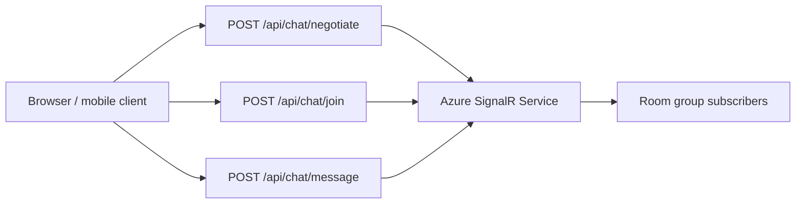
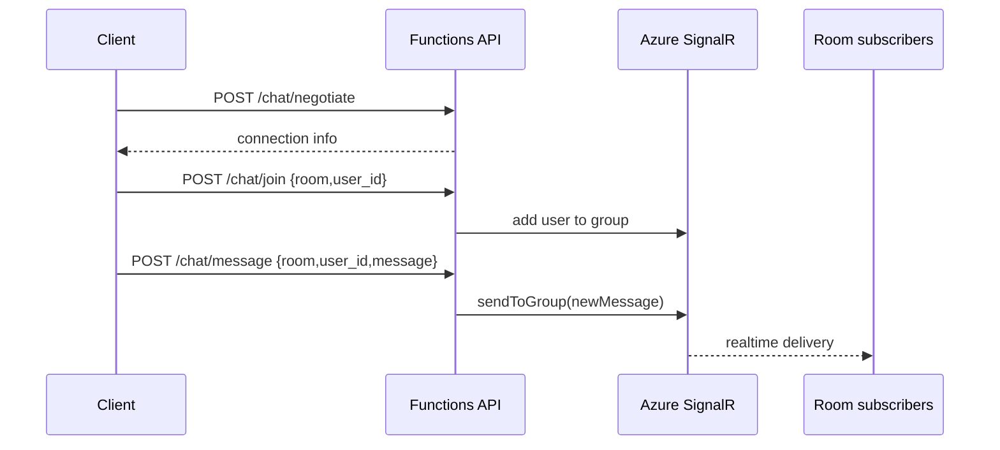

# SignalR Group Chat

> **Trigger**: HTTP + SignalR | **Guarantee**: at-most-once | **Complexity**: intermediate

## Overview
The `examples/realtime/signalr_group_chat/` recipe expands the basic broadcast story into room-scoped messaging. Clients negotiate a connection, join a SignalR group representing a room, and publish messages that fan out only to connections in that group.

This pattern is a good fit for chat rooms, team channels, multiplayer lobbies, or tenant-scoped live notifications. Because the delivery path is realtime and connection-oriented, the practical guarantee is at-most-once from the perspective of the sending HTTP call.

## When to Use
- You need room- or tenant-scoped realtime fan-out.
- Clients should only receive messages for the groups they joined.
- A lightweight serverless hub is preferred over managing your own WebSocket service.

## When NOT to Use
- Consumers need durable replay of missed messages.
- Messages must survive disconnects without a separate store.
- You need broker-style retries rather than transient realtime delivery.

## Architecture


## Behavior


## Implementation
The sample uses the SignalR connection info input binding for negotiation and the SignalR output binding for room join and send operations.

```python
@app.route(route="chat/join", methods=["POST"])
@with_context
@openapi(summary="Join SignalR group", tags=["Realtime"], route="/api/chat/join", method="post")
@validate_http(body=JoinRoomRequest)
@app.signalr_output(arg_name="signalr", hub_name=HUB_NAME, connection_string_setting="AzureSignalRConnectionString")
def join_room(req: func.HttpRequest, body: JoinRoomRequest, signalr: func.Out[str]) -> func.HttpResponse:
    signalr.set(json.dumps({"action": "add", "userId": body.user_id, "groupName": body.room}))
```

Message publish uses the same decorator stack and emits a room-scoped `newMessage` payload. All handlers log room and user metadata with `azure-functions-logging`.

## Run Locally
1. `cd examples/realtime/signalr_group_chat`
2. Create and activate a virtual environment.
3. `pip install -r requirements.txt`
4. Copy `local.settings.json.example` to `local.settings.json`.
5. Set `AzureSignalRConnectionString` for a SignalR instance in serverless mode.
6. Run `func start`, negotiate a client, join a room, then send a room message.

## Expected Output
```text
[Information] Negotiated SignalR chat connection hub=groupchat
[Information] Added user to SignalR room room=engineering user_id=ada
[Information] Published SignalR room message room=engineering user_id=ada message=deploy complete
```

## Production Considerations
- Presence: store room membership elsewhere if you need authoritative online/offline state.
- Auth: derive `user_id` from validated identity rather than trusting raw client input.
- Replay: persist chat history in storage if reconnecting clients need backlog.
- Abuse control: apply rate limits on join/send endpoints.
- Multi-room scale: choose consistent room naming and cleanup conventions.

## Related Links
- [Azure SignalR Service bindings for Azure Functions](https://learn.microsoft.com/en-us/azure/azure-signalr/signalr-concept-serverless-development-config)
- [Azure Functions SignalR trigger and bindings](https://learn.microsoft.com/en-us/azure/azure-functions/functions-bindings-signalr-service)
- [Serverless realtime communication with Azure SignalR Service](https://learn.microsoft.com/en-us/azure/azure-signalr/signalr-concept-serverless-development-config)
