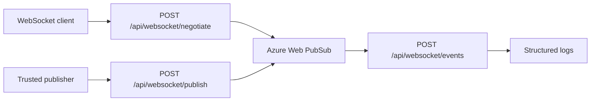
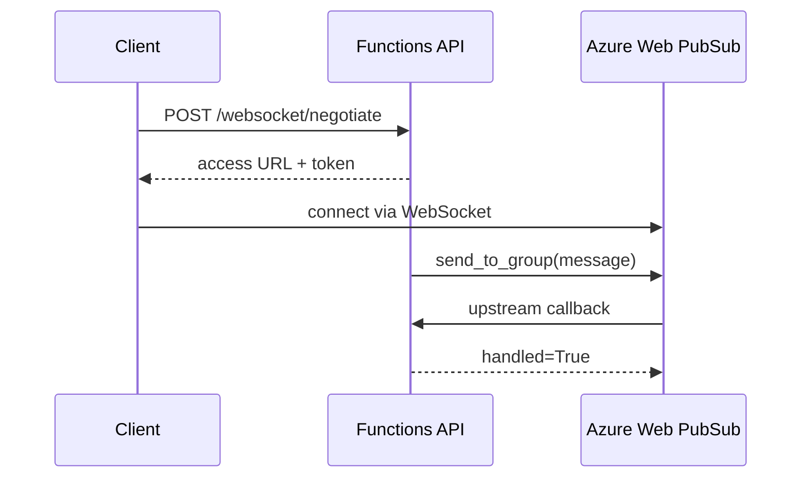

# WebSocket Proxy

> **Trigger**: HTTP + Web PubSub | **Guarantee**: at-most-once | **Complexity**: intermediate

## Overview
The `examples/realtime/websocket_proxy/` recipe shows how Azure Functions can act as a thin control plane in front of Azure Web PubSub. Functions issue client access tokens, accept publish requests from trusted callers, and handle upstream callbacks from the Web PubSub service.

This pattern works well when you want managed WebSocket infrastructure but still want application logic, authorization, and observability to stay inside Functions. It is especially useful for collaborative dashboards, live device updates, or browser sessions that need simple serverless fan-out.

## When to Use
- You need managed WebSocket connectivity without running your own socket gateway.
- Functions should control token issuance and message forwarding.
- Upstream events from Web PubSub need to be processed by serverless handlers.

## When NOT to Use
- You need durable ordered delivery like a queue or log broker.
- Clients must replay missed updates after reconnect.
- A plain HTTP polling model is sufficient.

## Architecture


## Behavior


## Implementation
The negotiate endpoint creates a Web PubSub access token through the SDK, and the publish endpoint forwards a room message after HTTP validation.

```python
@app.route(route="websocket/publish", methods=["POST"])
@with_context
@openapi(summary="Publish Web PubSub message", tags=["Realtime"], route="/api/websocket/publish", method="post")
@validate_http(body=PublishRequest)
def publish(req: func.HttpRequest, body: PublishRequest) -> func.HttpResponse:
    client = _build_webpubsub_client()
    client.send_to_group(group=body.room, message=body.message, content_type="text/plain")
```

The callback endpoint handles upstream events from Web PubSub and logs CloudEvent-style metadata with `azure-functions-logging`.

## Run Locally
1. `cd examples/realtime/websocket_proxy`
2. Create and activate a virtual environment.
3. `pip install -r requirements.txt`
4. Copy `local.settings.json.example` to `local.settings.json`.
5. Set `WebPubSubConnectionString` and `WEBPUBSUB_HUB_NAME`.
6. Run `func start` and test negotiate, publish, and callback routes.

## Expected Output
```text
[Information] Issued Web PubSub access token user_id=local-user
[Information] Forwarded WebSocket message through Web PubSub room=ops user_id=ada message=service degraded
[Information] Received Web PubSub upstream callback event_type=azure.webpubsub.sys.connected
```

## Production Considerations
- Token scope: issue least-privilege roles and short expirations.
- Trust boundary: restrict who can call publish endpoints.
- Callback validation: verify Web PubSub callback origin and event type handling.
- Fan-out cost: understand service limits and concurrent connection pricing.
- History: persist important events elsewhere if reconnect replay matters.

## Related Links
- [Azure Web PubSub overview](https://learn.microsoft.com/en-us/azure/azure-web-pubsub/overview)
- [Use Azure Functions with Azure Web PubSub](https://learn.microsoft.com/en-us/azure/azure-web-pubsub/reference-server-sdk-python)
- [Build realtime apps with Azure Web PubSub Service](https://learn.microsoft.com/en-us/azure/azure-web-pubsub/concept-service-internals)
