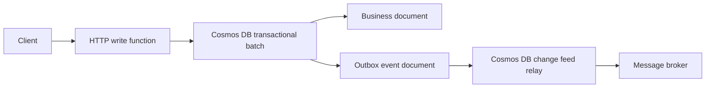
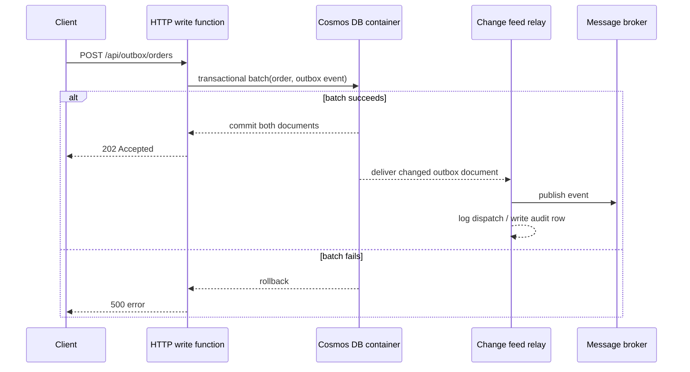

# Outbox Pattern

> **Trigger**: Cosmos DB Change Feed + HTTP | **State**: stateful | **Guarantee**: at-least-once | **Difficulty**: advanced

## Overview
The `examples/reliability/outbox_pattern/` sample demonstrates the transactional outbox pattern with
Azure Functions, Azure Cosmos DB, and a change feed relay. The HTTP function writes the business
document and an outbox event in the same Cosmos DB transactional batch, and a second function reads
the outbox event from the change feed and relays it to a broker boundary.

This pattern prevents the classic failure window where business data is committed but event
publication fails afterward. By storing the outbox record in the same partition and transaction as
the business write, the system guarantees that either both records are committed or neither is.

## When to Use
- You need to persist business state and publish an integration event without losing one or the other.
- You already use Azure Cosmos DB and can keep the business document and outbox event in the same logical partition.
- You can tolerate at-least-once relay behavior and design consumers to be idempotent.

## When NOT to Use
- You need exactly-once delivery semantics across the entire pipeline.
- Your business record and outbox event cannot share the same Cosmos DB partition boundary.
- A direct synchronous HTTP call to another service is the real requirement, not durable event relay.

## Architecture


## Behavior


## Prerequisites
- Python 3.10+
- Azure Functions Core Tools v4
- Azure Cosmos DB account or emulator with database `outboxdb` and containers `orders` and `leases`
- SQLite CLI, or another database supported by `azure-functions-db-python`, for relay audit storage

## Project Structure
```text
examples/reliability/outbox_pattern/
|-- function_app.py
|-- host.json
|-- local.settings.json.example
|-- requirements.txt
`-- README.md
```

## Implementation
The write endpoint accepts an order payload, builds two documents, and submits them in one Cosmos DB
transactional batch:

- an `order` document that represents the business state
- an `outbox` document that represents the integration event to relay later

Both documents use the same partition key so Cosmos DB can commit them atomically.

```python
operations = [
    ("create", (order_document,)),
    ("create", (outbox_document,)),
]
container.execute_item_batch(batch_operations=operations, partition_key=partition_key)
```

The relay function listens to the Cosmos DB change feed, filters for `type == "outbox"`, publishes
the event to a broker boundary, and records dispatch metadata with `azure-functions-db-python`. The sample
uses structured logging to make the relay path visible during local runs.

```python
@app.cosmos_db_trigger(...)
@db.output("dispatch_out", url="%DISPATCH_DB_URL%", table="outbox_dispatches")
def relay_outbox_events(documents: list[dict[str, Any]], dispatch_out: DbOut) -> None:
    dispatches = []
    for document in documents:
        if document.get("type") != "outbox":
            continue
        publish_to_broker(document)
        dispatches.append(build_dispatch_record(document))
    dispatch_out.set(dispatches)
```

## Run Locally
```bash
cd examples/reliability/outbox_pattern
pip install -r requirements.txt
cp local.settings.json.example local.settings.json
sqlite3 relay.db "CREATE TABLE IF NOT EXISTS outbox_dispatches (event_id TEXT PRIMARY KEY, aggregate_id TEXT NOT NULL, event_type TEXT NOT NULL, broker_name TEXT NOT NULL, dispatched_at TEXT NOT NULL, status TEXT NOT NULL);"
func start
```

## Expected Output
```text
[INFO] Accepted order and stored outbox event in one transactional batch. order_id=order-1001 event_id=evt-order-1001-created
[INFO] Received 2 changed document(s) from Cosmos DB.
[INFO] Relayed outbox event to broker boundary. event_id=evt-order-1001-created broker=log-broker
[INFO] Recorded 1 dispatch audit row(s).
```

## Production Considerations
- Partitioning: keep the business document and outbox event in the same logical partition or the batch is not atomic.
- Ordering: preserve stable event ordering per aggregate, especially when one order emits multiple events.
- Deduplication: assume the relay can replay and make downstream consumers idempotent.
- Cleanup: apply TTL to outbox records or archive them after the replay window expires.
- Broker integration: replace the sample's logging publisher with Service Bus, Event Hubs, or Kafka.
- Observability: log `order_id`, `event_id`, and relay outcome so failures can be replayed safely.

## Related Links
- [Transactional outbox](https://learn.microsoft.com/en-us/azure/architecture/best-practices/transactional-outbox-cosmos)
- [Implement the Transactional Outbox Pattern by Using Azure Cosmos DB](https://learn.microsoft.com/en-us/azure/architecture/databases/guide/transactional-out-box-cosmos)
- [Reliable event processing](https://learn.microsoft.com/en-us/azure/azure-functions/functions-reliable-event-processing)
