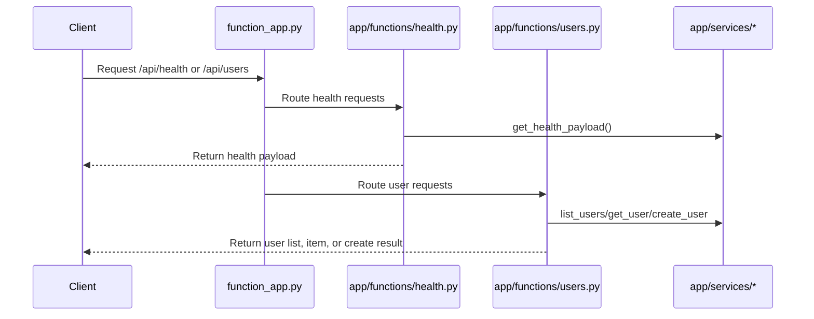

# Blueprint Modular App

> **Trigger**: HTTP | **State**: stateless | **Guarantee**: at-most-once | **Difficulty**: intermediate

## Overview
The `examples/runtime-and-ops/blueprint_modular_app/` example demonstrates how to split a function app into
an `app/` package using `func.Blueprint()`. `function_app.py` is reduced to composition logic and imports
blueprints from `app.functions.health` and `app.functions.users`, while shared logic lives under
`app.services` and logging setup lives under `app.core`.

This modular approach becomes important as endpoint count grows. Teams can own separate blueprints,
write focused tests, and avoid a single monolithic `function_app.py` file that becomes hard to review.

## When to Use
- Your app has multiple routes or domains and needs clean module boundaries.
- You want reusable route groups for internal platform patterns.
- You need maintainable structure for larger teams and code reviews.

## When NOT to Use
- Your app only has one or two trivial endpoints and modularization adds unnecessary indirection.
- You need shared mutable in-memory state across modules.
- Your team is still validating a tiny prototype and wants the smallest possible file count first.

## Architecture
```mermaid
flowchart TD
    A[function_app.py\nregister_functions()] --> B[app/functions/health.py\nGET /api/health]
    A --> C[app/functions/users.py\nGET /api/users\nGET /api/users/{id}\nPOST /api/users]
    B --> D[app/services/health_service.py]
    C --> E[app/services/user_service.py]
```

## Prerequisites
- Python 3.10+
- Azure Functions Core Tools v4
- HTTP client such as curl or Postman
- Local storage emulator for standard Functions runtime dependencies

## Project Structure
```text
examples/runtime-and-ops/blueprint_modular_app/
|-- function_app.py
|-- app/
|   |-- core/
|   |   `-- logging.py
|   |-- functions/
|   |   |-- health.py
|   |   `-- users.py
|   `-- services/
|       |-- health_service.py
|       `-- user_service.py
|-- host.json
|-- local.settings.json.example
|-- requirements.txt
`-- README.md
```

## Implementation
The root file composes blueprints only. This keeps startup code explicit and leaves route and service
logic inside the `app/` package.

```python
import azure.functions as func

from app.core.logging import configure_logging
from app.functions.health import health_blueprint
from app.functions.users import users_blueprint

configure_logging()

app = func.FunctionApp()
app.register_functions(health_blueprint)
app.register_functions(users_blueprint)
```

`app/functions/health.py` owns the readiness endpoint and delegates payload creation to a service module.

```python
import json

import azure.functions as func

from app.services.health_service import get_health_payload

health_blueprint = func.Blueprint()


@health_blueprint.route(route="health", methods=["GET"])
def get_health(req: func.HttpRequest) -> func.HttpResponse:
    del req
    return func.HttpResponse(
        body=json.dumps(get_health_payload()),
        mimetype="application/json",
        status_code=200,
    )
```

`app/functions/users.py` contains the HTTP routes, while `app/services/user_service.py` owns the
in-memory store used by the demo.

```python
import json

import azure.functions as func

from app.services.user_service import create_user, get_user, list_users

users_blueprint = func.Blueprint()


@users_blueprint.route(route="users", methods=["POST"])
def create_user_route(req: func.HttpRequest) -> func.HttpResponse:
    payload = req.get_json()
    user_id = str(payload.get("id", "")).strip()
    name = str(payload.get("name", "")).strip()
    user = create_user(user_id=user_id, name=name)
    return func.HttpResponse(body=json.dumps(user), mimetype="application/json", status_code=201)
```

The same module also exposes `GET /api/users` and `GET /api/users/{id}`.

## Behavior


## Run Locally
```bash
cd examples/runtime-and-ops/blueprint_modular_app
pip install -r requirements.txt
func start
```

## Expected Output
```text
GET  /api/health        -> 200 {"status": "healthy"}
GET  /api/users         -> 200 {"users": []}
POST /api/users         -> 201 {"id": "u1", "name": "Ada"}
GET  /api/users/u1      -> 200 {"id": "u1", "name": "Ada"}
GET  /api/users/missing -> 404 {"error": "user not found"}
```

## Production Considerations
- Scaling: keep route modules stateless; replace the in-memory service store with durable storage.
- Retries: HTTP handlers should return deterministic status codes for client retry policies.
- Idempotency: enforce idempotency keys for create operations when clients can retry POSTs.
- Observability: add per-blueprint logging and correlation IDs for route-level telemetry.
- Security: apply auth levels and input validation consistently across each blueprint module.

## Related Links
- [Azure Functions Python blueprints reference](https://learn.microsoft.com/en-us/azure/azure-functions/functions-reference-python#blueprints)
