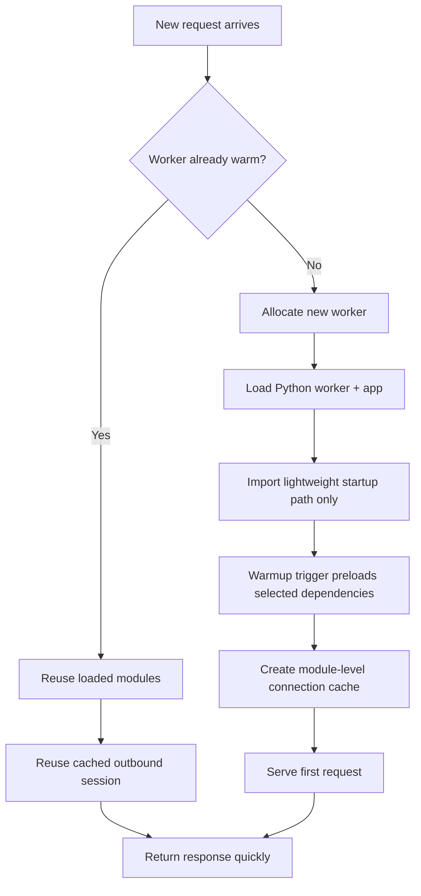
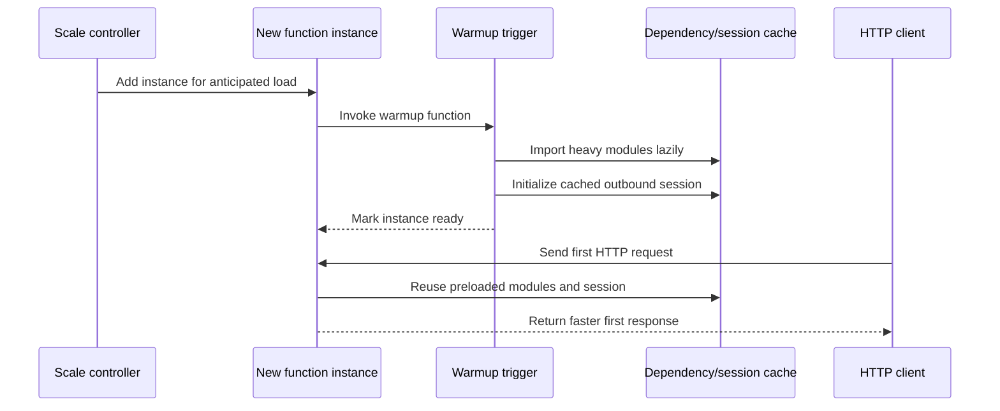

# Cold Start Mitigation

> **Trigger**: HTTP / Timer | **State**: stateless | **Guarantee**: request-response | **Difficulty**: beginner

## Overview
Cold starts happen when Azure Functions needs to allocate a new worker and initialize your Python app before serving traffic.
This recipe shows how to reduce that first-hit latency with four practical techniques:

- keep critical workloads on **Premium plan** so pre-warmed instances are available
- use a **warmup trigger** to preload dependencies during scale-out
- defer expensive modules with **lazy imports** so startup work stays small
- reuse outbound clients with **module-level connection caching** instead of rebuilding them on every request

The matching example in `examples/runtime-and-ops/cold_start_mitigation/` combines an HTTP trigger, a warmup trigger,
structured logging via `azure-functions-logging-python`, and a simple outbound session cache. It also points to
`azure-functions-doctor-python` for deployment diagnostics.

## When to Use
- You have bursty traffic and the first request after idle is noticeably slower.
- Your app imports heavy SDKs, ML packages, or large dependency graphs.
- You need predictable latency for user-facing APIs.
- You want a low-complexity mitigation before moving to custom containers.

## When NOT to Use
- Your workload is entirely background-driven and a few seconds of startup latency is acceptable.
- You only need throughput tuning rather than startup optimization.
- Your largest delays come from downstream APIs or databases, not function initialization.

## Architecture


## Prerequisites
- Python 3.10+
- Azure Functions Core Tools v4
- An Azure Functions app using the Python v2 programming model
- Premium plan if you need pre-warmed instances in production

## Project Structure
```text
examples/runtime-and-ops/cold_start_mitigation/
|-- function_app.py
|-- host.json
|-- local.settings.json.example
|-- requirements.txt
`-- README.md
```

## Implementation
The example keeps top-level imports minimal, then defers heavier work until the request path or warmup path needs it.

```python
_cached_session = None

def _lazy_import_requests():
    import importlib
    return importlib.import_module("requests")

def get_session():
    global _cached_session
    if _cached_session is None:
        requests = _lazy_import_requests()
        session = requests.Session()
        _cached_session = session
    return _cached_session
```

The warmup trigger preloads the same dependency chain used by the HTTP trigger so scale-out instances are ready before
receiving user traffic.

```python
@app.warm_up_trigger("warmup")
def warmup(warmup_context) -> None:
    _ = warmup_context
    _lazy_import_requests()
    get_session()
```

Key tactics:

- **Lazy imports**: keep global startup focused on the runtime, logging, and route registration.
- **Connection pooling**: cache a single outbound `requests.Session()` per worker process.
- **Warmup trigger**: preload dependencies during scale-out on supported hosting plans.
- **Premium plan**: keep pre-warmed instances available for latency-sensitive workloads.

## Behavior


## Run Locally
```bash
cd examples/runtime-and-ops/cold_start_mitigation
python -m venv .venv
source .venv/bin/activate
pip install -r requirements.txt
cp local.settings.json.example local.settings.json
func start
```

To simulate a ready instance locally, call the warmup endpoint before the HTTP route:

```bash
curl -i http://localhost:7071/admin/warmup
curl -i "http://localhost:7071/api/cold-start-demo?ping=0"
```

## Expected Output
```text
[INFO] Warmup trigger invoked; preloading requests session.
[INFO] HTTP cold-start demo invoked. session_reused=True dependency_loaded=True
```

## Production Considerations
- Pre-warmed instances are available on Premium plan, which is the most direct mitigation for user-facing APIs.
- Warmup triggers run during scale-out, not before every single cold start scenario.
- Keep warmup work small and deterministic; preload only the dependencies that materially improve latency.
- Module-level caches are per worker process and can disappear whenever the host recycles.
- Pair latency tuning with `azure-functions-doctor-python` checks so storage, app settings, and extension issues do not masquerade as cold-start problems.

## Related Links
- [Premium plan](https://learn.microsoft.com/en-us/azure/azure-functions/functions-premium-plan)
- [Azure Functions warmup trigger](https://learn.microsoft.com/en-us/azure/azure-functions/functions-bindings-warmup)
