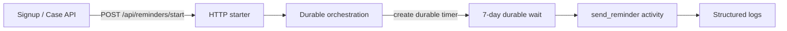
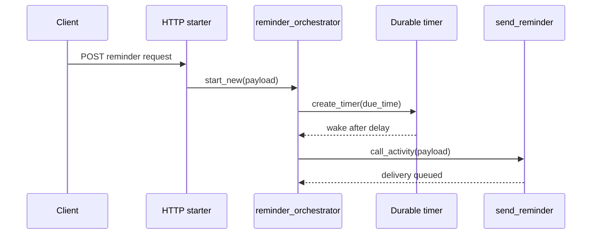

# Durable Timer Reminder

> **Trigger**: Orchestration + HTTP | **Guarantee**: at-least-once | **Complexity**: intermediate

## Overview
The `examples/scheduled-and-background/durable_timer_reminder/` recipe shows how to schedule a long-delay callback with Durable Functions instead of a short cron loop. An HTTP endpoint starts an orchestration, the orchestration sleeps on a durable timer for the requested delay, and an activity executes the reminder step after the wait finishes.

This pattern is useful when a business deadline is tied to a specific event, such as sending a reminder 7 days after signup or escalating an unapproved request after 24 hours. Durable timers survive host recycles because the delay is checkpointed in Durable state rather than held in memory.

## When to Use
- You need long-delay callbacks tied to individual business events.
- You want the platform to persist wait state across restarts.
- You need at-least-once reminder execution with orchestration status tracking.

## When NOT to Use
- A simple recurring cron timer is enough.
- The callback must execute exactly once without idempotent handling.
- The workflow needs only a fire-and-forget queue message rather than orchestration state.

## Architecture


## Behavior


## Implementation
The starter uses the canonical decorator order for HTTP recipes: `@app.route`, `@with_context`, `@openapi`, `@validate_http`, then `@app.durable_client_input`.

```python
@app.route(route="reminders/start", methods=["POST"])
@with_context
@openapi(summary="Start durable reminder", route="/api/reminders/start", method="post")
@validate_http(body=ReminderRequest, response_model=ReminderAccepted)
@app.durable_client_input(client_name="client")
async def start_reminder(req: func.HttpRequest, body: ReminderRequest, client: df.DurableOrchestrationClient) -> func.HttpResponse:
    payload = body.model_dump()
    instance_id = await client.start_new("reminder_orchestrator", client_input=payload)
```

The orchestration computes the due time deterministically, waits with `create_timer`, and then calls the activity:

```python
@app.orchestration_trigger(context_name="context")
def reminder_orchestrator(context: df.DurableOrchestrationContext) -> Generator[Any, Any, dict[str, object]]:
    payload = context.get_input() or {}
    due_time = context.current_utc_datetime + timedelta(days=int(payload.get("delay_days", 7)))
    yield context.create_timer(due_time)
    result = yield context.call_activity("send_reminder", payload)
    return {"status": "completed", **result}
```

All handlers emit structured logs through `azure-functions-logging`, and the HTTP contract is described with `@openapi` plus `@validate_http`.

## Run Locally
1. `cd examples/scheduled-and-background/durable_timer_reminder`
2. Create and activate a virtual environment.
3. `pip install -r requirements.txt`
4. Copy `local.settings.json.example` to `local.settings.json`.
5. Start the host with `func start`.
6. POST a reminder request to `http://localhost:7071/api/reminders/start`.

## Expected Output
```text
[Information] Started reminder orchestration instance_id=abc123 recipient=ada@example.com delay_days=7
[Information] Reminder callback reached delivery step recipient=ada@example.com subject=Trial expiry delivery=queued
```

## Production Considerations
- Idempotency: reminder activities must tolerate replay or duplicate wake-ups.
- Determinism: keep all time math inside the orchestrator based on `current_utc_datetime`.
- State growth: purge completed instances if reminder volume is high.
- Retry policy: add activity retries if downstream email or notification systems fail transiently.
- Security: avoid putting secrets or PII-heavy payloads into orchestration input unless required.

## Related Links
- [Durable Functions overview](https://learn.microsoft.com/en-us/azure/azure-functions/durable/durable-functions-overview)
- [Durable timers](https://learn.microsoft.com/en-us/azure/azure-functions/durable/durable-functions-timers)
- [Durable Functions bindings for Python](https://learn.microsoft.com/en-us/azure/azure-functions/durable/durable-functions-bindings?pivots=programming-language-python)
