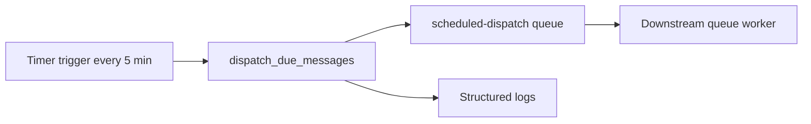
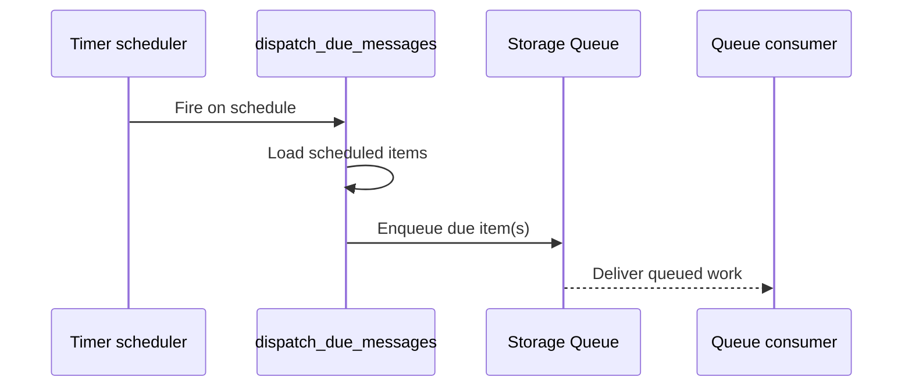

# Queue Scheduled Dispatch

> **Trigger**: Timer + Queue | **Guarantee**: at-least-once | **Complexity**: beginner

## Overview
The `examples/scheduled-and-background/queue_scheduled_dispatch/` recipe demonstrates a common compromise between simple scheduling and durable background processing. A timer trigger evaluates scheduled items, releases the due ones onto a queue, and lets downstream workers handle retries and backpressure.

This is practical when business users think in terms of schedules, but operations teams want queue semantics. The recipe models Storage Queue dispatch and maps cleanly to Service Bus scheduled enqueue when you need richer broker features later.

## When to Use
- You need scheduled release of work into a queue-backed pipeline.
- You want queue retry semantics after the scheduled time arrives.
- You need a lightweight scheduler without Durable orchestration per message.

## When NOT to Use
- Each scheduled item needs its own durable state and cancellation lifecycle.
- Exact-once delivery is required.
- You need second-level precision for large numbers of scheduled jobs.

## Architecture


## Behavior


## Implementation
The timer trigger evaluates due records and emits queue payloads for downstream processing:

```python
@app.timer_trigger(schedule="0 */5 * * * *", arg_name="timer", run_on_startup=False)
@app.queue_output(arg_name="outbox", queue_name="scheduled-dispatch", connection="AzureWebJobsStorage")
@with_context
def dispatch_due_messages(timer: func.TimerRequest, outbox: func.Out[str]) -> None:
    now = datetime.now(timezone.utc)
```

The sample reads `SCHEDULED_DISPATCHES_JSON`, filters records where `scheduled_for <= now`, and logs `past_due`, `due_count`, and the chosen scheduling mode. It uses `azure-functions-logging` in the timer handler so operators can trace every release cycle.

## Run Locally
1. `cd examples/scheduled-and-background/queue_scheduled_dispatch`
2. Create and activate a virtual environment.
3. `pip install -r requirements.txt`
4. Copy `local.settings.json.example` to `local.settings.json`.
5. Start Azurite or point `AzureWebJobsStorage` to a real Storage account.
6. Run `func start` and wait for the timer to evaluate the configured schedule.

## Expected Output
```text
[Information] Scheduled dispatch run complete past_due=False due_count=1 schedule_source=storage-queue-visibility-timeout
```

## Production Considerations
- Clock skew: keep schedule timestamps in UTC.
- Burst handling: a single release cycle can enqueue many jobs; size queue throughput accordingly.
- Duplicate release: at-least-once still applies, so workers must be idempotent.
- Data source: move from env-var schedules to a durable store for real workloads.
- Broker choice: switch to Service Bus scheduled enqueue when you need deferral, sessions, or dead-letter features.

## Related Links
- [Timer trigger for Azure Functions](https://learn.microsoft.com/en-us/azure/azure-functions/functions-bindings-timer)
- [Queue storage bindings for Azure Functions](https://learn.microsoft.com/en-us/azure/azure-functions/functions-bindings-storage-queue)
- [Service Bus messaging patterns](https://learn.microsoft.com/en-us/azure/service-bus-messaging/service-bus-messaging-overview)
