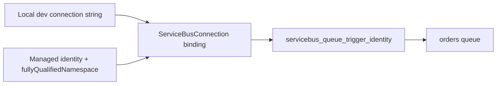
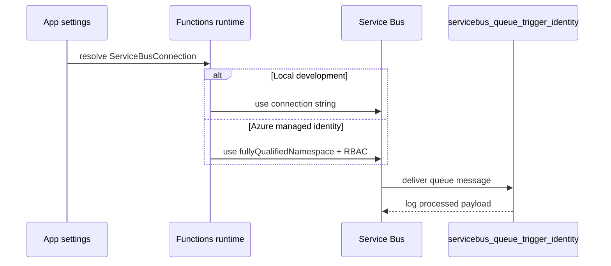

# Managed Identity Service Bus

> **Trigger**: Service Bus | **State**: stateless | **Guarantee**: at-least-once | **Difficulty**: intermediate

## Overview
The `examples/security-and-tenancy/managed_identity_servicebus/` recipe shows a Service Bus queue trigger using
`connection="ServiceBusConnection"`. For identity-based access, it uses the
`ServiceBusConnection__fullyQualifiedNamespace` setting instead of embedding credentials.

This pattern helps organizations remove shared access keys and adopt RBAC-based access control,
while preserving the same function code and binding contract.

## When to Use
- You want keyless Service Bus access from Azure Functions.
- You need consistent binding names across local and cloud environments.
- You are migrating from connection strings to managed identity safely.

## When NOT to Use
- Shared access policies are still mandatory in your environment and RBAC is unavailable.
- The function runs only locally and you do not need cloud identity parity.
- You cannot assign `Azure Service Bus Data Receiver` or equivalent role to the managed identity.

## Architecture


## Behavior


## Prerequisites
- Python 3.10+
- Azure Functions Core Tools v4
- Azure Service Bus namespace with queue `orders`
- Managed identity with `Azure Service Bus Data Receiver` role

## Project Structure
```text
examples/security-and-tenancy/managed_identity_servicebus/
|-- function_app.py
|-- host.json
|-- local.settings.json.example
|-- requirements.txt
`-- README.md
```

## Implementation
The function code is straightforward and independent of auth mechanism.

```python
@app.function_name(name="servicebus_queue_trigger_identity")
@app.service_bus_queue_trigger(
    arg_name="message",
    queue_name="orders",
    connection="ServiceBusConnection",
)
def servicebus_queue_trigger_identity(message: func.ServiceBusMessage) -> None:
    payload = message.get_body().decode("utf-8")
    logging.info("Received Service Bus message through ServiceBusConnection: %s", payload)
```

Only configuration changes between secret-based and managed identity setups.

```text
# Local / compatibility mode
ServiceBusConnection="Endpoint=sb://...;SharedAccessKeyName=...;SharedAccessKey=..."

# Managed identity mode
ServiceBusConnection__fullyQualifiedNamespace="<namespace>.servicebus.windows.net"
```

Use separate app settings per environment while keeping trigger code unchanged.

## Run Locally
```bash
cd examples/security-and-tenancy/managed_identity_servicebus
pip install -r requirements.txt
func start
```

## Expected Output
```text
[Information] Executing 'Functions.servicebus_queue_trigger_identity'
[Information] Received Service Bus message through ServiceBusConnection: {"id":"order-450","state":"created"}
[Information] Executed 'Functions.servicebus_queue_trigger_identity' (Succeeded)
```

## Production Considerations
- Scaling: tune Service Bus host settings for lock renewal and concurrency under peak load.
- Retries: redelivery and lock expiration can duplicate work; implement idempotent consumers.
- Idempotency: use Service Bus message ID or business key for de-duplication in downstream stores.
- Observability: include correlation IDs and delivery counts in logs for replay diagnostics.
- Security: disable shared keys where policy allows; rely on RBAC and managed identity.

## Related Links
- [Managed Identity Storage](./managed-identity-storage.md)
- [Service Bus Worker](../messaging-and-pubsub/servicebus-worker.md)
- [host.json Tuning](../runtime-and-ops/host-json-tuning.md)
- [Identity-based connections tutorial](https://learn.microsoft.com/en-us/azure/azure-functions/functions-identity-based-connections-tutorial)
