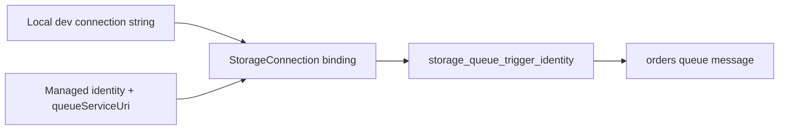
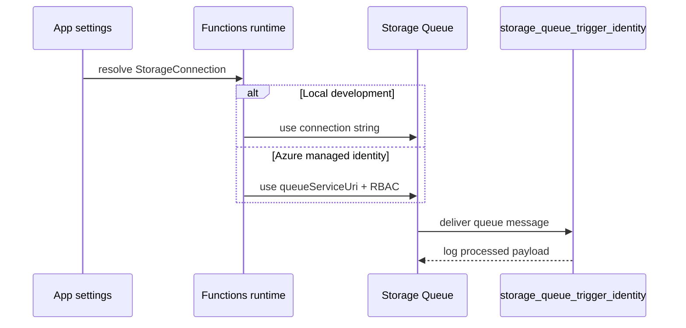

# Managed Identity Storage

> **Trigger**: Queue | **State**: stateless | **Guarantee**: at-least-once | **Difficulty**: intermediate

## Overview
The `examples/security-and-tenancy/managed_identity_storage/` recipe demonstrates a queue trigger that uses
`connection="StorageConnection"` and can be backed by either a connection string or managed identity.
The key identity pattern is the `StorageConnection__queueServiceUri` suffix.

This approach removes secret rotation burden and aligns Azure Functions with centralized identity and
RBAC governance. It is recommended for production workloads where keyless connectivity is preferred.

## When to Use
- You want to eliminate storage connection strings from app settings.
- Your organization standardizes on Entra ID and RBAC for data access.
- You need one binding name that works in local and cloud environments.

## When NOT to Use
- The target service does not support identity-based connections for your binding scenario.
- Local-only demos are simpler with a disposable connection string and no cloud identity setup.
- You cannot grant the managed identity least-privilege RBAC on the storage account.

## Architecture


## Behavior


## Prerequisites
- Python 3.10+
- Azure Functions Core Tools v4
- Azure Storage Queue named `orders`
- Managed identity with `Storage Queue Data Message Processor` or equivalent role

## Project Structure
```text
examples/security-and-tenancy/managed_identity_storage/
|-- function_app.py
|-- host.json
|-- local.settings.json.example
|-- requirements.txt
`-- README.md
```

## Implementation
The binding itself is unchanged between secret-based and identity-based connectivity.
Only app settings differ by environment.

```python
@app.function_name(name="storage_queue_trigger_identity")
@app.queue_trigger(
    arg_name="message",
    queue_name="orders",
    connection="StorageConnection",
)
def storage_queue_trigger_identity(message: func.QueueMessage) -> None:
    payload = message.get_body().decode("utf-8")
    logging.info("Received queue message through StorageConnection: %s", payload)
```

For local development, a connection string is common. In Azure, prefer the URI suffix pattern.

```text
# Local / test
StorageConnection="DefaultEndpointsProtocol=https;AccountName=...;AccountKey=..."

# Production (managed identity)
StorageConnection__queueServiceUri="https://<account>.queue.core.windows.net"
```

This keeps function code stable while infra evolves from secrets to RBAC.

## Run Locally
```bash
cd examples/security-and-tenancy/managed_identity_storage
pip install -r requirements.txt
func start
```

## Expected Output
```text
[Information] Executing 'Functions.storage_queue_trigger_identity'
[Information] Received queue message through StorageConnection: {"id":"order-901","total":99.5}
[Information] Executed 'Functions.storage_queue_trigger_identity' (Succeeded)
```

## Production Considerations
- Scaling: queue trigger scales with backlog; monitor account transaction limits.
- Retries: storage queue redelivery can reprocess messages; keep business writes idempotent.
- Idempotency: persist processed message IDs when side effects are not naturally idempotent.
- Observability: log queue name and business key; emit metrics for dequeue count and failures.
- Security: grant least-privilege RBAC and block public network paths where feasible.

## Related Links
- [Managed Identity Service Bus](./managed-identity-servicebus.md)
- [Queue Consumer](../messaging-and-pubsub/queue-consumer.md)
- [Output Binding vs SDK](../runtime-and-ops/output-binding-vs-sdk.md)
- [Identity-based connections tutorial](https://learn.microsoft.com/en-us/azure/azure-functions/functions-identity-based-connections-tutorial)
