# Service Combination Matrix

This reference maps Azure services to Azure Functions trigger and binding patterns, showing which cookbook recipes cover each combination. Use it to quickly locate an example or to identify coverage gaps.

Rows represent Azure services that integrate with Functions. Columns represent the 13 pattern categories in this cookbook. Each cell either links to a recipe or shows `—` where no recipe currently exists.

---

## Integration Ecosystem

```mermaid
graph TD
    AF[Azure Functions]

    AF --- HTTP[HTTP / APIM / Front Door]
    AF --- STORAGE[Blob Storage / Queue Storage]
    AF --- SB[Service Bus]
    AF --- EH[Event Hub]
    AF --- EG[Event Grid]
    AF --- COSMOS[Cosmos DB]
    AF --- SQL[Azure SQL]
    AF --- KV[Key Vault]
    AF --- SR[SignalR]
    AF --- AOAI[Azure OpenAI]
    AF --- AIS[AI Search]
    AF --- REDIS[Azure Cache for Redis]
    AF --- CDN[CDN / Front Door Static]
    AF --- DURABLE[Durable Task / Orchestration]

    HTTP --> |trigger| AF
    STORAGE --> |trigger / input / output| AF
    SB --> |trigger / input / output| AF
    EH --> |trigger / output| AF
    EG --> |trigger / output| AF
    COSMOS --> |trigger / input / output| AF
    SQL --> |input / output| AF
    KV --> |secret reference| AF
    SR --> |output| AF
    AOAI --> |SDK call| AF
    AIS --> |SDK call| AF
    REDIS --> |SDK call| AF
```

---

## Matrix

Column abbreviations:

| Abbrev. | Full category |
|---------|---------------|
| **APIs** | APIs & Ingress |
| **Sched** | Scheduled & Background |
| **Blob** | Blob & File Triggers |
| **Async** | Async APIs & Jobs |
| **Msg** | Messaging & Pub/Sub |
| **Stream** | Streams & Telemetry |
| **Data** | Data & Pipelines |
| **Orch** | Orchestration & Workflows |
| **Rely** | Reliability |
| **Sec** | Security & Tenancy |
| **Ops** | Runtime & Ops |
| **RT** | Realtime |
| **AI** | AI & Agents |

---

| Service | APIs | Sched | Blob | Async | Msg | Stream | Data | Orch | Rely | Sec | Ops | RT | AI |
|---------|------|-------|------|-------|-----|--------|------|------|------|-----|-----|----|----|
| **API Management** | [Hello HTTP Minimal](../patterns/apis-and-ingress/hello-http-minimal.md), [HTTP Auth Levels](../patterns/apis-and-ingress/http-auth-levels.md), [BFF Facade API](../patterns/apis-and-ingress/bff-facade-api.md) | — | — | [Async HTTP 202 Polling](../patterns/async-apis-and-jobs/async-http-202-polling.md) | — | — | — | — | — | [JWT Bearer Validation](../patterns/apis-and-ingress/auth-jwt-validation.md), [Multi-Tenant Auth](../patterns/apis-and-ingress/auth-multitenant.md) | — | — | — |
| **Front Door** | [BFF Facade API](../patterns/apis-and-ingress/bff-facade-api.md), [Hello HTTP Minimal](../patterns/apis-and-ingress/hello-http-minimal.md) | — | — | — | — | — | — | — | — | — | — | — | — |
| **CDN** | — | — | — | — | — | — | — | — | — | — | — | — | — |
| **Key Vault** | — | — | — | — | — | — | — | — | — | [Secretless Key Vault](../patterns/security-and-tenancy/secretless-keyvault.md) | — | — | — |
| **Azure Cache for Redis** | — | — | — | — | — | — | — | — | [Circuit Breaker](../patterns/reliability/circuit-breaker.md), [Rate Limiting Throttle](../patterns/reliability/rate-limiting-throttle.md) | — | — | — | — |
| **Cosmos DB** | — | — | — | — | — | — | [Change Feed Processor](../patterns/data-and-pipelines/change-feed-processor.md), [DB Input and Output Bindings](../patterns/data-and-pipelines/db-input-output.md), [CQRS Read Projection](../patterns/data-and-pipelines/cqrs-read-projection.md), [ETL Enrichment](../patterns/data-and-pipelines/etl-enrichment.md) | [Durable Fan-Out Fan-In](../patterns/orchestration-and-workflows/durable-fan-out-fan-in.md) | [Outbox Pattern](../patterns/reliability/outbox-pattern.md) | — | — | — | — |
| **Azure SQL** | [Full-Stack CRUD API](../patterns/apis-and-ingress/full-stack-crud-api.md) | — | — | — | — | — | [DB Input and Output Bindings](../patterns/data-and-pipelines/db-input-output.md), [SQLAlchemy REST Pagination](../patterns/data-and-pipelines/sqlalchemy-rest-pagination.md) | — | — | — | — | — | — |
| **Blob Storage** | — | — | [Blob Upload Processor](../patterns/blob-and-file-triggers/blob-upload-processor.md), [Blob Event Grid Trigger](../patterns/blob-and-file-triggers/blob-eventgrid-trigger.md) | — | — | — | [File Processing Pipeline](../patterns/data-and-pipelines/file-processing-pipeline.md) | — | — | [Managed Identity Storage](../patterns/security-and-tenancy/managed-identity-storage.md) | — | — | — |
| **Queue Storage** | — | — | — | [Queue-Backed Job](../patterns/async-apis-and-jobs/queue-backed-job.md) | [Queue Producer](../patterns/messaging-and-pubsub/queue-producer.md), [Queue Consumer](../patterns/messaging-and-pubsub/queue-consumer.md) | — | — | — | [Retry and Idempotency](../patterns/reliability/retry-and-idempotency.md), [Poison Message Handling](../patterns/reliability/poison-message-handling.md) | [Managed Identity Storage](../patterns/security-and-tenancy/managed-identity-storage.md) | — | — | — |
| **Service Bus** | — | — | — | — | [Service Bus Worker](../patterns/messaging-and-pubsub/servicebus-worker.md), [Service Bus Topic Fanout](../patterns/messaging-and-pubsub/servicebus-topic-fanout.md), [Service Bus Sessions](../patterns/messaging-and-pubsub/servicebus-sessions.md), [Service Bus DLQ Replay](../patterns/messaging-and-pubsub/servicebus-dlq-replay.md) | — | — | [Saga Compensation](../patterns/orchestration-and-workflows/saga-compensation.md) | [Poison Message Handling](../patterns/reliability/poison-message-handling.md) | [Managed Identity Service Bus](../patterns/security-and-tenancy/managed-identity-servicebus.md) | — | — | — |
| **Event Hub** | — | — | — | — | — | [Event Hub Consumer](../patterns/streams-and-telemetry/eventhub-consumer.md), [Event Hub Batch Window](../patterns/streams-and-telemetry/eventhub-batch-window.md), [Event Hub Checkpoint Replay](../patterns/streams-and-telemetry/eventhub-checkpoint-replay.md) | [ETL Enrichment](../patterns/data-and-pipelines/etl-enrichment.md) | — | — | — | — | — | — |
| **Event Grid** | [Webhook GitHub](../patterns/apis-and-ingress/webhook-github.md) | — | [Blob Event Grid Trigger](../patterns/blob-and-file-triggers/blob-eventgrid-trigger.md) | — | [Event Grid Event Router](../patterns/messaging-and-pubsub/eventgrid-event-router.md), [Event Grid Domain Events](../patterns/messaging-and-pubsub/eventgrid-domain-events.md) | — | — | — | — | — | — | — | — |
| **SignalR** | — | — | — | — | — | — | — | — | — | — | — | [SignalR Notifications](../patterns/realtime/signalr-notifications.md) | — |
| **Azure OpenAI** | [MCP Server Example](../patterns/ai-and-agents/mcp-server-example.md) | — | — | — | — | — | — | [Durable AI Pipeline](../patterns/ai-and-agents/durable-ai-pipeline.md) | — | — | — | — | [LangGraph Agent](../patterns/ai-and-agents/langgraph-agent.md), [RAG Knowledge API](../patterns/ai-and-agents/rag-knowledge-api.md), [LangGraph RAG Agent](../patterns/ai-and-agents/langgraph-rag-agent.md), [OpenAI Direct Chat](../patterns/ai-and-agents/openai-direct-chat.md), [Durable AI Pipeline](../patterns/ai-and-agents/durable-ai-pipeline.md), [Streaming AI Response](../patterns/ai-and-agents/streaming-ai-response.md), [AI Image Generation](../patterns/ai-and-agents/ai-image-generation.md), [Embedding Vector Search](../patterns/ai-and-agents/embedding-vector-search.md) |
| **AI Search** | — | — | — | — | — | — | — | — | — | — | — | — | [RAG Knowledge API](../patterns/ai-and-agents/rag-knowledge-api.md), [LangGraph RAG Agent](../patterns/ai-and-agents/langgraph-rag-agent.md), [Durable AI Pipeline](../patterns/ai-and-agents/durable-ai-pipeline.md), [Embedding Vector Search](../patterns/ai-and-agents/embedding-vector-search.md) |

---

## Integration Gaps

The following service-category combinations have no recipe today. These represent natural candidates for future additions.

| Service | Missing categories | Notes |
|---------|-------------------|-------|
| **API Management** | Blob, Msg, Stream, Data, Orch, Ops, RT, AI | APIM primarily fronts HTTP triggers; bindings to other services would be indirect |
| **Front Door** | Sched, Blob, Async, Msg, Stream, Data, Orch, Rely, Sec, Ops, RT, AI | Front Door routes to HTTP triggers only; no native binding |
| **CDN** | All | CDN offloads static assets; no native Functions trigger or binding exists |
| **Key Vault** | APIs, Sched, Blob, Async, Msg, Stream, Data, Orch, Rely, Ops, RT, AI | Key Vault is consumed via secret references and the SDK, not a dedicated binding |
| **Azure Cache for Redis** | APIs, Sched, Blob, Async, Msg, Stream, Data, Orch, Sec, Ops, RT, AI | No native Redis trigger/binding in the v2 Python model; SDK-only today |
| **Cosmos DB** | APIs, Sched, Blob, Async, Msg, Stream, Sec, Ops, RT, AI | HTTP + Cosmos DB (CRUD API), Timer + Cosmos DB (scheduled aggregation) are good candidates |
| **Azure SQL** | Sched, Blob, Async, Msg, Stream, Orch, Rely, Sec, Ops, RT, AI | SQL trigger (change tracking) support is preview; Sec recipe for Managed Identity SQL is a gap |
| **Blob Storage** | APIs, Sched, Async, Msg, Stream, Orch, Rely, Ops, RT, AI | HTTP + Blob (upload endpoint), Timer + Blob (cleanup job) are natural additions |
| **Queue Storage** | APIs, Sched, Blob, Stream, Data, Orch, Ops, RT, AI | Durable + Queue (external event) is a documentation gap |
| **Service Bus** | APIs, Sched, Blob, Async, Stream, Data, Sec (input), Ops, RT, AI | Service Bus input binding (peek) recipe is absent |
| **Event Hub** | APIs, Sched, Blob, Async, Msg, Orch, Rely, Sec, Ops, RT, AI | Event Hub output binding (producer) recipe is absent |
| **Event Grid** | Sched, Async, Stream, Data, Orch, Rely, Sec, Ops, RT, AI | Event Grid output binding (custom topic publish) is a gap |
| **SignalR** | APIs, Sched, Blob, Async, Msg, Stream, Data, Orch, Rely, Sec, Ops, AI | HTTP + SignalR negotiate endpoint recipe is absent |
| **Azure OpenAI** | Sched, Blob, Async, Msg, Stream, Data, Orch, Rely, Sec, Ops, RT | Timer-triggered batch inference and Service Bus + OpenAI worker are candidates |
| **AI Search** | APIs, Sched, Blob, Async, Msg, Stream, Data, Orch, Rely, Sec, Ops, RT | HTTP + AI Search (semantic search API) recipe is absent |

---

## Related Links

- https://learn.microsoft.com/azure/azure-functions/functions-triggers-bindings
- https://learn.microsoft.com/azure/architecture/serverless/guide/serverless-app-cicd-best-practices
